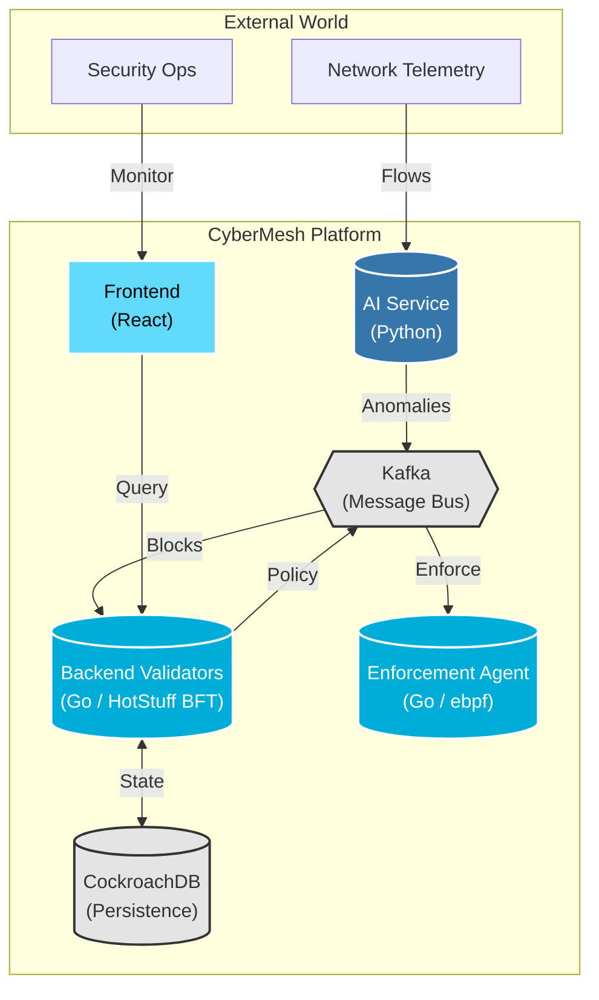

# CyberMesh Architecture Portal

**Version:** 2.1.0 | **Last Updated:** 2026-01-29

Welcome to **CyberMesh**, a distributed threat detection and response platform that combines real-time AI anomaly detection with BFT consensus.

---

## 🗺️ System Context Map

---

## 🧭 Where do I start?

Choose your path based on your role or goal:

### 🚀 I want the "Big Picture"
*   **[System Overview](architecture/01_system_overview.md)**: Start here. The end-to-end story of a packet becoming a policy.
*   **[System Timeline](architecture/11_system_timeline.md)**: Understand the "heartbeat" of the system (timings, latencies).

### 🧠 I am an AI / ML Engineer
*   **[AI Detection Pipeline](architecture/02_ai_detection_pipeline.md)**: How we extract 79 features and run 3 detection engines.
*   **[Feedback Loop](architecture/06_feedback_loop.md)**: How the system learns from validator feedback.

### ⛓️ I am a Blockchain / Backend Engineer
*   **[HotStuff Consensus](architecture/03_hotstuff_consensus.md)**: The 2-chain BFT engine that validates alerts.
*   **[State Machine](architecture/05_state_machine.md)**: Deterministic execution and state roots.
*   **[P2P Networking](architecture/10_p2p_networking.md)**: Libp2p, gossip, and peer discovery.
*   **[Security Model](architecture/09_security_model.md)**: Ed25519 signing and replay defenses.

### 🏗️ I am DevOps / SRE
*   **[GKE Deployment](architecture/12_gke_deployment.md)**: Kubernetes topology and manifests.
*   **[Kafka Message Bus](architecture/04_kafka_message_bus.md)**: Topics, schemas, and wire contracts.
*   **[Persistence](architecture/08_cockroach_persistence.md)**: CockroachDB schema and storage paths.

---

## 📚 Complete Index

For a flat list of all architecture and design documents, see the **[Architecture Index](ARCHITECTURE_INDEX.md)**.

