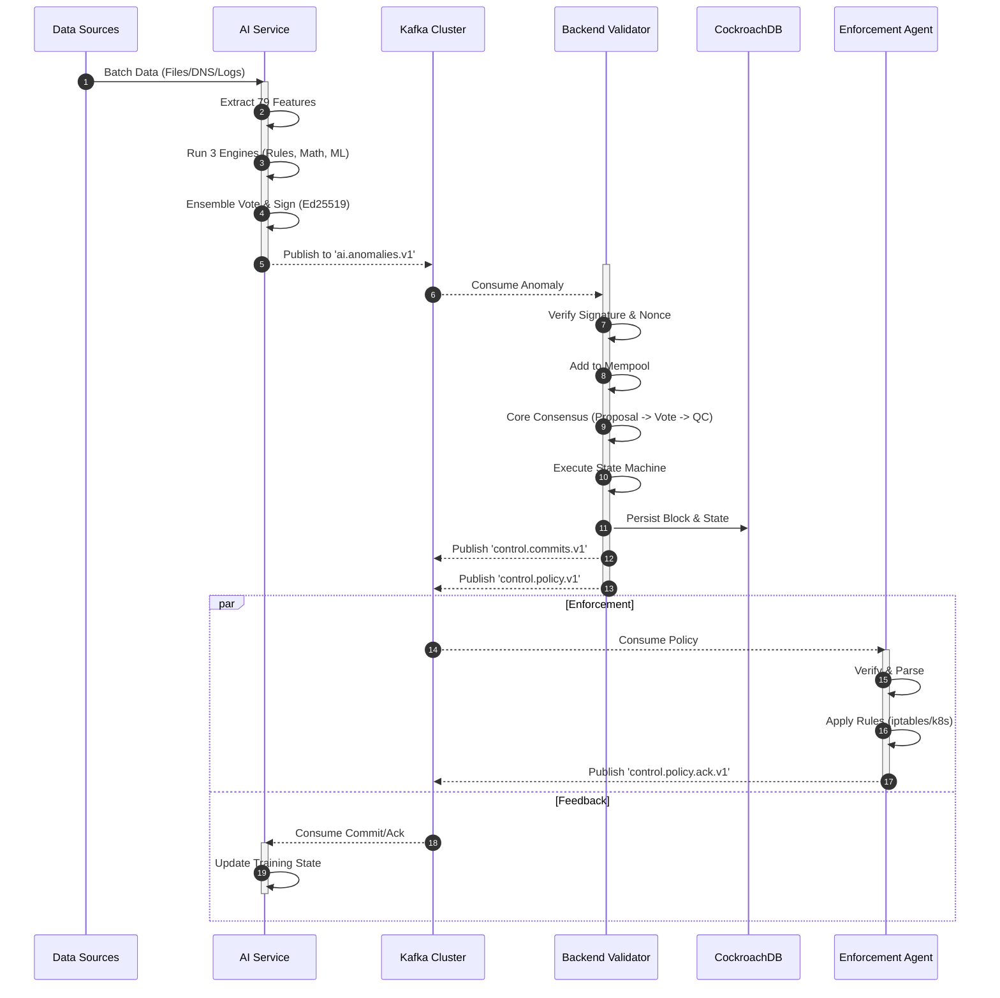

# Architecture 1: System Overview
## End-to-End Pipeline (Code-Backed)

**Last Updated:** 2026-01-29

This document describes the CyberMesh system at the "whole product" level: what each major component does and how data moves through the system from telemetry to enforcement.

---

## 1. Components

### 1.1 AI Service (Python)

- Polls telemetry in batches (default `TELEMETRY_BATCH_SIZE=1000` flows per poll).
- Extracts a fixed feature vector (79 features) and runs a 3-engine detection pipeline (Rules + Math + ML).
- Produces signed protobuf messages to Kafka topics (at minimum `ai.anomalies.v1`).

Primary code references:
- `ai-service/src/service/detection_loop.py`
- `ai-service/src/ml/pipeline.py`
- `ai-service/src/ml/feature_adapter.py`
- `ai-service/src/kafka/producer.py`
- `ai-service/src/utils/nonce.py`

### 1.2 Kafka (Message Bus)

Kafka decouples producers (AI Service, Backend, Enforcement Agent) from consumers (Backend, AI Service, Enforcement Agent).

Topic names are environment/config driven, but the default/expected topics in code are:

- `ai.anomalies.v1` (AI -> Backend)
- `ai.evidence.v1` (AI -> Backend, optional depending on configuration)
- `ai.policy.v1` (AI -> Backend, optional depending on configuration)
- `control.commits.v1` (Backend -> AI)
- `control.policy.v1` (Backend -> Enforcement Agent)
- `control.policy.ack.v1` (Enforcement Agent -> AI, optional)
- `ai.dlq.v1` (Backend consumer DLQ)

### 1.3 Backend Validators (Go)

- Consumes AI topics (`ai.*`) from Kafka.
- Verifies message authenticity (Ed25519 signatures + replay protection).
- Admits valid items into a mempool.
- Builds blocks from the mempool and runs HotStuff (2-chain) consensus over the block stream.
- Executes a deterministic state machine and persists results to CockroachDB.
- Produces commit and policy outputs to Kafka.

Primary code references:
- `backend/pkg/ingest/kafka/consumer.go`
- `backend/pkg/ingest/kafka/producer.go`
- `backend/pkg/ingest/kafka/signing.go`
- `backend/pkg/consensus/api/engine.go`
- `backend/pkg/consensus/pbft/pbft.go` (HotStuff implementation despite folder name)
- `backend/pkg/mempool/mempool.go`

### 1.4 CockroachDB (Persistence)

- Stores committed blocks and derived state (backend is the writer).

Primary code references:
- `backend/pkg/storage/cockroach/adapter.go`

### 1.5 Enforcement Agent (Go)

- Consumes `control.policy.v1` from Kafka.
- Verifies signature and parses the policy spec.
- Applies enforcement using a configured backend (iptables, nftables, Kubernetes NetworkPolicy, or noop).
- Optionally publishes policy acknowledgements to `control.policy.ack.v1` for the AI Service to consume.

Primary code references:
- `enforcement-agent/internal/controller/*`
- `enforcement-agent/internal/enforcer/*`
- `enforcement-agent/internal/kafka/*`
- `enforcement-agent/internal/ack/*`

### 1.6 Frontend (React/TypeScript)

- Browser UI; reads from the backend HTTP API.
- Uses a fetch-based typed client and React Query for caching/retries.

Primary code references:
- `cybermesh-frontend/src/App.tsx`
- `cybermesh-frontend/src/lib/api/client.ts`
- `cybermesh-frontend/src/hooks/data/*`

---

## 2. End-to-End Data Flow

The following sequence diagram illustrates the lifecycle of a threat detection, from network telemetry to policy enforcement.

---

## 3. Wire Contracts and Signing

- Kafka payloads are protobuf messages (canonical wire contracts; schemas live under `backend/proto/` and service-local `proto/` directories).
- Kafka messages are authenticated with Ed25519 signatures and domain separation (the signer prepends a domain string/topic-specific domain to the encoded bytes before signing/verifying).
- AI nonces are 16 bytes: `[8B timestamp_ms][4B instance_id][4B monotonic_counter]`.

---

## 4. Where to Find More Detail

- High-level design: `docs/design/HLD.md`
- Full end-to-end sequences: `docs/design/DATA_FLOW.md`
- Backend LLD: `docs/design/LLD-backend.md`
- AI service LLD: `docs/design/LLD-ai-service.md`
- Enforcement agent LLD: `docs/design/LLD-enforcement-agent.md`
- Frontend LLD: `docs/design/LLD-frontend.md`

