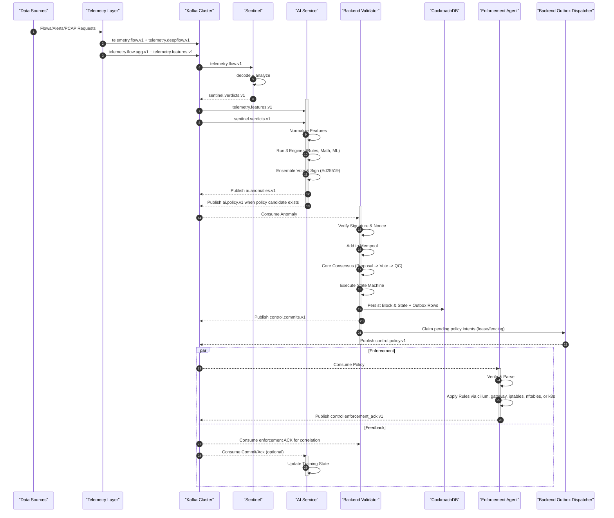

# Architecture 1: System Overview
## End-to-End Pipeline (Code-Backed)

**Last Updated:** 2026-02-25

This document describes the CyberMesh system at the "whole product" level: what each major component does and how data moves through the system from telemetry to enforcement.

---

## 1. Components

### 1.1 AI Service (Python)

- Consumes feature vectors from Kafka (`telemetry.features.v1`).
- Consumes Sentinel verdicts from Kafka (`sentinel.verdicts.v1`) through Sentinel adapter.
- Normalizes features and runs a 3-engine detection pipeline (Rules + Math + ML).
- Produces signed protobuf messages to Kafka topics (at minimum `ai.anomalies.v1`).

Primary code references:
- `ai-service/src/service/detection_loop.py`
- `ai-service/src/ml/pipeline.py`
- `ai-service/src/ml/feature_adapter.py`
- `ai-service/src/ml/telemetry_kafka.py`
- `ai-service/src/kafka/producer.py`
- `ai-service/src/utils/nonce.py`
- `ai-service/src/service/sentinel_adapter.py`
- `ai-service/src/service/policy_emitter.py`

### 1.1.1 Sentinel (Python)

- Consumes flow telemetry from Kafka (`telemetry.flow.v1`).
- Decodes flow protobuf (`FlowV1`) into canonical events.
- Runs orchestrator/agents and publishes verdicts to `sentinel.verdicts.v1`.
- Routes decode/validation/analyze failures to `sentinel.verdicts.v1.dlq`.

Primary code references:
- `sentinel/sentinel/kafka/gateway.py`
- `sentinel/sentinel/kafka/telemetry_decoder.py`
- `sentinel/sentinel/agents/orchestrator.py`
- `k8s_azure/sentinel/sentinel-kafka-ai-integration-job.yaml`

### 1.1.2 Telemetry Layer (Go + Python)

- Ingests network telemetry (flows/alerts/PCAP requests).
- Aggregates and normalizes flows into canonical schema.
- Generates CIC feature vectors and publishes to Kafka.

Primary code references:
- `telemetry-layer/stream-processor/`
- `telemetry-layer/feature-transformer_python/`
- `telemetry-layer/adapters/`
- `telemetry-layer/pcap-service/`

### 1.2 Kafka (Message Bus)

Kafka decouples producers (AI Service, Backend, Enforcement Agent) from consumers (Backend, AI Service, Enforcement Agent).

Topic names are environment/config driven. Defaults include:

- `telemetry.flow.v1` (Telemetry -> Telemetry)
- `telemetry.flow.agg.v1` (Telemetry -> Telemetry)
- `telemetry.features.v1` (Telemetry -> AI)
- `sentinel.verdicts.v1` (Sentinel -> AI)
- `telemetry.deepflow.v1` (Telemetry -> Telemetry)
- `pcap.request.v1` (Backend/AI/Ops -> Telemetry)
- `pcap.result.v1` (Telemetry -> Backend/AI/Ops)
- `ai.anomalies.v1` (AI -> Backend)
- `ai.evidence.v1` (AI -> Backend, optional depending on configuration)
- `ai.policy.v1` (AI -> Backend, optional depending on configuration)
- `control.commits.v1` (Backend -> AI)
- `control.policy.v1` (Backend -> Enforcement Agent)
- `control.enforcement_ack.v1` (Enforcement Agent -> Backend primary consumer, AI optional; configurable)
- `ai.dlq.v1` (Backend consumer DLQ)

### 1.3 Backend Validators (Go)

- Consumes AI topics (`ai.*`) from Kafka.
- Verifies message authenticity (Ed25519 signatures + replay protection).
- Admits valid items into a mempool.
- Builds blocks from the mempool and runs HotStuff (2-chain) consensus over the block stream.
- Executes a deterministic state machine and persists results to CockroachDB.
- Produces commit output to Kafka and policy output through durable outbox dispatch.

Primary code references:
- `backend/pkg/ingest/kafka/consumer.go`
- `backend/pkg/ingest/kafka/producer.go`
- `backend/pkg/ingest/kafka/signing.go`
- `backend/pkg/consensus/api/engine.go`
- `backend/pkg/consensus/pbft/pbft.go` (HotStuff implementation despite folder name)
- `backend/pkg/mempool/mempool.go`
- `backend/pkg/control/policyoutbox/dispatcher.go`
- `backend/pkg/control/policyoutbox/store.go`
- `backend/pkg/control/policyack/store.go`

### 1.4 CockroachDB (Persistence)

- Stores committed blocks and derived state (backend is the writer).

Primary code references:
- `backend/pkg/storage/cockroach/adapter.go`

### 1.5 Enforcement Agent (Go)

- Consumes `control.policy.v1` from Kafka.
- Verifies signature and parses the policy spec.
- Applies enforcement using a configured backend (cilium, gateway, iptables, nftables, kubernetes/k8s, or noop).
- Optionally publishes policy acknowledgements for backend/AI feedback.
  - Topic name is config-driven via `TOPIC_CONTROL_POLICY_ACK` (AI), `CONTROL_POLICY_ACK_TOPIC` (backend), and `ACK_TOPIC` (agent). Current default is `control.enforcement_ack.v1`.

Primary code references:
- `enforcement-agent/internal/controller/*`
- `enforcement-agent/internal/enforcer/*`
- `enforcement-agent/internal/kafka/*`
- `enforcement-agent/internal/ack/*`

### 1.5.1 Enforcement Plane Model (L3/L4)

Control plane path:
- `AI -> Backend -> control.policy.v1`
- backend consensus is the authorization gate before enforcement

Data plane path:
- Enforcement agent consumes `control.policy.v1`
- selects backend (`cilium`, `gateway`, `iptables`, `nftables`, `k8s`, `noop`)
- applies L3/L4 controls and emits ACK on `control.enforcement_ack.v1`

Traffic scope guidance:
- East-West: `cilium`/`k8s` primary, host firewall fallback (`iptables`/`nftables`)
- North-South: `gateway` primary, host firewall guardrails where needed

### 1.6 Frontend (React/TypeScript)

- Browser UI; reads from the backend HTTP API.
- Uses a fetch-based typed client and React Query for caching/retries.

Primary code references:
- `cybermesh-frontend/src/App.tsx`
- `cybermesh-frontend/src/lib/api/client.ts`
- `cybermesh-frontend/src/hooks/data/*`

---

## 2. End-to-End Data Flow

The following sequence diagram illustrates the lifecycle of a threat detection, from network telemetry to policy enforcement.

```mermaid
sequenceDiagram
    autonumber
    participant Telemetry as "Data Sources"
    participant TL as "Telemetry Layer"
    participant Kafka as "Kafka Cluster"
    participant Sentinel as "Sentinel"
    participant AI as "AI Service"
    participant Backend as "Backend Validator"
    participant DB as "CockroachDB"
    participant Agent as "Enforcement Agent"
    participant Outbox as "Backend Outbox Dispatcher"

    %% Phase 1: Detection
    Telemetry->>TL: Flows/Alerts/PCAP Requests
    TL->>Kafka: telemetry.flow.v1 + telemetry.deepflow.v1
    TL->>Kafka: telemetry.flow.agg.v1 + telemetry.features.v1
    Kafka->>Sentinel: telemetry.flow.v1
    Sentinel->>Sentinel: decode + analyze
    Sentinel-->>Kafka: sentinel.verdicts.v1
    activate AI
    Kafka->>AI: telemetry.features.v1
    Kafka->>AI: sentinel.verdicts.v1
    AI->>AI: Normalize Features
    AI->>AI: Run 3 Engines (Rules, Math, ML)
    AI->>AI: Ensemble Vote & Sign (Ed25519)
    AI-->>Kafka: Publish ai.anomalies.v1
    AI-->>Kafka: Publish ai.policy.v1 when policy candidate exists
    deactivate AI

    %% Phase 2: Consensus
    activate Backend
    Kafka-->>Backend: Consume Anomaly
    Backend->>Backend: Verify Signature & Nonce
    Backend->>Backend: Add to Mempool
    Backend->>Backend: Core Consensus (Proposal -> Vote -> QC)
    Backend->>Backend: Execute State Machine
    Backend->>DB: Persist Block & State + Outbox Rows
    Backend-->>Kafka: Publish control.commits.v1
    Backend->>Outbox: Claim pending policy intents (lease/fencing)
    Outbox-->>Kafka: Publish control.policy.v1
    deactivate Backend

    %% Phase 3: Enforcement & Feedback
    par Enforcement
        Kafka-->>Agent: Consume Policy
        activate Agent
        Agent->>Agent: Verify & Parse
        Agent->>Agent: Apply Rules via cilium, gateway, iptables, nftables, or k8s
        Agent-->>Kafka: Publish control.enforcement_ack.v1
        deactivate Agent
    and Feedback
        Kafka-->>Backend: Consume enforcement ACK for correlation
        Kafka-->>AI: Consume Commit/Ack (optional)
        activate AI
        AI->>AI: Update Training State
        deactivate AI
    end
```

---

## 3. Wire Contracts and Signing

- Kafka payloads are protobuf messages (canonical wire contracts; schemas live under `backend/proto/` and service-local `proto/` directories).
- Kafka messages are authenticated with Ed25519 signatures and domain separation (the signer prepends a domain string/topic-specific domain to the encoded bytes before signing/verifying).
- AI nonces are 16 bytes: `[8B timestamp_ms][4B instance_id][4B monotonic_counter]`.

---

## 4. Where to Find More Detail

- High-level design: `docs/design/HLD.md`
- Full end-to-end sequences: `docs/design/DATA_FLOW.md`
- Sentinel integration architecture: `docs/architecture/13_sentinel_integration.md`
- Backend LLD: `docs/design/LLD-backend.md`
- AI service LLD: `docs/design/LLD-ai-service.md`
- Telemetry Layer LLD: `docs/design/LLD-telemetry-layer.md`
- Enforcement agent LLD: `docs/design/LLD-enforcement-agent.md`
- Frontend LLD: `docs/design/LLD-frontend.md`
