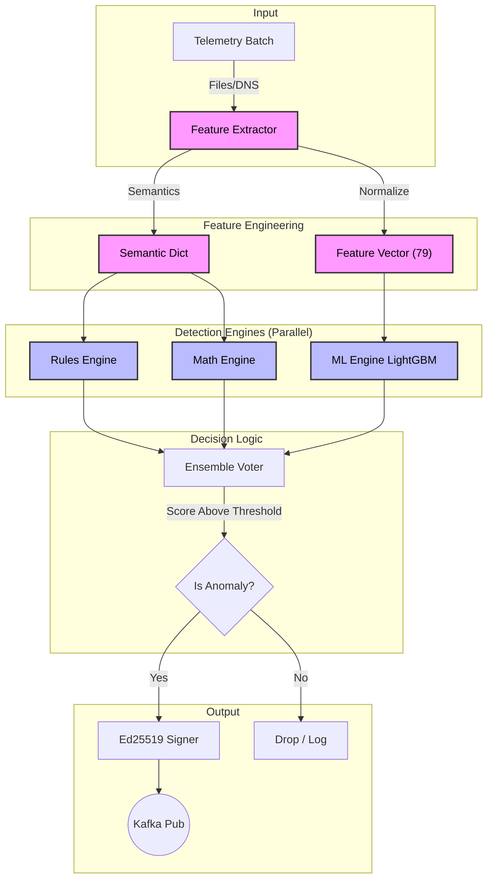

# Architecture 2: AI Detection Pipeline
## 3-Engine Detection Service (Actual Implementation)

**Last Updated:** 2026-01-29

This document describes how the AI Service polls telemetry, runs detections, and publishes signed messages to Kafka.

Primary code references:
- `ai-service/src/service/detection_loop.py` (background loop + publish gating)
- `ai-service/src/ml/pipeline.py` (DetectionPipeline.process + instrumentation)
- `ai-service/src/ml/telemetry.py` (TelemetrySource + FileTelemetrySource)
- `ai-service/src/ml/detectors.py` (RulesEngine, MathEngine, MLEngine)
- `ai-service/src/ml/ensemble.py` (EnsembleVoter)
- `ai-service/src/kafka/producer.py` (Kafka producer config + publish methods)
- `ai-service/src/utils/nonce.py` (nonce format)

---

## 1. Runtime Loop

The service runs a background daemon thread that periodically calls the pipeline and publishes if the decision says to publish and the local rate limiter allows it.

Key config knobs (AI service config dict):
- `DETECTION_INTERVAL` (default: 5 seconds)
- `DETECTION_TIMEOUT` (default: 30 seconds)
- `TELEMETRY_BATCH_SIZE` (default: 1000) - external batch size intent
- `MAX_FLOWS_PER_ITERATION` (default: 100) - hard cap used per pipeline iteration

Effective per-iteration flow limit in `DetectionPipeline.process()`:

```text
limit = min(MAX_FLOWS_PER_ITERATION (default 100), TELEMETRY_BATCH_SIZE (default 1000))
flows = telemetry.get_network_flows(limit=limit)
```

---

## 2. Pipeline Stages (DetectionPipeline.process)

Stages are instrumented with `time.perf_counter()` and returned as an `InstrumentedResult`:

1. Telemetry load
2. Feature extraction (unified 79-feature path)
3. Engine inference (Rules/Math/ML)
4. Ensemble voting
5. Evidence generation (only when publishing)



Notes:
- Engines are best-effort: a failing engine does not stop the pipeline; other engines still run.
- The ML engine uses normalized numeric features; Rules/Math use a semantic dict derived from the first flow in the batch.

---

## 3. Telemetry Sources

`TelemetrySource` is an interface with `get_network_flows(limit)` and `get_files(limit)`.

The default implementation used for Phase 6.1 is `FileTelemetrySource`:

- Searches JSON files under:
  - `flows/benign/*.json`, `flows/ddos/*.json`, `flows/*.json`
  - `files/benign/*.json`, `files/malware/*.json`, `files/*.json`
- Enforces a max file size of 10MB per JSON file.

---

## 4. Publishing and Security (AI Side)

### 4.1 Kafka Topics (AI Producer)

The AI service publishes to these default topics (topic names are config-driven):

- `ai.anomalies.v1`
- `ai.evidence.v1`
- `ai.policy.v1`

### 4.2 Nonce and Signing

- Nonce is 16 bytes: `[8B timestamp_ms][4B instance_id][4B monotonic_counter]`.
- Messages are signed with Ed25519 using domain separation (domain strings are topic-specific).

Important: idempotent producer settings reduce duplicates at the Kafka producer layer, but the overall pipeline should still be treated as at-least-once end-to-end (consumers must be idempotent/deduplicating).

---

## 5. Related Documents

- System overview: `docs/architecture/01_system_overview.md`
- Kafka bus details: `docs/architecture/04_kafka_message_bus.md`
- AI service LLD: `docs/design/LLD-ai-service.md`

