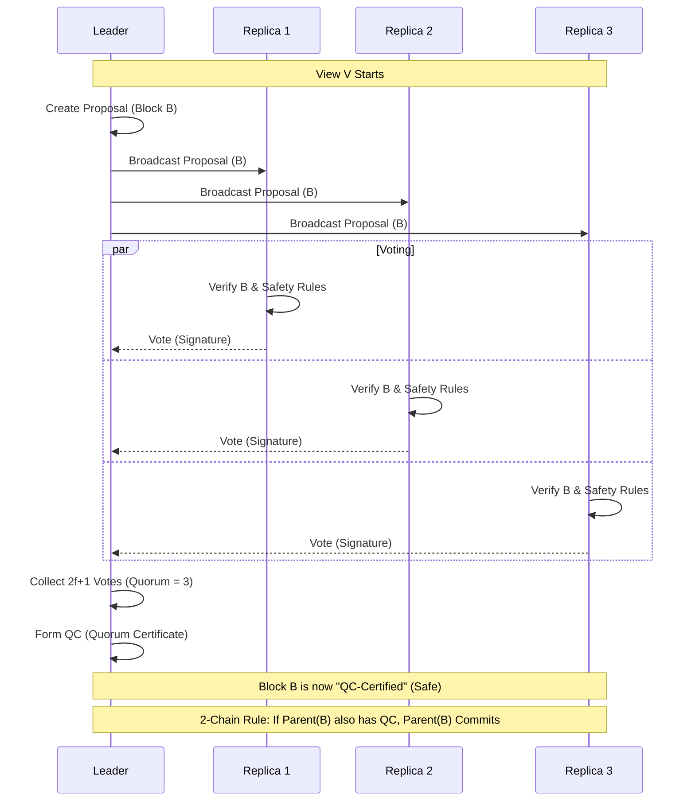
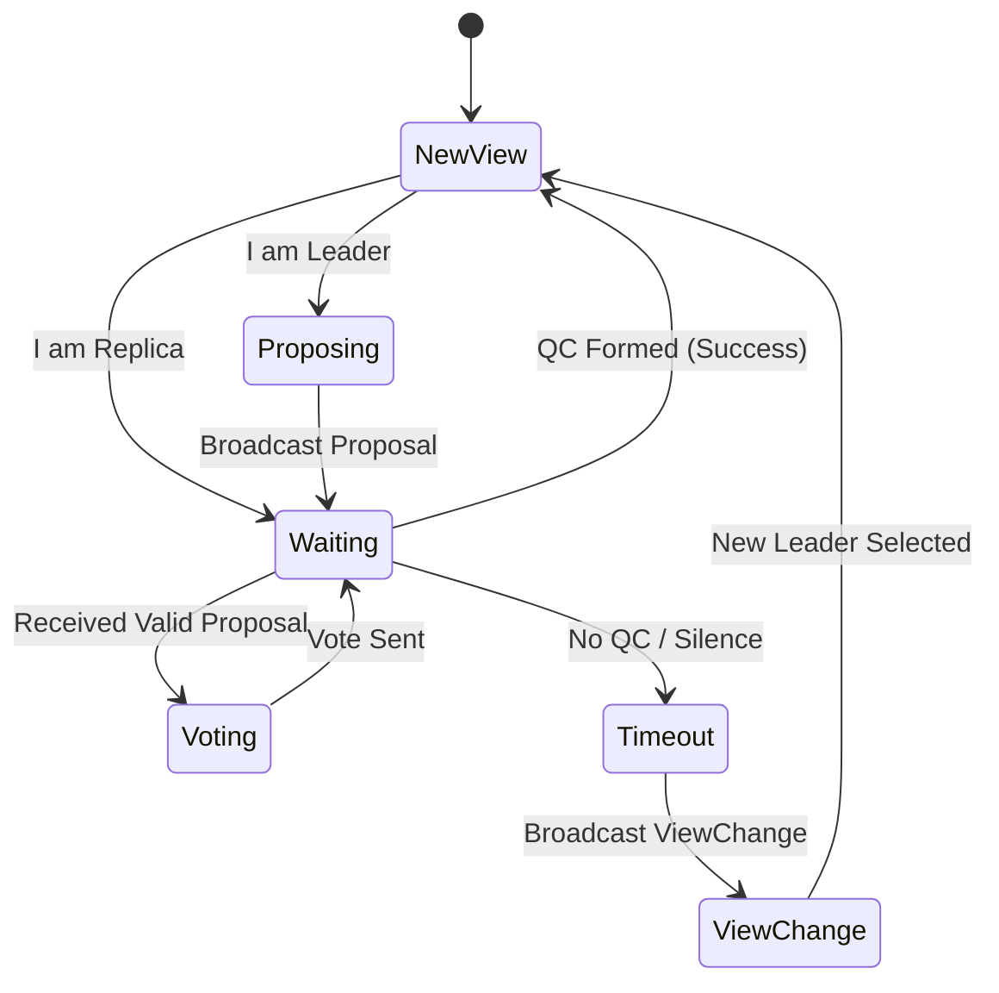

# Architecture 3: HotStuff Consensus
## 5-Node BFT (2-chain) - Actual Backend Implementation

**Last Updated:** 2026-01-29

This document describes the consensus protocol used by the backend validators. The implementation is HotStuff (2-chain) even though the package path contains `pbft/` (historical naming).

Primary code references:
- `backend/pkg/consensus/pbft/pbft.go` (HotStuff engine)
- `backend/pkg/consensus/api/engine.go` (orchestration, pacemaker, heartbeat, activation)
- `backend/pkg/consensus/messages/*` (message types + validation)
- `backend/pkg/consensus/types/common.go` (domains, IDs, message interfaces)
- `backend/cmd/cybermesh/main.go` (validator ID derivation and validator set)

---

## 1. Validator Identity and Quorum

### 1.1 ValidatorID

Validators are identified by a stable 32-byte identifier:

- `ValidatorID = SHA256(ed25519_public_key_bytes)`

This derivation happens in `backend/cmd/cybermesh/main.go` (`deriveValidatorID`).

### 1.2 Fault Model and Quorum

With `N=5` validators:

- `f = floor((N-1)/3) = 1` Byzantine failure tolerated
- quorum for votes/signatures is `2f+1 = 3`

---

## 2. Message Types and Signature Domains

Consensus messages are signed with Ed25519 using fixed domain separators (from `backend/pkg/consensus/types/common.go`):

- `CONSENSUS_PROPOSAL_V1`
- `CONSENSUS_VOTE_V1`
- `CONSENSUS_QC_V1`
- `CONSENSUS_VIEWCHANGE_V1`
- `CONSENSUS_NEWVIEW_V1`
- `CONSENSUS_HEARTBEAT_V1`

P2P transport uses topic names in the backend such as:

- `consensus/proposal`
- `consensus/vote`
- `consensus/viewchange`
- `consensus/newview`
- `consensus/heartbeat`

(See `backend/pkg/consensus/api/engine.go` topic mapping.)

---

## 3. HotStuff (2-chain) Protocol Sketch

This is not classic PBFT. There are no "Pre-Prepare/Prepare/Commit" phases; instead the core loop is Proposal -> Vote -> QC, with a 2-chain commit rule.

### 3.1 Consensus Loop (Visualized)



### 3.2 Proposal (Leader)

1. Leader is chosen by the leader rotation (`LeaderRotation`).
2. Leader builds a block proposal (typically from the mempool).
3. Proposal is signed (domain `CONSENSUS_PROPOSAL_V1`) and broadcast to peers.

### 3.3 Vote (Replicas)

On receiving a proposal, each validator:

1. Validates the proposal (structure + signatures + view/height rules + justifyQC rules, etc.).
2. Enforces safety: do not vote twice in the same view for different block hashes (`votesSent[view]`).
3. Signs a vote (domain `CONSENSUS_VOTE_V1`) and broadcasts it.

### 3.4 QC Formation (Leader)

The leader collects votes and, when quorum is reached (3 of 5), aggregates them into a Quorum Certificate (QC).

The pacemaker is notified when a QC is formed (see `HotStuff.OnProposal` and pacemaker callbacks in `backend/pkg/consensus/api/engine.go`).

### 3.5 2-chain Commit Rule (Simplified)

At a high level, HotStuff commits a block once it is safe according to the 2-chain rule (once a QC is formed for its descendant under the protocol's safety constraints).

This commit decision is internal to the HotStuff engine (`backend/pkg/consensus/pbft/pbft.go`) and results in:

- deterministic state machine execution
- persistence of committed blocks/state
- downstream outputs (e.g., commit and policy publications when Kafka is enabled)

---

## 4. View Change, Pacemaker, and Heartbeats

The backend wires a pacemaker and heartbeat subsystem to ensure liveness.

### 4.1 Pacemaker State Machine



### 4.2 Configuration

- Pacemaker config (from `backend/pkg/consensus/api/engine.go`):
  - `CONSENSUS_BASE_TIMEOUT` (default 10s)
  - `CONSENSUS_MIN_TIMEOUT` (default 5s)
  - `CONSENSUS_MAX_TIMEOUT` (default 60s)
  - `CONSENSUS_VIEWCHANGE_TIMEOUT` (default 30s)
- Heartbeat config (from `backend/pkg/consensus/api/engine.go`):
  - `CONSENSUS_HEARTBEAT_INTERVAL` (default 500ms)
  - `CONSENSUS_MAX_IDLE_TIME` (default 3s)
  - `CONSENSUS_MISSED_HEARTBEATS` (default 6)

If the leader becomes unresponsive, the pacemaker advances the view and leader rotation selects the next leader.

---

## 5. Implementation Map (Where Things Live)

```text
backend/pkg/consensus/api/engine.go
  - wires validator set, rotation, pacemaker, heartbeat, hotstuff engine
  - encodes/decodes messages and routes them by P2P topic

backend/pkg/consensus/pbft/pbft.go
  - HotStuff struct: view/height, lockedQC/prepareQC, pending votes, safety checks
  - proposal handling + vote generation + QC formation paths

backend/cmd/cybermesh/main.go
  - derives ValidatorID = sha256(pubkey)
  - builds validator set from environment and starts the node
```

