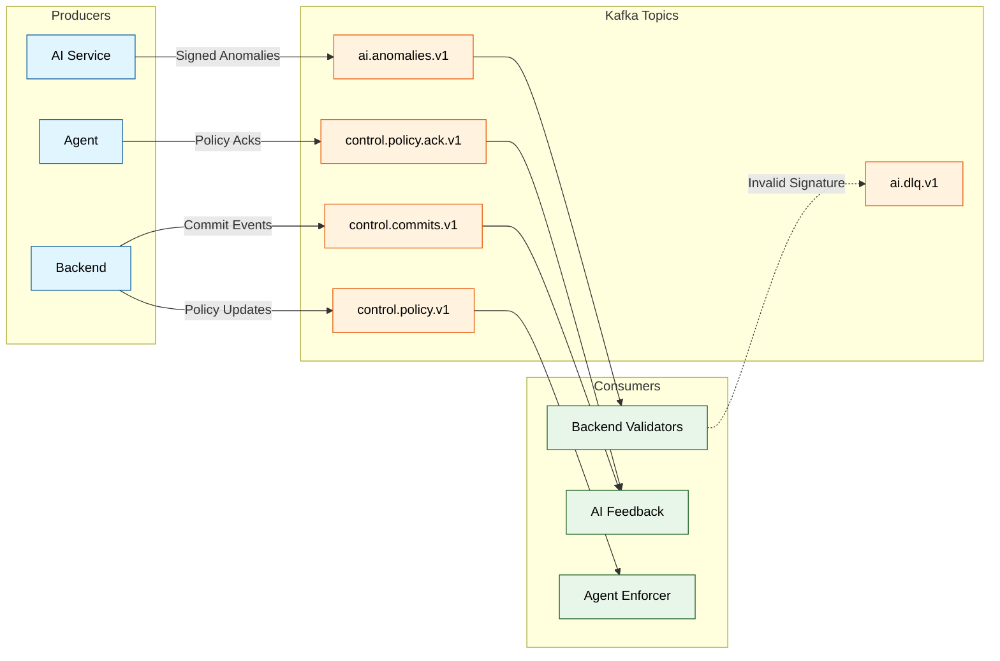

# Architecture 4: Kafka Message Bus
## Topics, Producers/Consumers, Wire Contracts, Verification

**Last Updated:** 2026-01-29

This document describes how CyberMesh uses Kafka to connect the AI service, backend validators, and enforcement agent.

Primary code references:
- Backend Kafka config: `backend/pkg/ingest/kafka/config.go`
- Backend wire schema + limits: `backend/pkg/ingest/kafka/schema.go`
- Backend verification: `backend/pkg/ingest/kafka/verifier.go`
- Backend producer signing (control topics): `backend/pkg/ingest/kafka/signing.go`
- Backend wiring (env knobs, signers): `backend/pkg/wiring/service.go`
- AI producer: `ai-service/src/kafka/producer.py`
- AI consumer: `ai-service/src/kafka/consumer.py`
- Agent Kafka client + ack publishing: `enforcement-agent/internal/kafka/*`, `enforcement-agent/internal/ack/*`

---

## 1. Topic Map (Defaults)

Topic names are configuration-driven. The defaults referenced in code are:



---

## 2. Consumer Group Behavior (Validators)

Consensus requires every validator to see the same AI inputs. The backend intentionally uses a separate consumer group per node, so each node consumes all partitions.

In `backend/cmd/cybermesh/main.go`:

- Base group: `KAFKA_CONSUMER_GROUP_ID` (default: `cybermesh-consensus`)
- Effective group: `cybermesh-consensus-node-{NODE_ID}` when `NODE_ID` is set

This is intentional duplication (not load balancing).

---

## 3. Transport Security and Kafka Client Config

### 3.1 Backend (Sarama)

`backend/pkg/ingest/kafka/config.go` builds a security-focused Sarama config:

- TLS is required in `production` and `staging` (`KAFKA_TLS_ENABLED` must be true).
- SASL is enabled; default mechanism is `SCRAM-SHA-512` (configurable).
- Compression defaults to `snappy` (configurable).
- Producer idempotence defaults to enabled (`KAFKA_PRODUCER_IDEMPOTENT=true`).

Note: idempotent producer settings reduce duplicates at the Kafka producer layer. End-to-end delivery should still be treated as at-least-once (consumers must be idempotent/dedup).

### 3.2 AI Service (confluent-kafka)

The AI producer config enables `enable.idempotence` and uses TLS/SASL settings based on environment configuration.

---

## 4. Wire Contracts and Limits

### 4.1 AI -> Backend (ai.* topics)

The backend parses protobuf payloads into typed messages in `backend/pkg/ingest/kafka/schema.go`:

- `AnomalyMsg` (ai.anomalies.v1)
- `EvidenceMsg` (ai.evidence.v1)
- `PolicyMsg` (ai.policy.v1)

DoS limits (enforced by schema validation and verifier):

- max total message: 1MB
- max payload: 512KB
- max proof blob: 256KB

### 4.2 Backend -> Others (control.* topics)

The backend publishes protobuf events (from `backend/proto/*`) and signs them:

- `control.commits.v1` (CommitEvent)
- `control.policy.v1` (PolicyUpdateEvent)

Signing domains are configurable:
- `CONTROL_SIGNING_DOMAIN` (default: `control.commits.v1`)
- `CONTROL_POLICY_SIGNING_DOMAIN` (default: `control.policy.v1`)

---

## 5. Signature Verification Rules (Backend on ai.* topics)

`backend/pkg/ingest/kafka/verifier.go` verifies AI messages with:

1. Structure + size validation (required fields + length checks)
2. Timestamp skew check (default +/- 5 minutes)
3. Payload size check (max 512KB)
4. Content hash check: `SHA256(payload)` must match `ContentHash`
5. Ed25519 signature check (domain + canonical bytes)

Canonical sign bytes (anomaly path) are constructed as:

```text
domainAnomaly + (ts_be_u64 || producer_id_len_be_u16 || producer_id || nonce_16 || content_hash_32)
```

Domain constants used by the verifier are:

- `domainAnomaly  = "ai.anomaly.v1"`
- `domainEvidence = "ai.evidence.v1"`
- `domainPolicy   = "ai.policy.v1"`

(These are signature domains; they may differ from the Kafka topic name string.)

---

## 6. DLQ (Backend)

When verification or processing fails, the backend can publish the raw message plus error context to a DLQ topic (default `ai.dlq.v1`), depending on consumer configuration.

---

## 7. Related Documents

- System overview: `docs/architecture/01_system_overview.md`
- AI pipeline: `docs/architecture/02_ai_detection_pipeline.md`
- Data flow: `docs/design/DATA_FLOW.md`

