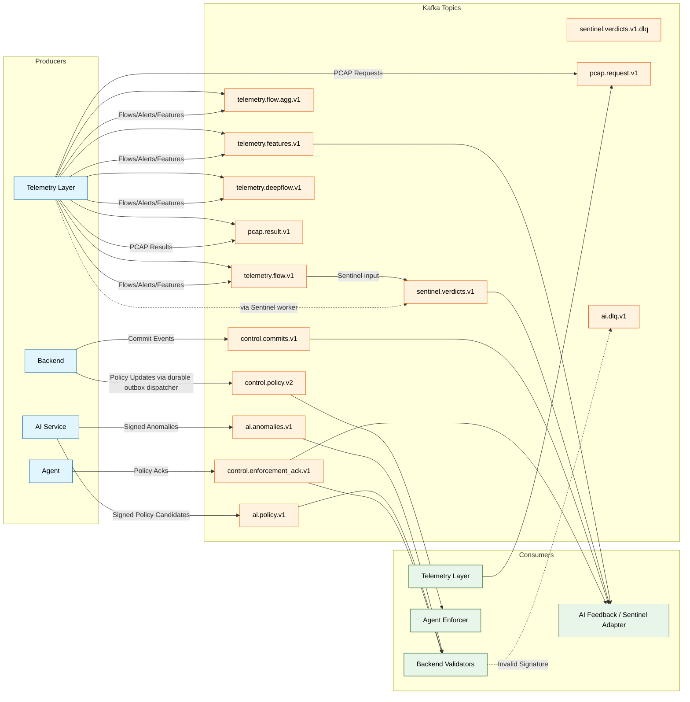

# Architecture 4: Kafka Message Bus
## Topics, Producers/Consumers, Wire Contracts, Verification

**Last Updated:** 2026-02-25

This document describes how CyberMesh uses Kafka to connect the telemetry layer, AI service, backend validators, and enforcement agent.

Primary code references:
- Backend Kafka config: `backend/pkg/ingest/kafka/config.go`
- Backend wire schema + limits: `backend/pkg/ingest/kafka/schema.go`
- Backend verification: `backend/pkg/ingest/kafka/verifier.go`
- Backend producer signing (control topics): `backend/pkg/ingest/kafka/signing.go`
- Backend wiring (env knobs, signers): `backend/pkg/wiring/service.go`
- Backend durable publish path: `backend/pkg/control/policyoutbox/*`
- Backend ACK correlation path: `backend/pkg/control/policyack/*`
- AI producer: `ai-service/src/kafka/producer.py`
- AI consumer: `ai-service/src/kafka/consumer.py`
- Agent Kafka client + ack publishing: `enforcement-agent/internal/kafka/*`, `enforcement-agent/internal/ack/*`
- Sentinel gateway worker: `sentinel/sentinel/kafka/gateway.py`
- Sentinel decode path: `sentinel/sentinel/kafka/telemetry_decoder.py`

---

## 1. Topic Map (Defaults)

Topic names are configuration-driven. The defaults referenced in code are:

Note: the policy-ack topic name is configuration-driven:
- AI: `TOPIC_CONTROL_POLICY_ACK`
- Backend: `CONTROL_POLICY_ACK_TOPIC`
- Enforcement agent: `ACK_TOPIC`
Current default is `control.enforcement_ack.v1`.

Control/data plane topic boundary:
- Control plane topics:
  - `ai.policy.v1`
  - `control.policy.v2`
- Data plane result topic:
  - `control.enforcement_ack.v1`

Interpretation:
- `control.policy.v2` is the control-plane instruction stream.
- Enforcement backends (`gateway`, `cilium`, `iptables`, `nftables`, `k8s`) are data-plane executors.
- `control.enforcement_ack.v1` is data-plane execution feedback.


```mermaid
graph LR
    subgraph Producers
        TL[Telemetry Layer]
        AI[AI Service]
        BE[Backend]
        AG[Agent]
    end

    subgraph Topics["Kafka Topics"]
        F1[telemetry.flow.v1]
        F2[telemetry.flow.agg.v1]
        F3[telemetry.features.v1]
        F4[telemetry.deepflow.v1]
        S1[sentinel.verdicts.v1]
        S2[sentinel.verdicts.v1.dlq]
        F5[pcap.request.v1]
        F6[pcap.result.v1]
        T1[ai.anomalies.v1]
        T1b[ai.policy.v1]
        T2[control.commits.v1]
        T3[control.policy.v2]
        T4[control.enforcement_ack.v1]
        DLQ[ai.dlq.v1]
    end

    subgraph Consumers
        BEC[Backend Validators]
        AIC[AI Feedback / Sentinel Adapter]
        AGC[Agent Enforcer]
        TLC[Telemetry Layer]
    end

    TL --> F1 & F2 & F3 & F4 & F6
    TLC --> F5
    F3 --> AIC
    F1 -->|Sentinel input| S1
    S1 --> AIC

    TL -->|Flows/Alerts/Features| F1 & F2 & F3 & F4
    TL -->|PCAP Results| F6
    TL -->|PCAP Requests| F5
    TL -.->|via Sentinel worker| S1

    AI -->|Signed Anomalies| T1
    AI -->|Signed Policy Candidates| T1b
    T1 --> BEC
    T1b --> BEC
    
    BE -->|Commit Events| T2
    T2 --> AIC
    
    BE -->|Policy Updates via durable outbox dispatcher| T3
    T3 --> AGC
    
    AG -->|Policy Acks| T4
    T4 --> BEC
    T4 --> AIC
    
    BEC -.->|Invalid Signature| DLQ

    classDef pro fill:#e1f5fe,stroke:#01579b,color:#000;
    classDef top fill:#fff3e0,stroke:#e65100,color:#000;
    classDef con fill:#e8f5e9,stroke:#1b5e20,color:#000;
    
    class TL,AI,BE,AG pro;
    class F1,F2,F3,F4,S1,S2,F5,F6,T1,T1b,T2,T3,T4,DLQ top;
    class BEC,AIC,AGC,TLC con;
```

---

## 2. Consumer Group Behavior (Validators)

Consensus requires every validator to see the same AI inputs. The backend intentionally uses a separate consumer group per node, so each node consumes all partitions.

In `backend/cmd/cybermesh/main.go`:

- Base group: `KAFKA_CONSUMER_GROUP_ID` (default: `cybermesh-consensus`)
- Effective group: `cybermesh-consensus-node-{NODE_ID}` when `NODE_ID` is set

This is intentional duplication (not load balancing).

---

## 3. Transport Security and Kafka Client Config

### 3.1 Backend (Sarama)

`backend/pkg/ingest/kafka/config.go` builds a security-focused Sarama config:

- TLS is required in `production` and `staging` (`KAFKA_TLS_ENABLED` must be true).
- SASL is enabled; default mechanism is `SCRAM-SHA-512` (configurable).
- Compression defaults to `snappy` (configurable).
- Producer idempotence defaults to enabled (`KAFKA_PRODUCER_IDEMPOTENT=true`).

Note: idempotent producer settings reduce duplicates at the Kafka producer layer. End-to-end delivery should still be treated as at-least-once (consumers must be idempotent/dedup).

### 3.2 AI Service (confluent-kafka)

The AI producer config enables `enable.idempotence` and uses TLS/SASL settings based on environment configuration.

---

## 4. Wire Contracts and Limits

### 4.1 AI -> Backend (ai.* topics)

The backend parses protobuf payloads into typed messages in `backend/pkg/ingest/kafka/schema.go`:

- `AnomalyMsg` (ai.anomalies.v1)
- `EvidenceMsg` (ai.evidence.v1)
- `PolicyMsg` (ai.policy.v1)

### 4.1.1 Sentinel -> AI topic

- `sentinel.verdicts.v1` carries `SentinelResultEvent` protobuf.
- Produced by Sentinel gateway worker, consumed by AI Sentinel adapter.
- Contract definition: `ai-service/proto/sentinel_result.proto`.

DoS limits (enforced by schema validation and verifier):

- max total message: 1MB
- max payload: 512KB
- max proof blob: 256KB

### 4.2 Backend -> Others (control.* topics)

The backend publishes protobuf events (from `backend/proto/*`) and signs them:

- `control.commits.v1` (CommitEvent)
- `control.policy.v2` (PolicyUpdateEvent)

`control.policy.v2` publication authority is implemented via durable outbox + leased dispatcher (single logical writer), not direct multi-writer publish from commit handlers.

### 4.3 Telemetry Topics

Telemetry topics use canonical Protobuf schemas (JSON allowed in dev/test):

- `telemetry.flow.v1` (FlowV1)
- `telemetry.flow.agg.v1` (FlowAgg)
- `telemetry.features.v1` (CIC v1 feature vector)
- `telemetry.deepflow.v1` (DeepFlowV1)
- `pcap.request.v1` / `pcap.result.v1`

Schema definitions live under `telemetry-layer/proto/` with generated bindings in `telemetry-layer/proto/gen/*`.

Signing domains are configurable:
- `CONTROL_SIGNING_DOMAIN` (default: `control.commits.v1`)
- `CONTROL_POLICY_SIGNING_DOMAIN` (default: `control.policy.v2`)

---

## 5. Signature Verification Rules (Backend on ai.* topics)

`backend/pkg/ingest/kafka/verifier.go` verifies AI messages with:

1. Structure + size validation (required fields + length checks)
2. Timestamp skew check (default +/- 5 minutes)
3. Payload size check (max 512KB)
4. Content hash check: `SHA256(payload)` must match `ContentHash`
5. Ed25519 signature check (domain + canonical bytes)

Canonical sign bytes (anomaly path) are constructed as:

```text
domainAnomaly + (ts_be_u64 || producer_id_len_be_u16 || producer_id || nonce_16 || content_hash_32)
```

Domain constants used by the verifier are:

- `domainAnomaly  = "ai.anomaly.v1"`
- `domainEvidence = "ai.evidence.v1"`
- `domainPolicy   = "ai.policy.v1"`

(These are signature domains; they may differ from the Kafka topic name string.)

---

## 6. DLQ (Backend)

When verification or processing fails, the backend can publish the raw message plus error context to a DLQ topic (default `ai.dlq.v1`), depending on consumer configuration.

---

## 7. Related Documents

- System overview: `docs/architecture/01_system_overview.md`
- Sentinel integration: `docs/architecture/13_sentinel_integration.md`
- AI pipeline: `docs/architecture/02_ai_detection_pipeline.md`
- Data flow: `docs/design/DATA_FLOW.md`
- Telemetry LLD: `docs/design/LLD-telemetry-layer.md`
