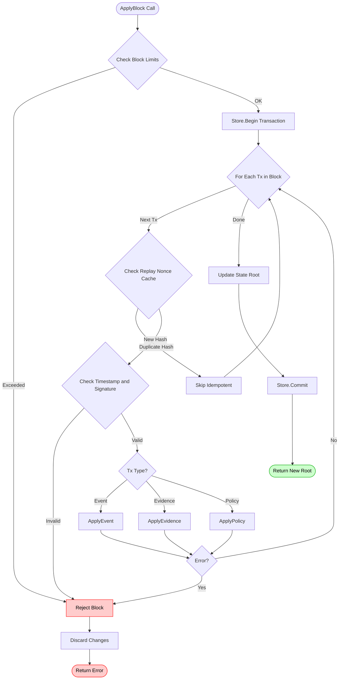

# Architecture 5: State Machine
## Deterministic Block Execution and State Roots (Backend)

**Last Updated:** 2026-01-29

This document describes the backend's deterministic state machine: how blocks of transactions are validated, applied, and turned into a verifiable state root.

Primary code references:
- `backend/pkg/state/executor.go` (ApplyBlock entry point + block-level limits + receipts)
- `backend/pkg/state/reducers.go` (ApplyEvent, ApplyEvidence, ApplyPolicy)
- `backend/pkg/state/store.go` (StateStore interface, MemStore, Txn)
- `backend/pkg/state/merkle.go` (deterministic Merkle root over KV pairs)
- `backend/pkg/state/query.go` (read helpers: proofs, nonce mapping, policy latest)

---

## 1. Core Entry Point: ApplyBlock

`ApplyBlock(store, now, skew, txs)` applies a list of transactions atomically.

Determinism properties (from code behavior):
- The caller passes `now` (block time); there is no `time.Now()` usage in the executor.
- There is no I/O (no DB/network/file reads) inside reducers/executor; the state machine only mutates the provided store transaction.
- Any validation or reducer error fails the whole block (fail-closed). The function returns partial receipts and an error, but does not commit.

Block-level limits (defense-in-depth):
- `MaxBlockTxs = 5000`
- `MaxBlockBytes = 16 MiB` (aggregate `len(tx.Payload())`)

---

## 2. Execution Flow

The execution process is designed to be **fail-closed**: any error invalidates the entire block.

Receipts include:
- index, tx type, content hash (from envelope if present), and an ExecCode

---

## 3. Data Model (Key Namespaces)

The reducers store payloads and derived indexes in a key-value namespace with string prefixes:

- `evt:{content_hash}`      -> event payload bytes
- `evi:{content_hash}`      -> evidence payload bytes
- `coc:{content_hash}{i}`   -> chain-of-custody ref hashes (by index)
- `pol:{content_hash}`      -> policy payload bytes
- `pol:latest`              -> latest policy content hash

Producer metadata + replay defense:

- `prod:last:{producer_id}` -> last timestamp (big-endian int64)
- `prod:cnt:{producer_id}`  -> event count (big-endian uint64)
- `nonce:{producer_id}{nonce}` -> content hash (bytes) for replay detection + forensics

---

## 4. Nonce Replay Handling (Execution-Time)

Admission paths should already dedupe, but the executor enforces nonce uniqueness again:

- If the same nonce maps to the same content hash, the tx is treated as an idempotent replay and is skipped with an OK receipt.
- If the same nonce maps to a different content hash, the block fails with `ErrNonceReplay`.

---

## 5. State Root Construction (Merkle)

The store computes a deterministic Merkle root over key-sorted KV pairs:

1. sort pairs by key bytes
2. leaf hash = `LeafHash(key, value)`
3. internal node hash = `NodeHash(left, right)`
4. odd leaf is carried by hashing with a zero right child

This is implemented in `backend/pkg/state/merkle.go` (`BuildRoot`).

---

## 6. Related Documents

- System overview: `docs/architecture/01_system_overview.md`
- HotStuff consensus: `docs/architecture/03_hotstuff_consensus.md`
- Backend LLD: `docs/design/LLD-backend.md`

