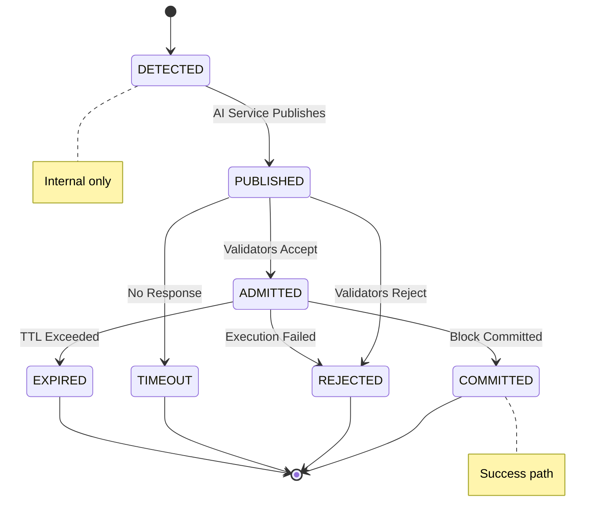

# Architecture 6: Feedback Loop
## Lifecycle Tracking, Acceptance Metrics, Calibration, Threshold Adjustment (AI Service)

**Last Updated:** 2026-01-29

This document describes the AI service "feedback loop": how it tracks anomaly lifecycles (detected -> published -> committed/rejected/etc) and uses those metrics to drive calibration and threshold adjustments.

Primary code references:
- Lifecycle tracker: `ai-service/src/feedback/tracker.py`
- Threshold adjustment: `ai-service/src/feedback/threshold_manager.py`
- Calibration model: `ai-service/src/feedback/calibrator.py`
- Feedback service wiring: `ai-service/src/feedback/service.py`

---

## 1. Lifecycle States

The tracker defines these states:

- DETECTED   (internal only)
- PUBLISHED  (sent to Kafka ai.anomalies.v1)
- ADMITTED   (accepted by validators / in mempool)
- COMMITTED  (finalized in a committed block)
- REJECTED   (validators rejected)
- TIMEOUT    (no response within window)
- EXPIRED    (TTL exceeded before commitment)

Allowed transitions are explicitly enforced in code (`VALID_TRANSITIONS`).

---

## 2. Storage Model (Redis)

The tracker uses a hybrid Redis model:

- Hash per anomaly for primary lifecycle data:
  - key: `anomaly:lifecycle:{anomaly_id}`
  - fields include: `state`, timestamps per stage, `anomaly_type`, `confidence`, `raw_score`, and optional policy/ack fields

- Timeline sorted sets for time-window queries:
  - `anomaly:timeline:{STATE}` where score is timestamp and value is anomaly_id
  - used to compute windowed counts (per-state)

- Hourly aggregate counters for fast metrics:
  - `metrics:state_counts:hourly:{hour_key}`
  - hash fields: `{STATE} -> count`

The lifecycle hash is expired using `lifecycle_ttl_seconds` from `FeedbackConfig`.

---

## 3. Acceptance Metrics

Acceptance metrics are computed from state counts in a time window:

- acceptance_rate = committed / published
- admission_rate  = admitted / published
- commitment_rate = committed / admitted
- rejection_rate  = rejected / published
- timeout_rate    = timeout / published

The tracker supports:
- aggregate metrics for a window (hourly buckets)
- per-anomaly-type metrics (more expensive: scans timelines and filters by type)

Window sizes and minimum samples come from `FeedbackConfig` (e.g., `metric_window_realtime`, `min_samples_realtime`, etc.).

---

## 4. Threshold Adjustment (ThresholdManager)

Thresholds are stored in Redis:

- `thresholds:current` (current thresholds map)
- `thresholds:history` (history list)

Default thresholds are initialized in code if none exist (example types: ddos, malware, port_scan, data_exfil).

Strategy (as implemented):
- If acceptance rate is below target ranges, increase threshold (be more selective).
- If acceptance rate is above target ranges, decrease threshold (detect more).
- Adjustments are clamped (min/max threshold and max adjustment step).

---

## 5. Calibration Model (Calibrator)

The calibrator supports:
- isotonic regression
- Platt scaling (logistic regression)

Retraining decision logic (`should_retrain`) considers:
- time since last train (retrain interval)
- new samples available vs `calibration_min_samples`
- low acceptance rate vs `calibration_acceptance_threshold` (when window has enough samples)

Models can be saved to:
- Redis (binary)
- filesystem (versioned + "latest")

---

## 6. Policy Acks (Optional)

The tracker has fields and methods to record policy dispatch and policy ACK results/latencies.

In the current architecture:
- the enforcement agent may publish ACKs to `control.policy.ack.v1`
- the AI service may consume those ACKs and record outcomes via `record_policy_ack`

---

## 7. Related Documents

- AI pipeline: `docs/architecture/02_ai_detection_pipeline.md`
- Kafka bus: `docs/architecture/04_kafka_message_bus.md`
- Data flow: `docs/design/DATA_FLOW.md`

