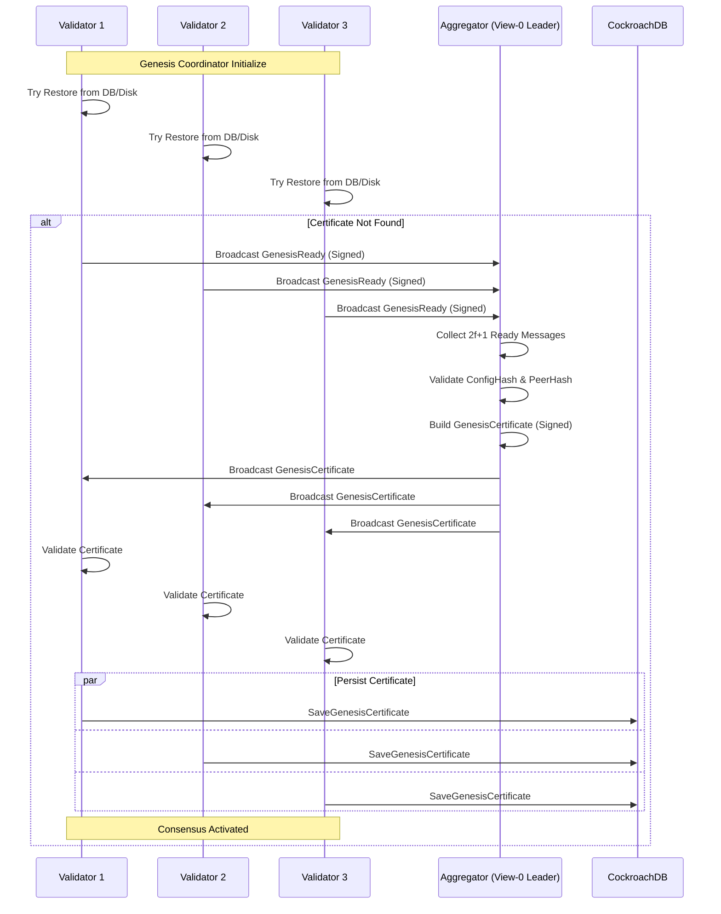

# Architecture 7: Genesis Bootstrap
## Genesis Ready + Certificate (Consensus Bring-Up)

**Last Updated:** 2026-01-29

This document describes how validators "bootstrap" consensus using a genesis readiness ceremony and a genesis certificate.

Primary code references:
- Coordinator: `backend/pkg/consensus/genesis/coordinator.go`
- Engine wiring: `backend/pkg/consensus/api/engine.go`
- DB persistence: `backend/pkg/storage/cockroach/adapter.go` (genesis certificate)

---

## 1. Why Genesis Exists

Before HotStuff/pacemaker/heartbeats are activated, validators need to confirm they agree on:

- the genesis configuration fingerprint (`ConfigHash`)
- the peer/topology fingerprint (`PeerHash`)

This prevents nodes from starting consensus with mismatched configs or peer sets.

---

## 2. Deterministic Aggregator and Quorum

- The "aggregator" is deterministic: the view-0 leader (`rotation.GetLeaderForView(ctx, 0)`).
- Required quorum is `2f+1` (computed from validator count when not explicitly configured).

For `N=5`, quorum is `3`.

---

## 3. Bootstrap Flow

---

## 4. Message Types and Signing

The ceremony uses consensus message types:

- `GenesisReady`
- `GenesisCertificate`

These messages are signed using the consensus crypto service:

- Coordinator uses `crypto.SignWithContext(ctx, msg.SignBytes())`.
- Verification happens through the consensus message validation path (the crypto signature is part of the encoded message).

Important: this signing format is different from Kafka message signatures (see `docs/architecture/09_security_model.md`).

---

## 5. Time Skew Tolerances

There are two relevant tolerances:

- `ClockSkewTolerance` (default: 5 seconds inside coordinator; engine wires a default of 10 seconds via config)
- `GenesisClockSkewTolerance` (default: 24 hours)

The coordinator uses the genesis tolerance for ceremony messages and falls back to the normal tolerance for certain checks (see coordinator code paths where it chooses between the two).

Config knobs (engine wiring):
- `CONSENSUS_CLOCK_SKEW_TOLERANCE` (default 10s)
- `CONSENSUS_GENESIS_CLOCK_SKEW_TOLERANCE` (default 24h)

---

## 6. Persistence and Restore

The coordinator persists a successfully validated genesis certificate in two places:

1. CockroachDB (if a storage backend is wired)
   - via `backend.LoadGenesisCertificate` / `backend.SaveGenesisCertificate`
2. Local filesystem (if `StatePath` is configured)
   - JSON state file written atomically (`.tmp` + rename)

On restart, the coordinator attempts restore in this order:

1. database restore
2. disk restore
3. otherwise start the ceremony and rebroadcast loop

---

## 7. Configuration Knobs (Coordinator Defaults)

Defaults inside `NewCoordinator`:

- `ReadyTimeout`: 30s
- `CertificateTimeout`: 60s
- `ClockSkewTolerance`: 5s
- `GenesisClockSkewTolerance`: 24h
- `ReadyRefreshInterval`: 0 (disabled unless configured)
- Rebroadcast backoff: base 5s up to 60s (bounded by `ReadyRefreshInterval` when set)

---

## 8. Related Documents

- HotStuff consensus: `docs/architecture/03_hotstuff_consensus.md`
- Cockroach persistence: `docs/architecture/08_cockroach_persistence.md`
- Security model: `docs/architecture/09_security_model.md`
