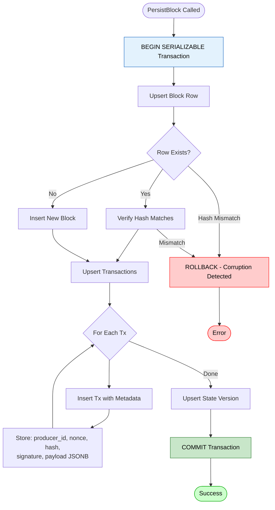

# Architecture 8: Cockroach Persistence
## Schema, Migrations, and Write Paths (Backend)

**Last Updated:** 2026-01-29

This document describes what the backend persists to CockroachDB and how.

Primary code references:
- DB adapter: `backend/pkg/storage/cockroach/adapter.go`
- Migrations: `backend/pkg/storage/cockroach/migrations/*.sql`
- Consensus persistence tables: `backend/pkg/storage/cockroach/migrations/002_consensus_persistence.sql`
- Genesis certificate table: `backend/pkg/storage/cockroach/migrations/003_genesis_certificate.sql` and `004_genesis_certificate_keyed.sql`

---

## 1. What Is Persisted

The backend persists:

- Committed blocks (`blocks`)
- Transactions per block with envelope/signature metadata (`transactions`)
- Versioned state snapshots (`state_versions`)
- Security/audit events (`audit_logs`)
- Validator metadata (`validators`)
- Reputation/quarantine/policy state tables (schema exists; usage depends on code paths)
- Consensus restart state (proposals, votes, QCs, metadata)
- Genesis certificate (for durable bootstrap restore)

---

## 2. Schema Source of Truth

The schema is defined by SQL migrations under:

```text
backend/pkg/storage/cockroach/migrations/
  001_init.sql
  002_consensus_persistence.sql
  003_genesis_certificate.sql
  004_genesis_certificate_keyed.sql
  ...
```

From these migrations, the DB includes (at least) the following tables:

```text
Core:
  blocks
  transactions
  state_versions
  validators
  audit_logs
  state_reputation
  state_quarantine
  state_policies

Consensus persistence:
  consensus_proposals
  consensus_qcs
  consensus_votes
  consensus_evidence
  consensus_metadata

Genesis:
  genesis_certificates
```

---

## 3. PersistBlock: Transactional Write Path

`adapter.PersistBlock(ctx, blk, receipts, stateRoot)` writes a committed block and its transactions.

Key properties from `backend/pkg/storage/cockroach/adapter.go`:

- Uses a DB transaction with SERIALIZABLE isolation:
  - `db.BeginTx(... Isolation: sql.LevelSerializable)`
- Uses INSERT ... ON CONFLICT DO NOTHING and then verifies idempotency by re-reading:
  - if a row already exists, the adapter checks that the existing hash/content matches (defense against corruption/mismatch)
- Writes:
  - the block header row (includes tx_root from the block header; QC fields are TODO placeholders in current code)
  - the transactions for that block, including:
    - producer_id, nonce, content_hash, pubkey, signature, alg
    - payload JSONB and optional custody chain JSONB
    - status derived from receipts



---

## 4. Consensus Persistence (Restart Recovery)

The adapter prepares statements for consensus persistence tables (proposals, votes, QCs, evidence, metadata).

This data is intended to support restarting the HotStuff engine without losing critical in-flight consensus state.

---

## 5. Genesis Certificate Persistence

The genesis coordinator persists the genesis certificate through the storage backend:

- `LoadGenesisCertificate(ctx) ([]byte, bool, error)`
- `SaveGenesisCertificate(ctx, data []byte) error`

The schema starts as a singleton row (migration 003) and is later extended to a keyed identity (migration 004).

---

## 6. Related Documents

- System overview: `docs/architecture/01_system_overview.md`
- Genesis bootstrap: `docs/architecture/07_genesis_bootstrap.md`
- Security model: `docs/architecture/09_security_model.md`

