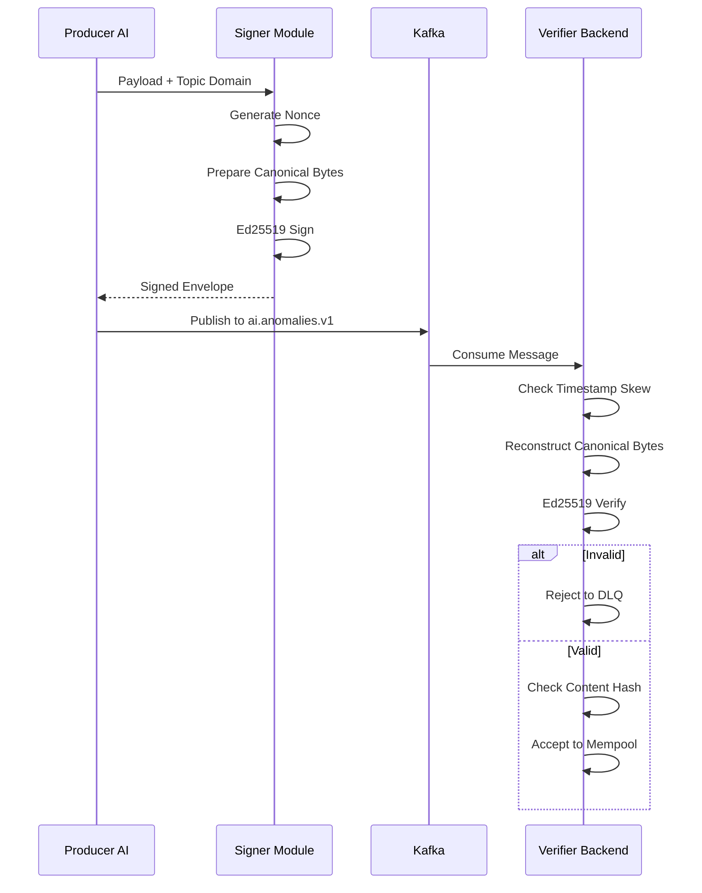

# Architecture 9: Security Model
## Transport, Auth, Message Signing, Verification, Replay Defense

**Last Updated:** 2026-01-29

This document summarizes the security mechanisms implemented in the CyberMesh codebase. It focuses on what is enforced in code (not aspirational controls).

Primary code references:
- Backend API auth/RBAC: `backend/pkg/api/middleware.go`, `backend/pkg/api/router.go`, `backend/pkg/config/config_api.go`
- Backend Kafka verification (AI messages): `backend/pkg/ingest/kafka/schema.go`, `backend/pkg/ingest/kafka/verifier.go`
- Backend Kafka signing (control topics): `backend/pkg/ingest/kafka/signing.go`, `backend/pkg/wiring/service.go`
- Consensus crypto service (versioned signatures + replay cache): `backend/pkg/utils/crypto.go`
- Consensus message domains: `backend/pkg/consensus/types/common.go`
- P2P/consensus message size limits: `backend/pkg/consensus/messages/encoding.go`

---

## 1. Network/Transport Controls

### 1.1 Kafka

Backend Sarama config (`backend/pkg/ingest/kafka/config.go`):
- TLS required in production/staging (`KAFKA_TLS_ENABLED` must be true).
- SASL enabled; SCRAM mechanisms supported/configurable.
- Producer idempotence enabled by default (`KAFKA_PRODUCER_IDEMPOTENT=true`).

AI service Kafka config (`ai-service/src/config/*`, `ai-service/src/kafka/*`) similarly supports TLS/SASL and idempotent producer settings.

### 1.2 Backend HTTP API

The backend API supports TLS and optional mTLS client authentication (see `backend/pkg/api/server.go`).

---

## 2. Backend API Authentication and RBAC

The backend applies a global auth middleware for non-public endpoints:

- Public endpoints: `/api/v1/health` and `/api/v1/ready`
- Auth methods:
  - mTLS client certificate (role derived from certificate CN)
  - Bearer token validation against configured allowlist (`API_BEARER_TOKENS`)
  - API key header is present as a dev-mode fallback but marked TODO for real validation

Production RBAC:
- In production, the backend can enforce RBAC by endpoint prefixes.
- RBAC is only enabled when a client CA is configured (`API_TLS_CLIENT_CA_FILE`), otherwise it is disabled at startup.

---

## 3. Kafka Message Authenticity and Integrity

There are two distinct signing schemes in the system:

### 3.1 AI -> Backend (Signing Flow)

The system uses **Ed25519** signatures with strict domain separation.

Enforced checks (anomaly/evidence/policy paths):
- structure + required fields + length checks (see `schema.go`)
- timestamp skew check (default +/- 5 minutes)
- payload/proof/params size limits:
  - payload max 512KB
  - proof blob max 256KB
  - total message max 1MB
- content hash check:
  - `SHA256(payload_or_blob)` must equal `ContentHash`
- Ed25519 signature verification over canonical sign bytes
- producer/pubkey mismatch rejection
- policy pubkey allowlist (optional) for `ai.policy.v1`

Signature domains used by the backend verifier are:
- `ai.anomaly.v1`
- `ai.evidence.v1`
- `ai.policy.v1`

These are signature domains (domain separation strings); they are not necessarily identical to Kafka topic names.

Replay defense:
- Kafka verifier does not use the consensus replay cache.
- Replay is handled via nonce tracking/dedup in the backend execution path (see `backend/pkg/state/executor.go` nonce mapping).

### 3.2 Backend -> Others (control.* topics)

The backend signs protobuf events for:
- `control.commits.v1` (CommitEvent)
- `control.policy.v1` (PolicyUpdateEvent)

Signing implementation (`backend/pkg/ingest/kafka/signing.go`):
- `ed25519.Sign(privateKey, domain || proto_bytes)`
- fields set on the protobuf message: `Signature`, `Pubkey`, `Alg`

There is no version/timestamp/nonce signature wrapper on these control-topic protobuf messages.

---

## 4. Consensus / P2P Message Signing (Non-Kafka)

Consensus messages (proposal, vote, QC, viewchange, newview, heartbeat, and genesis messages) are signed via the consensus crypto service:

- `backend/pkg/utils/crypto.go` implements a versioned signature package:
  - `[version(4B)][timestamp(8B)][nonce(16B if enabled)][signature(64B)]`
- Replay protection is implemented with an in-memory replay cache keyed by `(nonce, payload_hash)`, default size 10000.

Domain separation for consensus messages uses fixed strings (see `backend/pkg/consensus/types/common.go`), e.g.:
- `CONSENSUS_PROPOSAL_V1`
- `CONSENSUS_VOTE_V1`
- `CONSENSUS_HEARTBEAT_V1`
- `CONSENSUS_GENESIS_READY_V1`
- `CONSENSUS_GENESIS_CERT_V1`

Key rotation support:
- `utils.CryptoService` supports versioned keys and optional auto-rotation, but whether auto-rotation is enabled depends on configuration.

---

## 5. Size Limits / DoS Guardrails

Examples of enforced limits:

- Kafka message size limits (backend schema/verifier):
  - total message max 1MB
  - payload max 512KB
  - proof blob max 256KB
- Consensus message encoding has per-type max sizes (config-driven) (see `backend/pkg/consensus/messages/encoding.go`)

---

## 6. Related Documents

- Kafka bus: `docs/architecture/04_kafka_message_bus.md`
- Genesis bootstrap: `docs/architecture/07_genesis_bootstrap.md`
- Backend LLD: `docs/design/LLD-backend.md`

