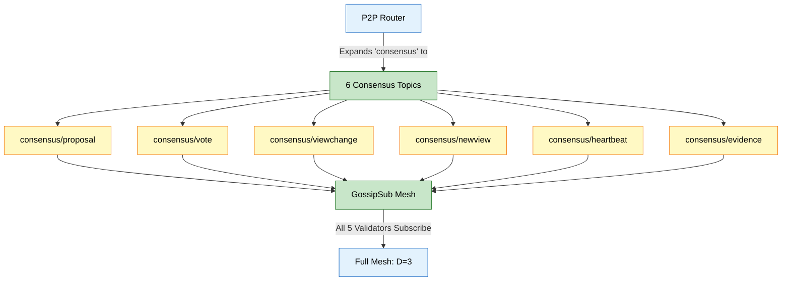

# Architecture 10: P2P Networking
## libp2p Host, DHT Discovery, GossipSub Topics (Backend)

**Last Updated:** 2026-01-29

This document describes the backend validator P2P layer used for consensus message transport.

Primary code references:
- Router: `backend/pkg/p2p/router.go`
- Connection state/trust: `backend/pkg/p2p/state.go`
- Consensus topic bridge: `backend/pkg/p2p/consensus_bridge.go`

---

## 1. What P2P Is Used For

P2P transports consensus messages between validators (proposals, votes, view changes, heartbeats, etc.).

P2P is not used for Kafka ingestion; Kafka remains the bus between services (AI <-> Backend <-> Agent).

---

## 2. Identity and Trust Gates

### 2.1 Deterministic Peer Identity

Peer identity is derived deterministically:

- Prefer `P2P_ID_SEED` (hex; must be at least 32 bytes)
- Else derive from the backend crypto service public key (hashed)
- In production/staging: random identities are forbidden (startup fails without a seed)

### 2.2 Connection Gating

The router enforces transport-level gating:

- `ALLOWED_IPS` allowlist (CIDRs)
- optional `TRUSTED_P2P_PEERS` list
- quarantine decisions from the P2P State

---

## 3. Discovery

The router builds a Kademlia DHT and uses routing-based discovery.

Optional local discovery:
- mDNS can be enabled for dev/test environments.

Peer dialing:
- Explicit bootstrap peers can be configured (`P2P_BOOTSTRAP_PEERS`) as multiaddrs or hostnames.
- Discovery loop periodically attempts to connect to discovered peers.

---

## 4. PubSub (GossipSub)

The router uses GossipSub (message signing enabled, strict signature verification enabled).

Important: the network is not a guaranteed full mesh. GossipSub maintains a mesh with parameters tuned for small validator clusters.

Default GossipSub mesh parameters (router config):
- `D = 3`
- `Dlo = 2`
- `Dhi = 4`
- `Dlazy = 4`
- `HeartbeatInterval = 1s`

Peer scoring is enabled and wired to the P2P State (app-specific score).

---

## 5. Topics

Topics are plain strings (not `/cybermesh/...` paths). They come from:

- `P2P_TOPICS` (config) and/or
- the consensus layer attaching handlers

If the topic list contains `consensus`, the router expands it to avoid mismatches:

**GossipSub Parameters:** D=3 (each validator maintains 3 peers per topic)

The router also supports an internal "adjacency" topic used for diagnostics/telemetry.

---

## 6. Size Limits and DoS Guardrails

The router enforces:
- max message size checks (`P2P_MAX_MESSAGE_SIZE`)
- per-topic maximum sizes via topic validators (`TopicMaxSize` map)

Handler concurrency is bounded by a semaphore (`P2P_MAX_HANDLER_GOROUTINES`).

---

## 7. GKE Deployment Notes (Current Manifests)

In `k8s_gke/configmap.yaml`, validators set:

- `P2P_LISTEN_PORT=8001`
- `P2P_BOOTSTRAP_PEERS` contains multiaddrs for all validator pods (via the headless service DNS)

The headless service `validator-headless` exposes:
- P2P: 8001
- API: 443
- metrics: 9100

---

## 8. Related Documents

- HotStuff consensus: `docs/architecture/03_hotstuff_consensus.md`
- System timeline: `docs/architecture/11_system_timeline.md`
- GKE deployment: `docs/architecture/12_gke_deployment.md`

