# Architecture 11: System Timeline
## Operational Timing Across AI, Consensus, and Enforcement

**Last Updated:** 2026-01-29

This document summarizes the key "clocks" in CyberMesh. Values are taken from code defaults and/or the current GKE manifests.

Primary code references:
- AI loop: `ai-service/src/service/detection_loop.py`, `ai-service/src/ml/pipeline.py`
- Backend block build: `backend/cmd/cybermesh/main.go`, `backend/pkg/wiring/service.go`
- Consensus heartbeat/pacemaker: `backend/pkg/consensus/api/engine.go`
- Enforcement agent metrics/control: `k8s_gke/daemonset.yaml` (runtime env)

---

## 1. AI Detection Loop (AI Service)

Scheduling:
- `DETECTION_INTERVAL` default is 5 seconds (background daemon thread).

Per-iteration telemetry size:
- `TELEMETRY_BATCH_SIZE` default 1000
- `MAX_FLOWS_PER_ITERATION` default 100
- Effective `limit = min(MAX_FLOWS_PER_ITERATION, TELEMETRY_BATCH_SIZE)` in `DetectionPipeline.process()`

Publishing rate limit:
- `max_detections_per_second` default is 100 (see AI settings + rate limiter)

```mermaid
gantt
    title System Timing (Default Configuration)
    dateFormat X
    axisFormat %Ls
    
    section AI Service
    Detection Loop (5s interval)     :a1, 0, 5000
    Detection Loop (5s interval)     :a2, 5000, 10000
    Detection Loop (5s interval)     :a3, 10000, 15000
    
    section Backend Validators
    Block Build (500ms)              :b1, 0, 500
    Block Build (500ms)              :b2, 500, 1000
    Block Build (500ms)              :b3, 1000, 1500
    Block Build (500ms)              :b4, 1500, 2000
    Block Build (500ms)              :b5, 2000, 2500
    Block Build (500ms)              :b6, 2500, 3000
    Block Build (500ms)              :b7, 3000, 3500
    Block Build (500ms)              :b8, 3500, 4000
    Block Build (500ms)              :b9, 4000, 4500
    Block Build (500ms)              :b10, 4500, 5000
    
    section Consensus Heartbeat
    Heartbeat (500ms)                :c1, 0, 500
    Heartbeat (500ms)                :c2, 500, 1000
    Heartbeat (500ms)                :c3, 1000, 1500
    Heartbeat (500ms)                :c4, 1500, 2000
    Heartbeat (500ms)                :c5, 2000, 2500
    Heartbeat (500ms)                :c6, 2500, 3000
    Heartbeat (500ms)                :c7, 3000, 3500
    Heartbeat (500ms)                :c8, 3500, 4000
    Heartbeat (500ms)                :c9, 4000, 4500
    Heartbeat (500ms)                :c10, 4500, 5000
```

**Key Observations:**
- AI runs **10x slower** than backend/consensus (5s vs 500ms)
- Block building and heartbeats are **synchronized** at 500ms intervals
- Within each 5s AI cycle, validators can propose **~10 blocks**

---

## 2. Backend Block Build Loop (Validators)

Block build cadence is configured in the backend wiring config.

Default in `backend/cmd/cybermesh/main.go`:
- `BLOCK_BUILD_INTERVAL` defaults to 500ms
- `BLOCK_MIN_MEMPOOL_TXS` defaults to 1

This means the proposer attempts to build/propose blocks frequently, but actual propose/commit cadence depends on mempool contents and consensus liveness.

---

## 3. Consensus Liveness (HotStuff + Pacemaker + Heartbeats)

Consensus engine timing defaults in `backend/pkg/consensus/api/engine.go`:

Heartbeats:
- `CONSENSUS_HEARTBEAT_INTERVAL` default 500ms
- `CONSENSUS_MISSED_HEARTBEATS` default 6
- `CONSENSUS_MAX_IDLE_TIME` default 3s

Pacemaker / view timeouts:
- `CONSENSUS_BASE_TIMEOUT` default 10s
- `CONSENSUS_MIN_TIMEOUT` default 5s
- `CONSENSUS_MAX_TIMEOUT` default 60s
- `CONSENSUS_VIEWCHANGE_TIMEOUT` default 30s

Genesis skew tolerance:
- `CONSENSUS_GENESIS_CLOCK_SKEW_TOLERANCE` default 24h

---

## 4. Enforcement Agent (DaemonSet)

The enforcement agent consumes policies from Kafka and exposes metrics/health on:
- `METRICS_ADDR` default `:9094` in `k8s_gke/daemonset.yaml`

Policy apply latency depends on backend (iptables/nftables/k8s) and host performance; it is not fixed in code defaults.

---

## 5. Related Documents

- AI detection pipeline: `docs/architecture/02_ai_detection_pipeline.md`
- Kafka message bus: `docs/architecture/04_kafka_message_bus.md`
- HotStuff consensus: `docs/architecture/03_hotstuff_consensus.md`
- Genesis bootstrap: `docs/architecture/07_genesis_bootstrap.md`

