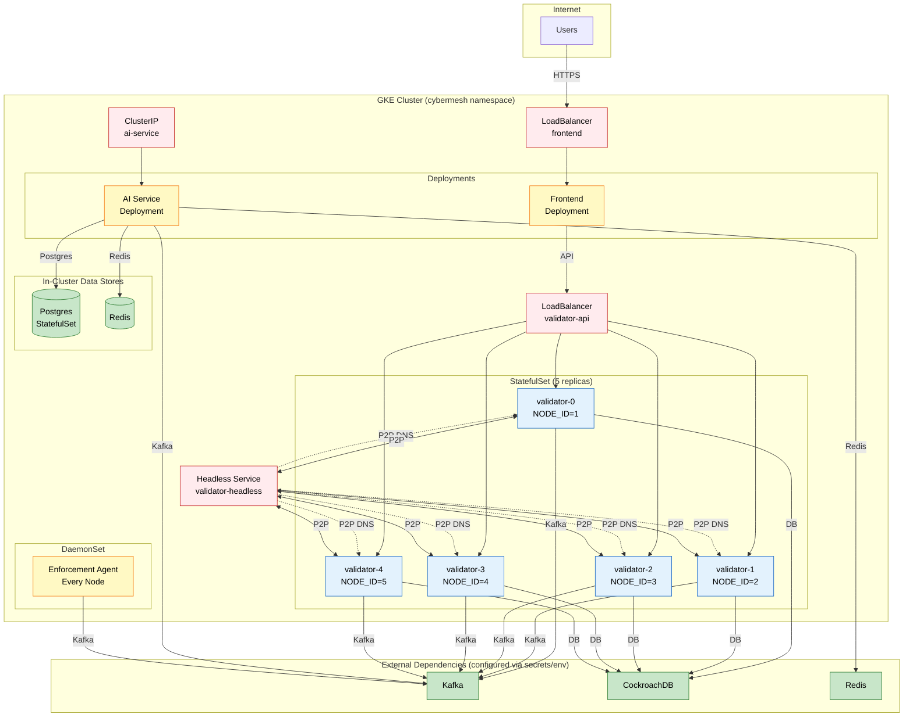
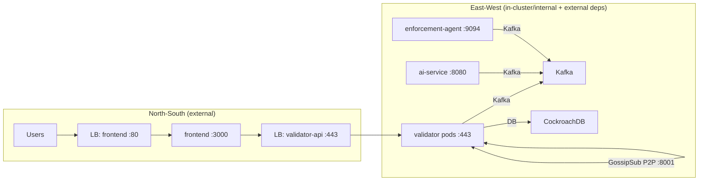

# Architecture 12: GKE Deployment
## Kubernetes Manifests and Runtime Topology (k8s_gke/)

**Last Updated:** 2026-01-30

This document summarizes how the current CyberMesh manifests deploy the system on GKE.
It intentionally avoids including any sensitive values (no keys, passwords, usernames, or full DSNs).

Primary source of truth:
- `k8s_gke/*`

---

## 1. Namespace

- Namespace: `cybermesh` (see `k8s_gke/namespace.yaml`)

---

## 2. Core Workloads

### 2.1 Backend Validators (StatefulSet)

- `k8s_gke/statefulset.yaml`
- Replicas: 5
- Pod naming: `validator-{0..4}`
- P2P listen port: `P2P_LISTEN_PORT=8001` (from `k8s_gke/configmap.yaml`)
- Headless service for stable DNS:
  - `k8s_gke/service-headless.yaml` (`validator-headless`)

Services:
- `validator-headless` (ClusterIP None) exposes:
  - API 443
  - P2P 8001
  - metrics 9100
- `validator-api` (LoadBalancer) exposes:
  - API 443
  - metrics 9100

Notes:
- `NODE_ID` is derived from the StatefulSet ordinal (validator-0 -> NODE_ID=1).
- Commit/policy signing keys are injected via env/volume and written to a local path inside the container for the backend to load.

### 2.2 AI Service (Deployment)

- `k8s_gke/ai-service-deployment.yaml`
- Exposes:
  - API 8080
  - metrics 10000
- Model artifacts are synced from GCS into a volume in an init container (see the `sync-models-datasets` init container).
- Service `k8s_gke/ai-service-service.yaml` is `ClusterIP` (internal-only).

### 2.3 Enforcement Agent (DaemonSet)

- `k8s_gke/daemonset.yaml`
- Runs on every node (`hostNetwork: true`, privileged with `NET_ADMIN` capability).
- Consumes policies from Kafka topic `control.policy.v1`.
- Exposes metrics/health/control on `:9094`.

### 2.4 Frontend (Deployment)

- `k8s_gke/frontend-deployment.yaml`
- Service `k8s_gke/frontend-service.yaml`:
  - LoadBalancer on port 80 -> container port 3000

### 2.5 Deployment Topology

---

### 2.6 North-South vs East-West Traffic (Diagram)

---

## 3. Data Stores (Current Manifests)

### 3.1 CockroachDB

The validator StatefulSet contains an initContainer that checks TCP connectivity to a CockroachDB endpoint on port 26257.
In the current manifests, this is configured as an external CockroachDB endpoint (not an in-cluster CockroachDB StatefulSet).

### 3.2 Postgres (AI service)

There is an in-cluster Postgres StatefulSet for AI service needs:
- `k8s_gke/postgres-statefulset.yaml`

### 3.3 Redis

Redis is deployed via:
- `k8s_gke/redis.yaml`

---

## 4. Networking and Security

- Network policies: `k8s_gke/network-policies.yaml`
- Cloud Armor backend configs:
  - `k8s_gke/cloud-armor-backendconfig.yaml`
- Secrets/config:
  - `k8s_gke/configmap.yaml` (backend env)
  - `k8s_gke/secret.yaml` + service-specific secrets/configmaps

---

## 5. Related Documents

- System overview: `docs/architecture/01_system_overview.md`
- P2P networking: `docs/architecture/10_p2p_networking.md`
- Kafka bus: `docs/architecture/04_kafka_message_bus.md`
