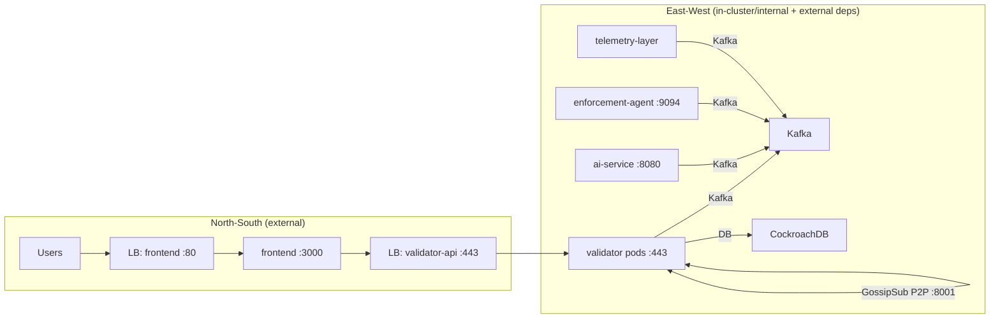

# Architecture 12: GKE Deployment
## Kubernetes Manifests and Runtime Topology (k8s_gke/)

**Last Updated:** 2026-02-18

This document summarizes how the current CyberMesh manifests deploy the system across GKE and Azure-oriented manifest sets.
It intentionally avoids including any sensitive values (no keys, passwords, usernames, or full DSNs).

Primary source of truth:
- Core GKE stack: `k8s_gke/*`
- Telemetry/Sentinel operational manifests: `k8s_azure/telemetry/*`, `k8s_azure/sentinel/*`

---

## 1. Namespace

- Namespace: `cybermesh` (see `k8s_gke/namespace.yaml`)

---

## 2. Core Workloads

### 2.1 Backend Validators (StatefulSet)

- `k8s_gke/statefulset.yaml`
- Replicas: 5
- Pod naming: `validator-{0..4}`
- P2P listen port: `P2P_LISTEN_PORT=8001` (from `k8s_gke/configmap.yaml`)
- Headless service for stable DNS:
  - `k8s_gke/service-headless.yaml` (`validator-headless`)

Services:
- `validator-headless` (ClusterIP None) exposes:
  - API 443
  - P2P 8001
  - metrics 9100
- `validator-api` (LoadBalancer) exposes:
  - API 443
  - metrics 9100

Notes:
- `NODE_ID` is derived from the StatefulSet ordinal (validator-0 -> NODE_ID=1).
- Commit/policy signing keys are injected via env/volume and written to a local path inside the container for the backend to load.

### 2.2 AI Service (Deployment)

- `k8s_gke/ai-service-deployment.yaml`
- Exposes:
  - API 8080
  - metrics 10000
- Model artifacts are synced from GCS into a volume in an init container (see the `sync-models-datasets` init container).
- Service `k8s_gke/ai-service-service.yaml` is `ClusterIP` (internal-only).

### 2.3 Enforcement Agent (DaemonSet)

- `k8s_gke/daemonset.yaml`
- Runs on every node (`hostNetwork: true`, privileged with `NET_ADMIN` capability).
- Consumes policies from Kafka topic `control.policy.v1`.
- Backend mode is configured by `ENFORCEMENT_BACKEND` and supports:
  - `cilium`, `gateway`, `iptables`, `nftables`, `kubernetes`/`k8s`, `noop`
- Exposes metrics/health/control on `:9094`.

Related manifests in repo:
- `k8s_gke/enforcement-agent-cilium.yaml`
- `k8s_gke/enforcement-agent-daemonset-cilium-dryrun.yaml`
- `k8s_gke/telemetry/gateway-gate/*` (gateway gate validation setup)

### 2.4 Frontend (Deployment)

- `k8s_gke/frontend-deployment.yaml`
- Service `k8s_gke/frontend-service.yaml`:
  - LoadBalancer on port 80 -> container port 3000

### 2.5 Telemetry Layer and Sentinel Manifests

In the current repo layout:

- `k8s_gke/telemetry/*` contains gate-focused manifests (gateway/hostfw validation paths).
- Runtime telemetry pipeline manifests are maintained under `k8s_azure/telemetry/layer/*`, including:
  - `01-telemetry-pipeline.yaml`
  - `02-gateway-adapter.yaml`
  - `03-baremetal-adapter.yaml`
  - `04-cloudlogs-adapter.yaml`
  - `07-edge-feature-transformer.yaml`
- Sentinel Kafka integration job is maintained under:
  - `k8s_azure/sentinel/sentinel-kafka-ai-integration-job.yaml`

These services are configured via ConfigMap/Secrets and connect to Kafka for ingest/output.

### 2.6 Deployment Topology

```mermaid
graph TB
    subgraph Internet
        User[Users]
    end

    subgraph External["External Dependencies (configured via secrets/env)"]
        Kafka[Kafka]
        CRDB[CockroachDB]
        ExtRedis[Redis]
    end

    subgraph GKE["GKE Cluster (cybermesh namespace)"]
        subgraph Validators["StatefulSet (5 replicas)"]
            V0[validator-0<br/>NODE_ID=1]
            V1[validator-1<br/>NODE_ID=2]
            V2[validator-2<br/>NODE_ID=3]
            V3[validator-3<br/>NODE_ID=4]
            V4[validator-4<br/>NODE_ID=5]
        end
        
        subgraph Services["Deployments"]
            S[Sentinel Gateway<br/>Job (azure manifest set)]
            AI[AI Service<br/>Deployment]
            FE[Frontend<br/>Deployment]
        end

        subgraph Telemetry["Telemetry Layer (azure manifest set)"]
            SP[Telemetry Pipeline<br/>Deployment]
            FT[Edge Feature Transformer<br/>Deployment]
            AD[Adapters<br/>Gateway/Baremetal/Cloudlogs]
            PCAP[PCAP Service<br/>Pipeline path]
        end
        
        subgraph Agents["DaemonSet"]
            Agent[Enforcement Agent<br/>Every Node]
        end
        
        subgraph Data["In-Cluster Data Stores"]
            PG[(Postgres<br/>StatefulSet)]
            InRedis[(Redis)]
        end
        
        LB1[LoadBalancer<br/>validator-api]
        LB2[LoadBalancer<br/>frontend]
        HL[Headless Service<br/>validator-headless]
        AISVC[ClusterIP<br/>ai-service]
    end
    
    User -->|HTTPS| LB2
    LB2 --> FE
    FE -->|API| LB1
    
    LB1 --> V0 & V1 & V2 & V3 & V4
    HL -.->|P2P DNS| V0 & V1 & V2 & V3 & V4
    
    V0 & V1 & V2 & V3 & V4 <-->|P2P| HL
    V0 & V1 & V2 & V3 & V4 -->|DB| CRDB
    V0 & V1 & V2 & V3 & V4 -->|Kafka| Kafka

    S -->|Consume telemetry.flow.v1| Kafka
    S -->|Publish sentinel.verdicts.v1| Kafka
    AI -->|Consume sentinel.verdicts.v1| Kafka
    AI -->|Kafka| Kafka
    Agent -->|Kafka| Kafka
    SP -->|Kafka| Kafka
    FT -->|Kafka| Kafka
    AD -->|Kafka| Kafka
    PCAP -->|Kafka| Kafka
    AI -->|Redis| ExtRedis
    AI -->|Redis| InRedis
    AI -->|Postgres| PG
    AISVC --> AI
    
    classDef validator fill:#e3f2fd,stroke:#1565c0,color:#000;
    classDef service fill:#fff9c4,stroke:#f57f17,color:#000;
    classDef data fill:#c8e6c9,stroke:#2e7d32,color:#000;
    classDef lb fill:#ffebee,stroke:#c62828,color:#000;
    
    class V0,V1,V2,V3,V4 validator;
    class S,AI,FE,Agent service;
    class Kafka,CRDB,ExtRedis,PG,InRedis data;
    class LB1,LB2,HL,AISVC lb;
```

---

### 2.6 North-South vs East-West Traffic (Diagram)

```mermaid
flowchart LR
    subgraph NorthSouth["North-South (external)"]
        U[Users] --> FE_LB[LB: frontend :80]
        FE_LB --> FE[frontend :3000]
        FE --> BE_LB[LB: validator-api :443]
    end

    subgraph EastWest["East-West (in-cluster/internal + external deps)"]
        BE_LB --> V[validator pods :443]
        V <-->|GossipSub P2P :8001| V
        V -->|Kafka| Kafka[Kafka]
        V -->|DB| CRDB[CockroachDB]
        AI[ai-service :8080] -->|Kafka| Kafka
        EA[enforcement-agent :9094] -->|Kafka| Kafka
        TL[telemetry-layer] -->|Kafka| Kafka
    end
```

---

## 3. Data Stores (Current Manifests)

### 3.1 CockroachDB

The validator StatefulSet contains an initContainer that checks TCP connectivity to a CockroachDB endpoint on port 26257.
In the current manifests, this is configured as an external CockroachDB endpoint (not an in-cluster CockroachDB StatefulSet).

### 3.2 Postgres (AI service)

There is an in-cluster Postgres StatefulSet for AI service needs:
- `k8s_gke/postgres-statefulset.yaml`

### 3.3 Redis

Redis is deployed via:
- `k8s_gke/redis.yaml`

---

## 4. Networking and Security

- Network policies: `k8s_gke/network-policies.yaml`
- Cloud Armor backend configs:
  - `k8s_gke/cloud-armor-backendconfig.yaml`
- Secrets/config:
  - `k8s_gke/configmap.yaml` (backend env)
  - `k8s_gke/secret.yaml` + service-specific secrets/configmaps

---

## 5. Related Documents

- System overview: `docs/architecture/01_system_overview.md`
- P2P networking: `docs/architecture/10_p2p_networking.md`
- Kafka bus: `docs/architecture/04_kafka_message_bus.md`
- Sentinel integration: `docs/architecture/13_sentinel_integration.md`
