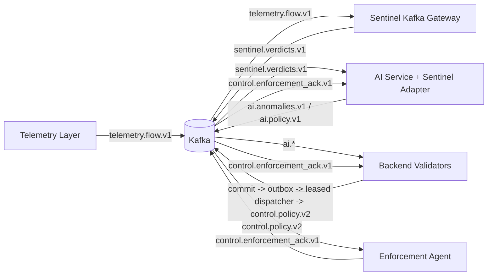
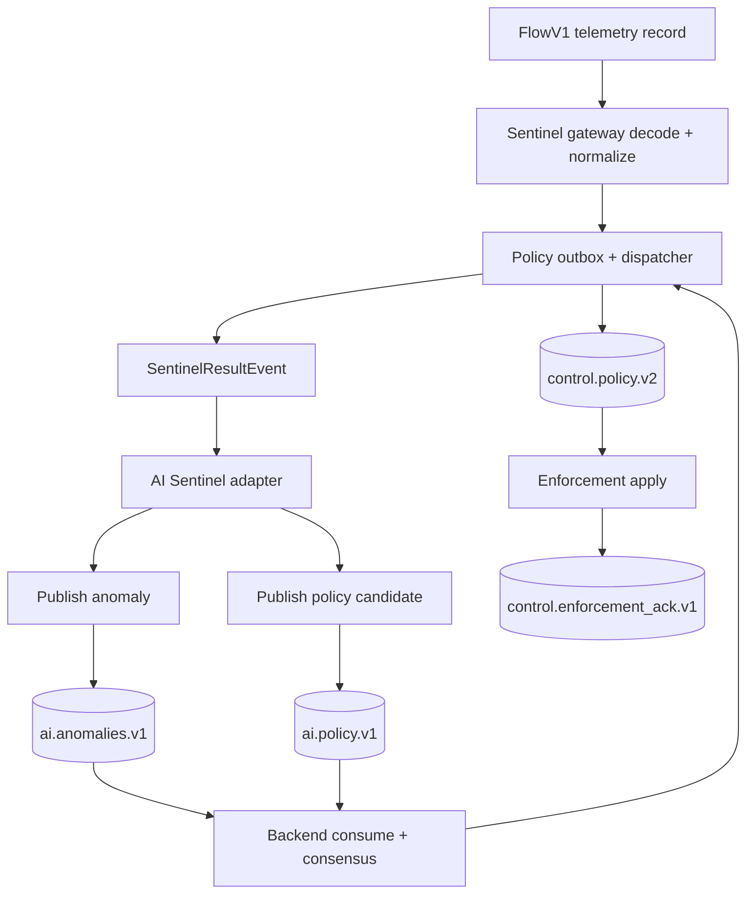
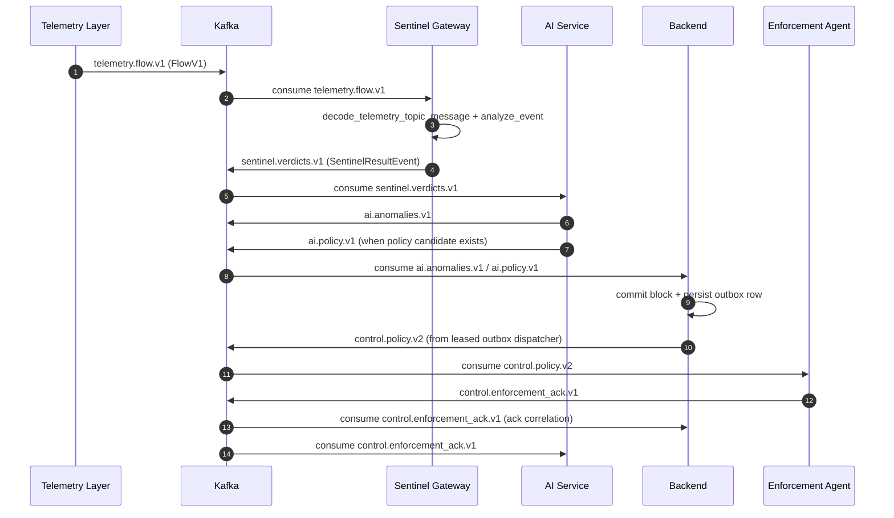

# Architecture 13: Sentinel Integration
## Telemetry -> Sentinel -> AI -> Backend -> Enforcement

**Last Updated:** 2026-02-25

This document is the source of truth for how Sentinel runs in the platform today.

---

## 1. At a Glance

| Item | Value |
|---|---|
| Purpose | Run multi-agent security analysis on telemetry flows before AI policy/anomaly publishing |
| Sentinel Input Topic | `telemetry.flow.v1` (protobuf `FlowV1`) |
| Sentinel Output Topic | `sentinel.verdicts.v1` (protobuf `SentinelResultEvent`) |
| AI Adapter Input | `sentinel.verdicts.v1` |
| AI Outputs from Sentinel path | `ai.anomalies.v1`, `ai.policy.v1` |
| Backend Policy Output | `control.policy.v2` |
| Enforcement ACK | `control.enforcement_ack.v1` (backend primary consumer; AI optional) |
| Deployment Mode (current) | Sentinel Kafka worker job in `k8s_azure/sentinel/sentinel-kafka-ai-integration-job.yaml` |

---

## 2. Sentinel Agent Matrix

| Agent family | Runtime status | Notes |
|---|---|---|
| Signature / Static File | Active | Fast-path signatures + static file analysis in `FILE` graph |
| Behavior | Active | Flow/process/sequence behavior scoring |
| Network | Active | `NETWORK_FLOW` analysis path (`FlowAgent`) |
| Threat Intel | Active | File and telemetry intel enrichment |
| LLM Reasoner | Optional | Enabled by config; file modality only |
| MCP Runtime Controls | Active | `MCP_RUNTIME` modality |
| Exfil / DLP | Active | `EXFIL_EVENT` modality |
| Resilience | Active | `RESILIENCE_EVENT` modality |
| Identity | Gap | No dedicated identity-only agent class yet |
| Cloud IAM | Gap | No dedicated cloud IAM-only agent class yet |

---

## 3. C4 Container View (Integrated Path)

---

## 4. DFD (Logical)

---

## 5. Runtime Sequence (Current)

---

## 6. Contracts and Code References

### 5.1 Sentinel Worker
- Input decode and routing: `sentinel/sentinel/kafka/gateway.py`
- Telemetry decoder: `sentinel/sentinel/kafka/telemetry_decoder.py`
- Sentinel result protobuf emit: `sentinel/sentinel/kafka/gateway.py`
- Contract generated type: `sentinel/sentinel/contracts/generated/sentinel_result_pb2.py`

### 5.2 AI Sentinel Adapter
- Adapter consume/decode/map: `ai-service/src/service/sentinel_adapter.py`
- Sentinel protobuf contract: `ai-service/proto/sentinel_result.proto`
- Generated protobuf: `ai-service/src/contracts/generated/sentinel_result_pb2.py`
- Policy candidate builder: `ai-service/src/service/policy_emitter.py`
- Publish methods: `ai-service/src/service/publisher.py`

### 5.3 Backend + Enforcement
- Backend consume ai.policy: `backend/pkg/ingest/kafka/consumer.go`
- Backend outbox publish path: `backend/pkg/control/policyoutbox/store.go`, `backend/pkg/control/policyoutbox/dispatcher.go`
- Backend policy producer implementation: `backend/pkg/ingest/kafka/producer.go`
- Backend ACK correlation: `backend/pkg/control/policyack/store.go`
- Enforcement consume control.policy + ack publish: `enforcement-agent/internal/config/config.go`, `enforcement-agent/internal/controller/*`, `enforcement-agent/internal/ack/*`

---

## 7. Operational Notes

- Topic names are config-driven but default to:
  - `telemetry.flow.v1`
  - `sentinel.verdicts.v1`
  - `ai.anomalies.v1`
  - `ai.policy.v1`
  - `control.policy.v2`
  - `control.enforcement_ack.v1`
- AI Sentinel adapter policy path is gated by:
  - `SENTINEL_ADAPTER_ENABLED`
  - `SENTINEL_ADAPTER_MODE=prod`
  - `SENTINEL_POLICY_ENABLED=true`
- Sentinel policy routing depends on target extraction from verdict context/findings.

---

## 8. Control Plane and Data Plane in This Path

In the integrated Sentinel pipeline:

- Control plane:
  - Sentinel + AI + Backend produce and authorize policy intent
  - `sentinel.verdicts.v1 -> ai.policy.v1 -> control.policy.v2`
- Data plane:
  - Enforcement backend applies runtime network controls
  - backend choice is config-driven (`gateway`, `cilium`, `iptables`, `nftables`, `k8s`)
  - execution result is published as `control.enforcement_ack.v1`

Scope guidance:
- East-West traffic: typically `cilium` or `k8s` policy backends
- North-South traffic: typically `gateway` backend
- Host fallback/guardrail: `iptables` or `nftables`

---

## 9. Related Docs

- System overview: `docs/architecture/01_system_overview.md`
- Kafka bus: `docs/architecture/04_kafka_message_bus.md`
- AI LLD: `docs/design/LLD-ai-service.md`
- Sentinel LLD: `docs/design/LLD-sentinel.md`
