# CyberMesh Data Flow Documentation

**Version:** 2.0.0  
**Last Updated:** 2026-01-30

---

## 📑 Navigation

**Quick Links:**
- [🔄 End-to-End Flow](#2-end-to-end-data-flow)
- [🤖 Detection Flow](#3-detection-flow-ai-service)
- [⚙️ Consensus Flow](#4-consensus-flow-backend)
- [🔁 Feedback Loop](#5-feedback-loop-flow)
- [🚫 Enforcement Flow](#6-enforcement-flow)
- [📨 Kafka Topics](#7-kafka-topic-mapping)
- [🗄️ Database Flow](#8-database-write-flow)

---

## 1. Overview

This document describes how data flows through the CyberMesh system, from network telemetry ingestion to threat detection, consensus validation, and policy enforcement.

> [!IMPORTANT]
> CyberMesh uses an **asynchronous, event-driven architecture** with Kafka as the central message bus connecting all services.

---

## 2. End-to-End Data Flow

### 2.1 Complete Pipeline

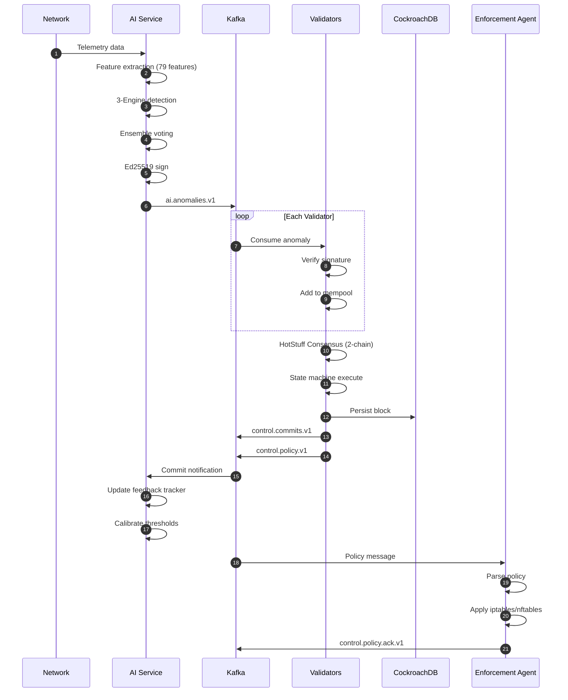

---

## 3. Detection Flow (AI Service)

### 3.1 Detection Pipeline

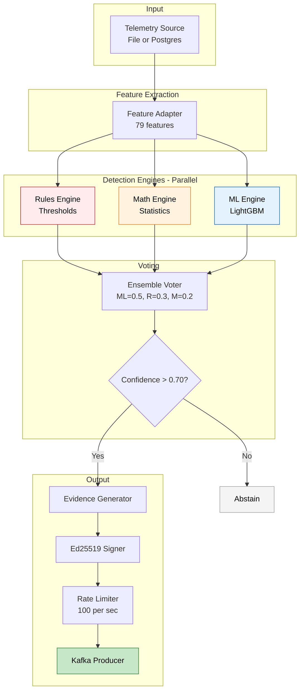

### 3.2 Detection Loop Timing

```mermaid
gantt
    title Detection Loop (5 second cycle)
    dateFormat X
    axisFormat %L ms
    
    section Phase 1
    Poll Telemetry     :0, 100
    Feature Extraction :100, 200
    
    section Phase 2
    Rules Engine       :200, 50
    Math Engine        :200, 80
    ML Engine          :200, 150
    
    section Phase 3
    Ensemble Voting    :350, 50
    Evidence Gen       :400, 50
    Signing            :450, 20
    Publish            :470, 30
    
    section Idle
    Sleep              :500, 4500
```

> [!NOTE]
> The detection loop runs every **5 seconds**. Total processing time is ~500ms, leaving 4.5s for idle/sleep.

---

## 4. Consensus Flow (Backend)

### 4.1 HotStuff (2-Chain) Commit Flow

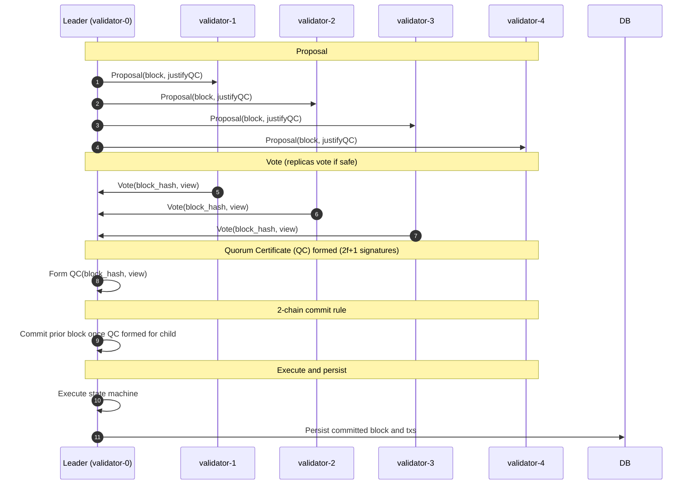

### 4.2 Leader Election & View Change

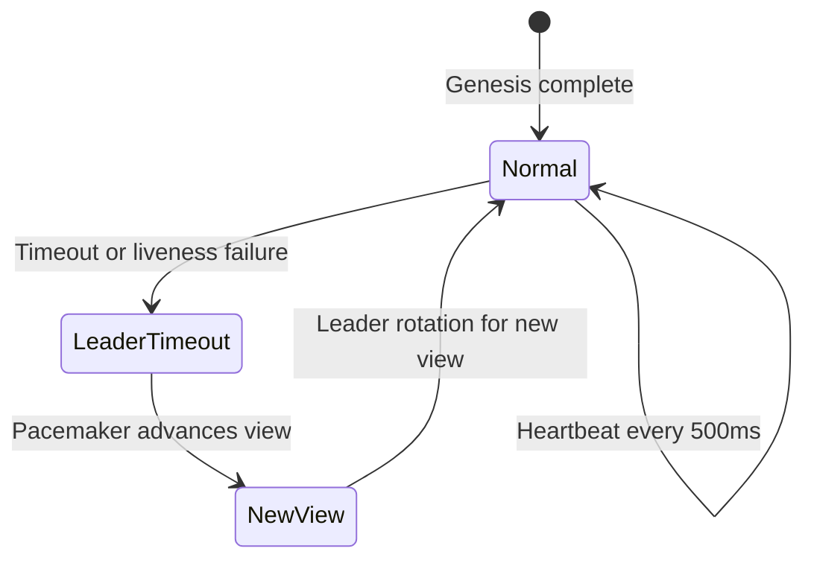

---

## 5. Feedback Loop Flow

### 5.1 Anomaly Lifecycle (7-State Machine)

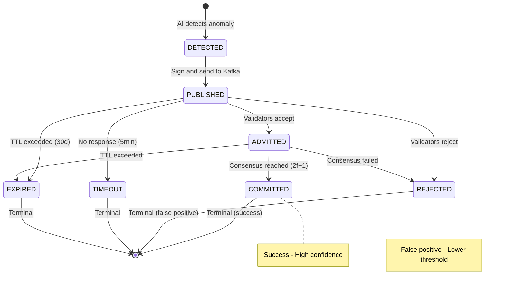

### 5.2 Threshold Adjustment

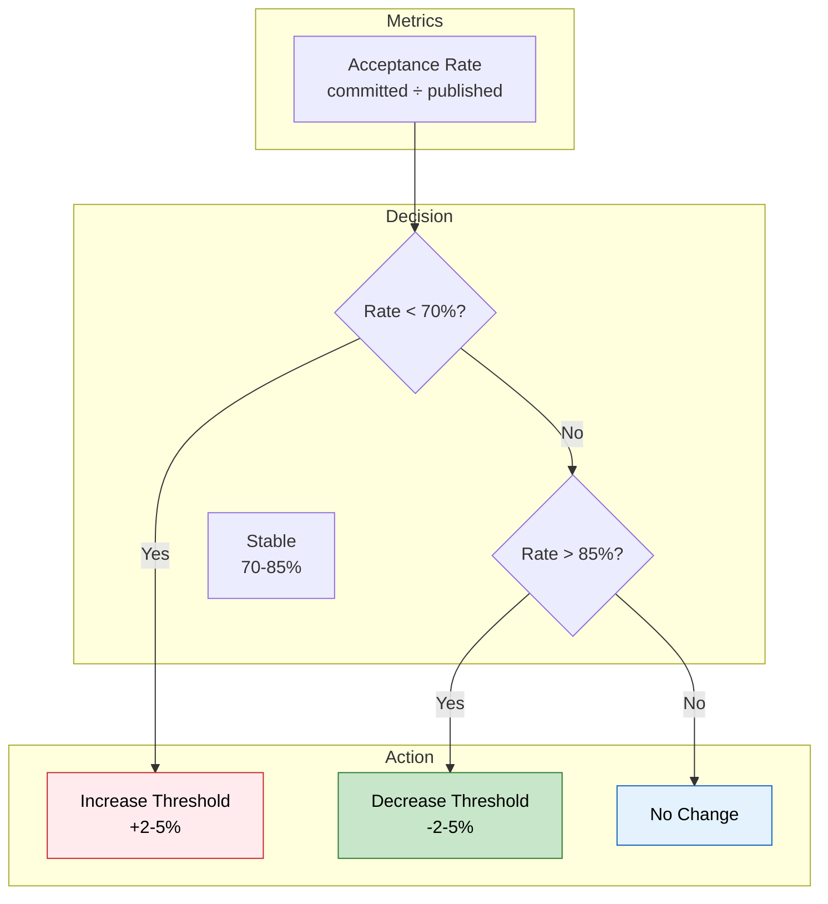

> [!TIP]
> The AI service automatically adjusts thresholds based on validator acceptance rates to minimize false positives while maintaining high detection rates.

---

## 6. Enforcement Flow

### 6.1 Policy Enforcement Pipeline

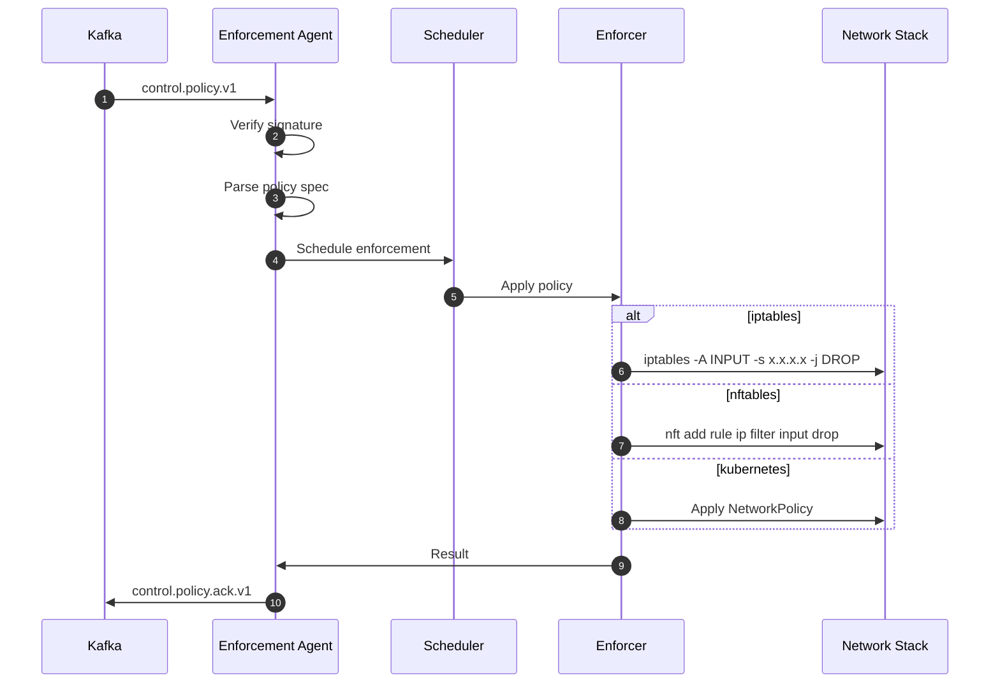

### 6.2 Enforcement Backends

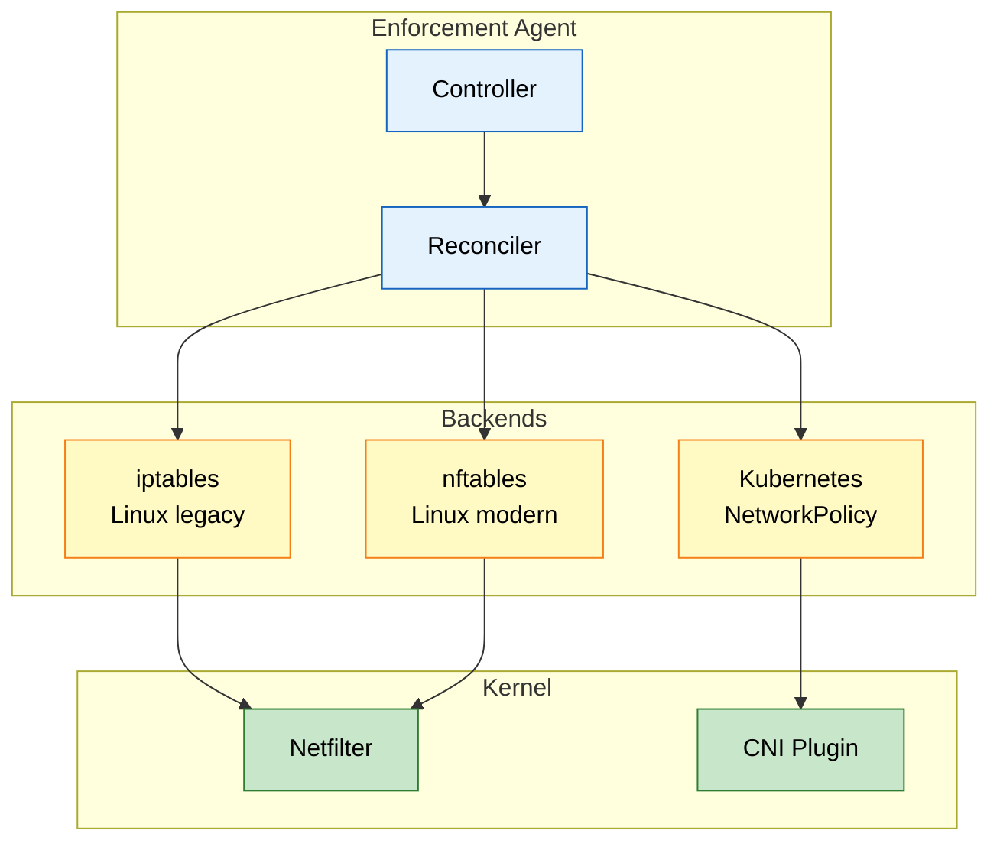

---

## 7. Kafka Topic Mapping

### 7.1 Message Flow Diagram

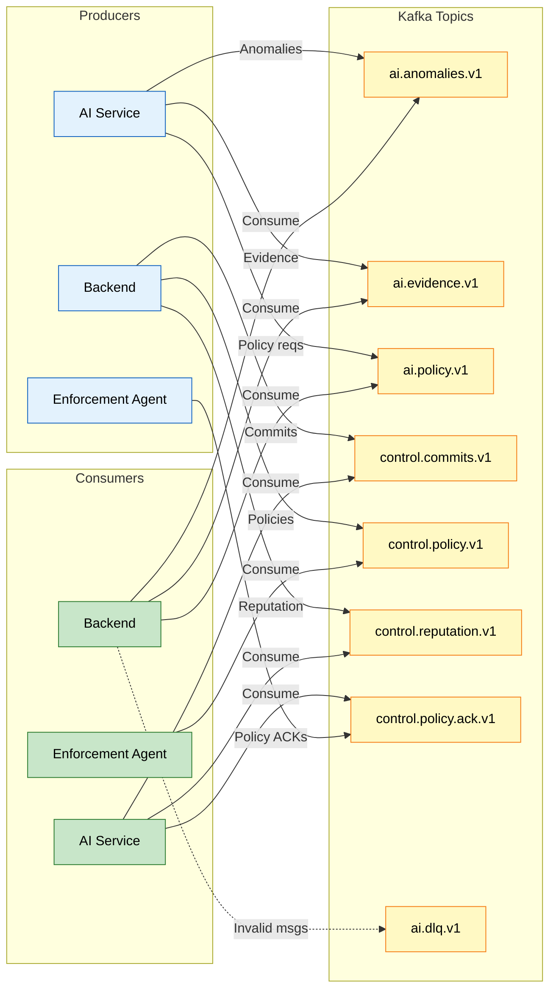

### 7.2 Message Schemas

| Topic | Producer | Consumer | Schema | Size |
|-------|----------|----------|--------|------|
| `ai.anomalies.v1` | AI | Backend | Protobuf (AnomalyEvent) | ~2KB |
| `ai.evidence.v1` | AI | Backend | Protobuf (EvidenceEvent) | ~512KB max |
| `ai.policy.v1` | AI | Backend | Protobuf (PolicyEvent) | ~1KB |
| `control.commits.v1` | Backend | AI | Protobuf (CommitEvent) | ~1KB |
| `control.policy.v1` | Backend | Agent | Protobuf (PolicyUpdateEvent) | ~2KB |
| `control.reputation.v1` | Backend | AI | Protobuf (ReputationEvent) | ~500B |
| `control.policy.ack.v1` | Agent | AI | Protobuf (PolicyAckEvent) | ~1KB |
| `ai.dlq.v1` | Backend | - | Original + error | Varies |

> [!WARNING]
> All Kafka messages **MUST** be signed with Ed25519 using domain separation. Invalid signatures are rejected to the DLQ.

---

## 8. Database Write Flow

### 8.1 Persistence Pipeline

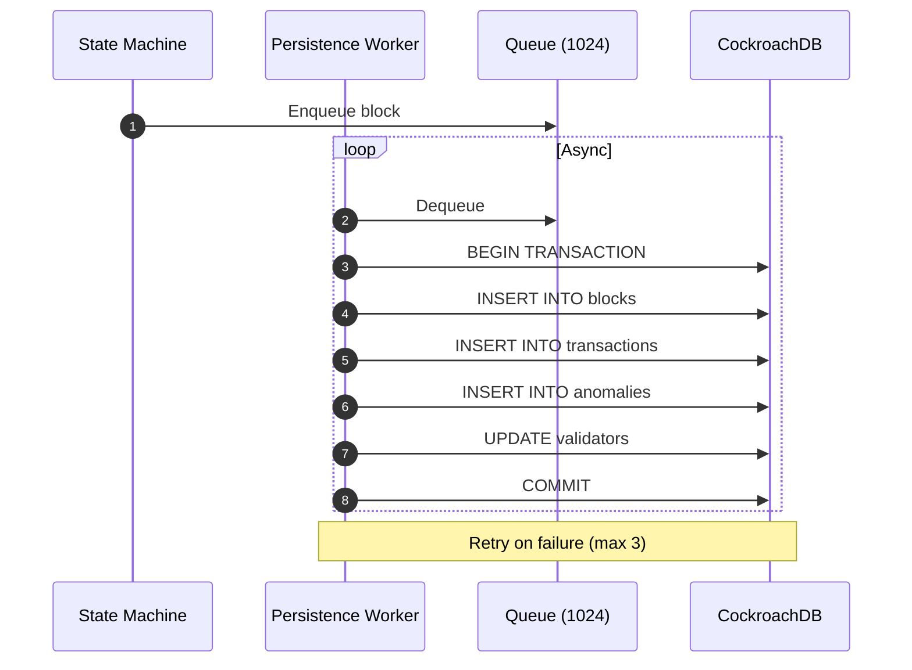

### 8.2 Tables Written

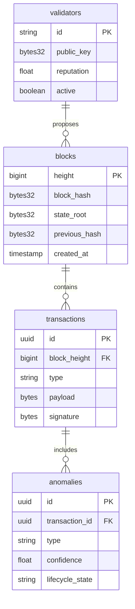

---

## 9. API Data Flow

### 9.1 Dashboard Request Flow

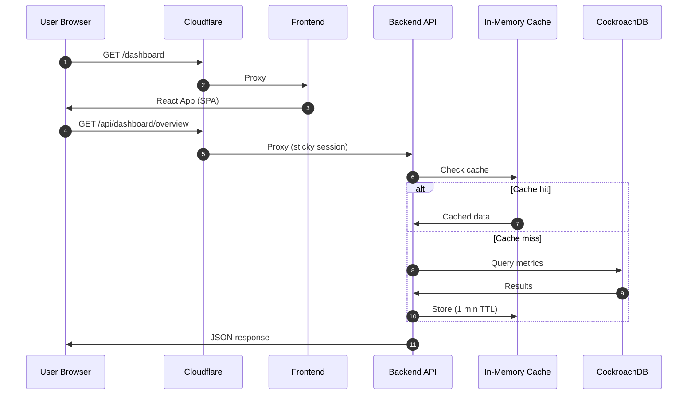

> [!NOTE]
> **Sticky sessions** ensure the same backend pod handles subsequent requests, making the in-memory cache effective.

---

## 10. Related Documents

### Design Documents
- [High-Level Design](./HLD.md)
- [Backend LLD](./LLD-backend.md)
- [AI Service LLD](./LLD-ai-service.md)
- [Enforcement Agent LLD](./LLD-enforcement-agent.md)

### Architecture Documents
- [Kafka Message Bus](../architecture/04_kafka_message_bus.md)
- [Feedback Loop](../architecture/06_feedback_loop.md)
- [HotStuff Consensus](../architecture/03_hotstuff_consensus.md)

---

**[⬆️ Back to Top](#-navigation)**
