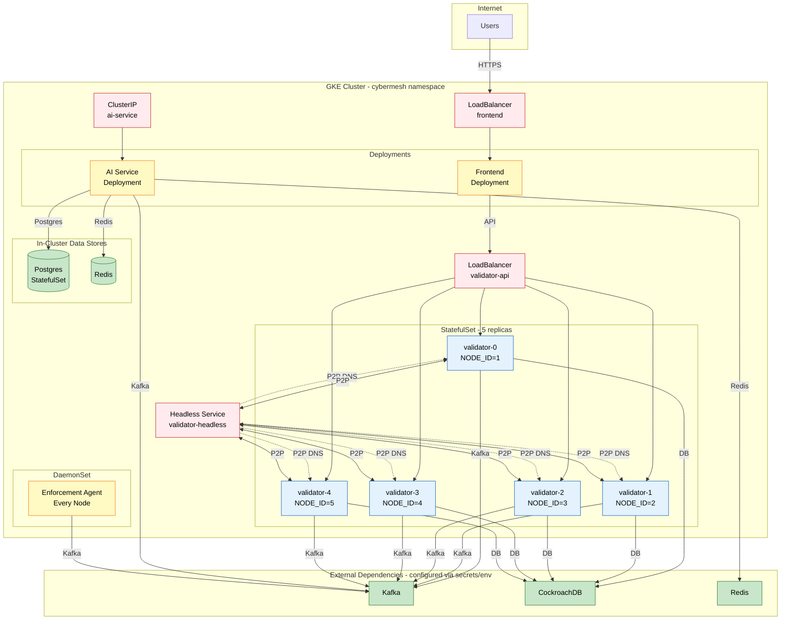

# CyberMesh Deployment (GKE)

**Version:** 2.0.0  
**Last Updated:** 2026-01-30

---

## 📑 Navigation

**Quick Links:**
- [☸️ Workloads](#2-workloads-k8s_gke)
- [🔌 Services & Ports](#3-services-and-ports)
- [☁️ External Dependencies](#4-external-dependencies)
- [🔒 Configuration & Secrets](#5-configuration-and-secrets)
- [📦 Storage](#6-storage)
- [🚀 Deployment Steps](#8-applying-the-manifests)

This document describes the *current* Kubernetes deployment layout as defined by `k8s_gke/`.

> [!CAUTION]
> This document intentionally **avoids any secret material** (no keys, passwords, usernames, or full connect ion strings).

---

## 1. Source of Truth

- **Kubernetes manifests:** `k8s_gke/`
- **Runtime architecture overview:** [docs/architecture/12_gke_deployment.md](../architecture/12_gke_deployment.md)

---

## 2. High-Level Topology

### 2.1 Deployment Diagram



> [!NOTE]
> The diagram shows the complete GKE deployment topology with 5 validators, external dependencies, and in-cluster data stores.

---

## 3. Workloads (`k8s_gke/`)

| Component | Kind | Name | Replicas | Notes |
|----------|------|------|----------|-------|
| **Backend validators** | StatefulSet | `validator` | 5 | HotStuff validators + API + metrics |
| **AI service** | Deployment | `ai-service` | 1 | Detection pipeline + Kafka pub/sub + metrics |
| **Enforcement agent** | DaemonSet | `enforcement-agent` | N (per node) | ⚠️ HostNetwork + privileged (NET_ADMIN) |
| **Frontend** | Deployment | `frontend` | 1 | Dashboard UI |
| **Postgres** | StatefulSet | `postgres` | 1 | AI telemetry/local DB (dev/test) |
| **Redis** | Deployment | `redis` | 1 | Optional in-cluster Redis |

> [!WARNING]
> The **enforcement agent** runs with `hostNetwork: true` and requires `NET_ADMIN` capability for iptables/nftables access.

---

## 4. Services and Ports

### 3.1 Backend (Validators)

**Services:**
- `validator-headless` (ClusterIP None) - Stable DNS for validator pods
- `validator-api` (LoadBalancer) - External entry point

**Ports:**
- **API:** 443 (HTTPS)
- **P2P:** 8001 (GossipSub validator-to-validator)
- **Metrics:** 9100 (Prometheus)

### 3.2 Frontend

**Service:** `frontend` (LoadBalancer)

**Ports:**
- 80 → 3000 (container)

### 3.3 AI Service

**Service:** `ai-service` (ClusterIP)

**Ports:**
- **API:** 8080
- **Metrics:** 10000 (Prometheus)

### 3.4 Postgres

**Service:** `postgres` (ClusterIP None - Headless)

**Port:** 5432

---

## 5. External Dependencies

> [!NOTE]
> These external services are configured via environment variables and secrets:

- ☁️ **Kafka** (Confluent Cloud)
- 🗄️ **CockroachDB** (Cockroach Labs Cloud)
- 📊 **Redis** (may be external, may be in -cluster)

> [!IMPORTANT]
> The validator StatefulSet has an **initContainer** that waits for CockroachDB connectivity on port 26257.

---

## 6. Configuration and Secrets

### 6.1 ConfigMaps

| ConfigMap | Purpose |
|-----------|---------|
| `cybermesh-config` | Backend validator runtime config |
| `ai-service-config` | AI service runtime config |
| `frontend-config` | Frontend runtime config |
| `db-root-cert` | CockroachDB root CA cert bundle |
| `ai-service-entrypoint` | AI service entrypoint script |

### 6.2 Secrets

> [!CAUTION]
> **Never print secret contents.** The following secrets contain sensitive credentials:

| Secret | Purpose |
|--------|---------|
| `cybermesh-secrets` | 🔒 DB/Kafka/Redis credentials + crypto material |
| `validator-pubkeys` | 🔑 Validator public keys |
| `validator-keys` | 🔑 Validator private keys (mounted as files) |
| `backend-tls` | 🔒 Backend HTTPS TLS cert/key |
| `ai-service-secret` | 🔑 AI signing key file |
| `ai-service-postgres` | 🔒 AI service Postgres credentials |

---

## 7. Storage

### 7.1 Persistent Volume Claims

| Workload | PVC | Size | Purpose |
|----------|-----|------|---------|
| **Validators** | `logs` (per-pod) | 2Gi | Validator logs |
| **AI Service** | `ai-service-data` | 1Gi | Nonce state persistence |
| **Postgres** | `postgres-data` (per-pod) | 10Gi | Postgres data |

> [!NOTE]
> Genesis state PVC is commented out; genesis is restored from DB/disk logic in code.

---

## 8. Health and Readiness

### 8.1 Backend Validators

**From `k8s_gke/statefulset.yaml`:**
- ✅ **Liveness:** `GET https://.../api/v1/health`
- ✅ **Readiness:** `GET https://.../api/v1/ready`
- ⏱️ **Startup:** `GET https://.../api/v1/ready` (long window for genesis)

### 8.2 AI Service

**From `k8s_gke/ai-service-deployment.yaml`:**
- ✅ **Liveness:** `GET http://.../health`
- ✅ **Readiness:** `GET http://.../ready`
- ⏱️ **Startup:** `GET http://.../ready` (longer for model load + DB connect)

### 8.3 Frontend

**From `k8s_gke/frontend-deployment.yaml`:**
- ✅ **Liveness:** `GET http://.../`
- ✅ **Readiness:** `GET http://.../`

---

## 9. Applying the Manifests

> [!TIP]
> Apply manifests in dependency order. This ordering matches the dependencies:

```bash
# 1. Namespace + RBAC
kubectl apply -f k8s_gke/namespace.yaml
kubectl apply -f k8s_gke/rbac.yaml
kubectl apply -f k8s_gke/enforcement-agent-rbac.yaml
kubectl apply -f k8s_gke/ai-service-rbac.yaml

# 2. Secrets + ConfigMaps
kubectl apply -f k8s_gke/secret.yaml
kubectl apply -f k8s_gke/configmap.yaml
kubectl apply -f k8s_gke/configmap-db-cert.yaml
kubectl apply -f k8s_gke/frontend-configmap.yaml
kubectl apply -f k8s_gke/ai-service-configmap.yaml
kubectl apply -f k8s_gke/ai-service-entrypoint-configmap.yaml
kubectl apply -f k8s_gke/ai-service-secret.yaml
kubectl apply -f k8s_gke/ai-service-postgres-secret.yaml

# 3. PVCs + Data Stores
kubectl apply -f k8s_gke/ai-service-pvc.yaml
kubectl apply -f k8s_gke/postgres-statefulset.yaml
kubectl apply -f k8s_gke/redis.yaml

# 4. Core Services + Workloads
kubectl apply -f k8s_gke/service-headless.yaml
kubectl apply -f k8s_gke/service.yaml
kubectl apply -f k8s_gke/statefulset.yaml
kubectl apply -f k8s_gke/ai-service-service.yaml
kubectl apply -f k8s_gke/ai-service-deployment.yaml
kubectl apply -f k8s_gke/frontend-service.yaml
kubectl apply -f k8s_gke/frontend-deployment.yaml
kubectl apply -f k8s_gke/daemonset.yaml

# 5. Optional Hardening
kubectl apply -f k8s_gke/network-policies.yaml
kubectl apply -f k8s_gke/cloud-armor-backendconfig.yaml
```

### Verification

```bash
# Check pods
kubectl get pods -n cybermesh

# Check services
kubectl get svc -n cybermesh

# Check logs (if needed)
kubectl logs -n cybermesh validator-0 --tail=100
```

---

## 10. Related Documents

### Design Documents
- [HLD](./HLD.md)
- [DATA_FLOW](./DATA_FLOW.md)

### Architecture Documents
- [GKE Deployment Architecture](../architecture/12_gke_deployment.md)

### Setup Guides
- [GKE Setup Guide](../../k8s_gke/GKE_SETUP_GUIDE.md)

---

**[⬆️ Back to Top](#-navigation)**
