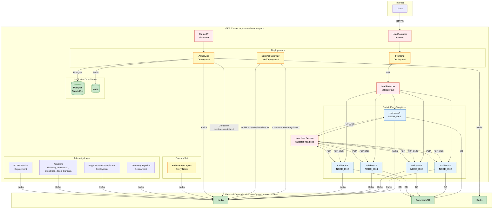

# CyberMesh Deployment (GKE + Azure Manifests)

**Version:** 1
**Last Updated:** 2026-02-25

---

## 📑 Navigation

**Quick Links:**
- [🧭 Topology](#2-high-level-topology)
- [☸️ Workloads](#3-workloads-k8s_gke)
- [🛰️ Telemetry Workloads](#31-telemetry-layer-workloads-telemetry-layerdeployments)
- [🔌 Services & Ports](#4-services-and-ports)
- [☁️ External Dependencies](#5-external-dependencies)
- [🔒 Configuration & Secrets](#6-configuration-and-secrets)
- [📦 Storage](#7-storage)
- [🚀 Deployment Steps](#9-applying-the-manifests)

This document describes the Kubernetes deployment layout for CyberMesh.

Notes:
- `k8s_gke/` is the source of truth for the core platform (validators, AI service, frontend, enforcement agent).
- Telemetry and Sentinel operational manifests are maintained under `k8s_azure/telemetry/*` and `k8s_azure/sentinel/*`.
- `telemetry-layer/deployments/` remains available for local/test bring-up.

> [!CAUTION]
> This document intentionally **avoids any secret material** (no keys, passwords, usernames, or full connection strings).

---

## 1. Source of Truth

- **Kubernetes manifests:** `k8s_gke/`
- **Telemetry operational manifests:** `k8s_azure/telemetry/`
- **Sentinel operational manifests:** `k8s_azure/sentinel/`
- **Telemetry manifests (local/test):** `telemetry-layer/deployments/`
- **Runtime architecture overview:** [docs/architecture/12_gke_deployment.md](../architecture/12_gke_deployment.md)

---

## 2. High-Level Topology

### 2.1 Deployment Diagram


```mermaid
graph TB
    subgraph Internet
        User[Users]
    end

    subgraph External["External Dependencies - configured via secrets/env"]
        Kafka[Kafka]
        CRDB[CockroachDB]
        ExtRedis[Redis]
    end

    subgraph GKE["GKE Cluster - cybermesh namespace"]
        subgraph Validators["StatefulSet - 5 replicas"]
            V0["validator-0<br/>NODE_ID=1"]
            V1["validator-1<br/>NODE_ID=2"]
            V2["validator-2<br/>NODE_ID=3"]
            V3["validator-3<br/>NODE_ID=4"]
            V4["validator-4<br/>NODE_ID=5"]
        end
        
        subgraph Services["Deployments"]
            S["Sentinel Gateway<br/>Job/Deployment"]
            AI["AI Service<br/>Deployment"]
            FE["Frontend<br/>Deployment"]
        end

        subgraph Telemetry["Telemetry Layer"]
            SP["Telemetry Pipeline<br/>Deployment"]
            FT["Edge Feature Transformer<br/>Deployment"]
            AD["Adapters<br/>Gateway, Baremetal, Cloudlogs, Zeek, Suricata"]
            PCAP["PCAP Service<br/>Deployment"]
        end
        
        subgraph Agents["DaemonSet"]
            Agent["Enforcement Agent<br/>Every Node"]
        end
        
        subgraph Data["In-Cluster Data Stores"]
            PG[("Postgres<br/>StatefulSet")]
            InRedis[(Redis)]
        end
        
        LB1["LoadBalancer<br/>validator-api"]
        LB2["LoadBalancer<br/>frontend"]
        HL["Headless Service<br/>validator-headless"]
        AISVC["ClusterIP<br/>ai-service"]
    end
    
    User -->|HTTPS| LB2
    LB2 --> FE
    FE -->|API| LB1
    
    LB1 --> V0 & V1 & V2 & V3 & V4
    HL -.->|P2P DNS| V0 & V1 & V2 & V3 & V4
    
    V0 & V1 & V2 & V3 & V4 <-->|P2P| HL
    V0 & V1 & V2 & V3 & V4 -->|DB| CRDB
    V0 & V1 & V2 & V3 & V4 -->|Kafka| Kafka

    S -->|Consume telemetry.flow.v1| Kafka
    S -->|Publish sentinel.verdicts.v1| Kafka
    AI -->|Consume sentinel.verdicts.v1| Kafka
    AI -->|Kafka| Kafka
    Agent -->|Kafka| Kafka
    SP -->|Kafka| Kafka
    FT -->|Kafka| Kafka
    AD -->|Kafka| Kafka
    PCAP -->|Kafka| Kafka
    AI -->|Redis| ExtRedis
    AI -->|Redis| InRedis
    AI -->|Postgres| PG
    AISVC --> AI
    
    classDef validator fill:#e3f2fd,stroke:#1565c0,color:#000;
    classDef service fill:#fff9c4,stroke:#f57f17,color:#000;
    classDef data fill:#c8e6c9,stroke:#2e7d32,color:#000;
    classDef lb fill:#ffebee,stroke:#c62828,color:#000;
    
    class V0,V1,V2,V3,V4 validator;
    class S,AI,FE,Agent service;
    class Kafka,CRDB,ExtRedis,PG,InRedis data;
    class LB1,LB2,HL,AISVC lb;
```

> [!NOTE]
> The diagram shows runtime topology. Today, core services are deployed from `k8s_gke/`, while telemetry/sentinel runtime workloads are deployed from `k8s_azure/` (with `telemetry-layer/deployments/` retained for local/test bring-up).

---

## 3. Workloads (`k8s_gke/`)

| Component | Kind | Name | Replicas | Notes |
|----------|------|------|----------|-------|
| **Backend validators** | StatefulSet | `validator` | 5 | HotStuff validators + API + metrics |
| **AI service** | Deployment | `ai-service` | 1 | Detection pipeline + Kafka pub/sub + metrics |
| **Sentinel gateway** | Job (current) / Deployment (target) | `sentinel-kafka-ai-integration*` | on-demand | Telemetry ingest -> `sentinel.verdicts.v1` (from `k8s_azure/sentinel/`) |
| **Enforcement agent** | DaemonSet | `enforcement-agent` | N (per node) | ⚠️ HostNetwork + privileged (NET_ADMIN) |
| **Frontend** | Deployment | `frontend` | 1 | Dashboard UI |
| **Postgres** | StatefulSet | `postgres` | 1 | AI telemetry/local DB (dev/test) |
| **Redis** | Deployment | `redis` | 1 | Optional in-cluster Redis |

> [!WARNING]
> The **enforcement agent** runs with `hostNetwork: true` and requires `NET_ADMIN` capability for iptables/nftables backends.
> Cilium/gateway modes are also supported by code and deployed via dedicated manifests where applicable.

Supported enforcement backends:
- `cilium`
- `gateway`
- `iptables`
- `nftables`
- `kubernetes` / `k8s`
- `noop`

---

## 3.1 Telemetry Layer Workloads (`k8s_azure/telemetry/` + `telemetry-layer/deployments/`)

Telemetry runtime manifests are maintained in `k8s_azure/telemetry/layer/`.
Local/test bring-up manifests remain in `telemetry-layer/deployments/` and are useful for isolated validation.
Secrets are injected via ConfigMap/Secret env wiring.

| Component | Kind | Name | Notes |
|----------|------|------|-------|
| Telemetry pipeline | Deployment | `telemetry-pipeline` | Bridge + stream processor + feature transformer pipeline |
| Gateway adapter | Deployment | `telemetry-gateway-adapter` | IPFIX/gateway ingest to `telemetry.flow.v1` |
| Bare-metal adapter | DaemonSet | `telemetry-baremetal-adapter` | Host sensor ingest to `telemetry.flow.v1` |
| Cloud logs adapter | Deployment | `telemetry-cloudlogs-adapter` | Cloud flow log ingest to `telemetry.flow.v1` |
| Edge feature transformer | Deployment | `telemetry-edge-feature-transformer` | Optional edge mode |
| Test Kafka + UI | Deployment/Service | `test-kafka`, `kafka-ui` | Local-only bring-up (do not use in prod) |
| Test CockroachDB | Deployment/Service | `test-cockroachdb` | Local-only bring-up (do not use in prod) |

Related:
- `k8s_azure/telemetry/layer/*`
- `telemetry-layer/deployments/README.md`
- Telemetry LLD: `docs/design/LLD-telemetry-layer.md`
- Sentinel integration manifests: `k8s_azure/sentinel/sentinel-kafka-ai-integration-job.yaml`

---

## 4. Services and Ports

### 3.1 Backend (Validators)

**Services:**
- `validator-headless` (ClusterIP None) - Stable DNS for validator pods
- `validator-api` (LoadBalancer) - External entry point

**Ports:**
- **API:** 443 (HTTPS)
- **P2P:** 8001 (GossipSub validator-to-validator)
- **Metrics:** 9100 (Prometheus)

### 3.2 Frontend

**Service:** `frontend` (LoadBalancer)

**Ports:**
- 80 → 3000 (container)

### 3.3 AI Service

**Service:** `ai-service` (ClusterIP)

**Ports:**
- **API:** 8080
- **Metrics:** 10000 (Prometheus)

### 3.4 Postgres

**Service:** `postgres` (ClusterIP None - Headless)

**Port:** 5432

---

## 5. External Dependencies

> [!NOTE]
> These external services are configured via environment variables and secrets:

- ☁️ **Kafka** (Confluent Cloud)
- 🗄️ **CockroachDB** (Cockroach Labs Cloud)
- 📊 **Redis** (may be external, may be in -cluster)

> [!IMPORTANT]
> The validator StatefulSet has an **initContainer** that waits for CockroachDB connectivity on port 26257.

---

## 6. Configuration and Secrets

### 6.1 ConfigMaps

| ConfigMap | Purpose |
|-----------|---------|
| `cybermesh-config` | Backend validator runtime config |
| `ai-service-config` | AI service runtime config |
| `frontend-config` | Frontend runtime config |
| `telemetry-config` | Telemetry layer runtime config (stream/transform/adapters/pcap) |
| `db-root-cert` | CockroachDB root CA cert bundle |
| `ai-service-entrypoint` | AI service entrypoint script |

> [!NOTE]
> `cybermesh-config` also carries control-plane durability/perf knobs used by backend outbox + ACK workers, including:
> `CONTROL_POLICY_OUTBOX_*` and `CONTROL_POLICY_ACK_*` settings.

### 6.2 Secrets

> [!CAUTION]
> **Never print secret contents.** The following secrets contain sensitive credentials:

| Secret | Purpose |
|--------|---------|
| `cybermesh-secrets` | 🔒 DB/Kafka/Redis credentials + crypto material |
| `validator-pubkeys` | 🔑 Validator public keys |
| `validator-keys` | 🔑 Validator private keys (mounted as files) |
| `backend-tls` | 🔒 Backend HTTPS TLS cert/key |
| `ai-service-secret` | 🔑 AI signing key file |
| `ai-service-postgres` | 🔒 AI service Postgres credentials |
| `telemetry-secrets` | 🔒 Telemetry Kafka/Schema Registry credentials |

---

## 7. Storage

### 7.1 Persistent Volume Claims

| Workload | PVC | Size | Purpose |
|----------|-----|------|---------|
| **Validators** | `logs` (per-pod) | 2Gi | Validator logs |
| **AI Service** | `ai-service-data` | 1Gi | Nonce state persistence |
| **Postgres** | `postgres-data` (per-pod) | 10Gi | Postgres data |

> [!NOTE]
> Genesis state PVC is commented out; genesis is restored from DB/disk logic in code.

---

## 8. Health and Readiness

### 8.1 Backend Validators

**From `k8s_gke/statefulset.yaml`:**
- ✅ **Liveness:** `GET https://.../api/v1/health`
- ✅ **Readiness:** `GET https://.../api/v1/ready`
- ⏱️ **Startup:** `GET https://.../api/v1/ready` (long window for genesis)

### 8.2 AI Service

**From `k8s_gke/ai-service-deployment.yaml`:**
- ✅ **Liveness:** `GET http://.../health`
- ✅ **Readiness:** `GET http://.../ready`
- ⏱️ **Startup:** `GET http://.../ready` (longer for model load + DB connect)

### 8.3 Frontend

**From `k8s_gke/frontend-deployment.yaml`:**
- ✅ **Liveness:** `GET http://.../`
- ✅ **Readiness:** `GET http://.../`

---

## 9. Applying the Manifests

> [!TIP]
> Apply manifests in dependency order. This ordering matches the dependencies:

```bash
# 1. Namespace + RBAC
kubectl apply -f k8s_gke/namespace.yaml
kubectl apply -f k8s_gke/rbac.yaml
kubectl apply -f k8s_gke/enforcement-agent-rbac.yaml
kubectl apply -f k8s_gke/ai-service-rbac.yaml

# 2. Secrets + ConfigMaps
kubectl apply -f k8s_gke/secret.yaml
kubectl apply -f k8s_gke/configmap.yaml
kubectl apply -f k8s_gke/configmap-db-cert.yaml
kubectl apply -f k8s_gke/frontend-configmap.yaml
kubectl apply -f k8s_gke/ai-service-configmap.yaml
kubectl apply -f k8s_gke/ai-service-entrypoint-configmap.yaml
kubectl apply -f k8s_gke/ai-service-secret.yaml
kubectl apply -f k8s_gke/ai-service-postgres-secret.yaml

# 3. PVCs + Data Stores
kubectl apply -f k8s_gke/ai-service-pvc.yaml
kubectl apply -f k8s_gke/postgres-statefulset.yaml
kubectl apply -f k8s_gke/redis.yaml

# 4. Core Services + Workloads
kubectl apply -f k8s_gke/service-headless.yaml
kubectl apply -f k8s_gke/service.yaml
kubectl apply -f k8s_gke/statefulset.yaml
kubectl apply -f k8s_gke/ai-service-service.yaml
kubectl apply -f k8s_gke/ai-service-deployment.yaml
kubectl apply -f k8s_gke/frontend-service.yaml
kubectl apply -f k8s_gke/frontend-deployment.yaml
kubectl apply -f k8s_gke/daemonset.yaml

# 5. Optional Hardening
kubectl apply -f k8s_gke/network-policies.yaml
kubectl apply -f k8s_gke/cloud-armor-backendconfig.yaml
```

### Verification

```bash
# Check pods
kubectl get pods -n cybermesh

# Check services
kubectl get svc -n cybermesh

# Check logs (if needed)
kubectl logs -n cybermesh validator-0 --tail=100
```

---

## 10. Related Documents

### Design Documents
- [HLD](./HLD.md)
- [DATA_FLOW](./DATA_FLOW.md)

### Architecture Documents
- [GKE Deployment Architecture](../architecture/12_gke_deployment.md)

### Setup Guides
- [GKE Setup Guide](../../k8s_gke/GKE_SETUP_GUIDE.md)

---

**[⬆️ Back to Top](#-navigation)**
