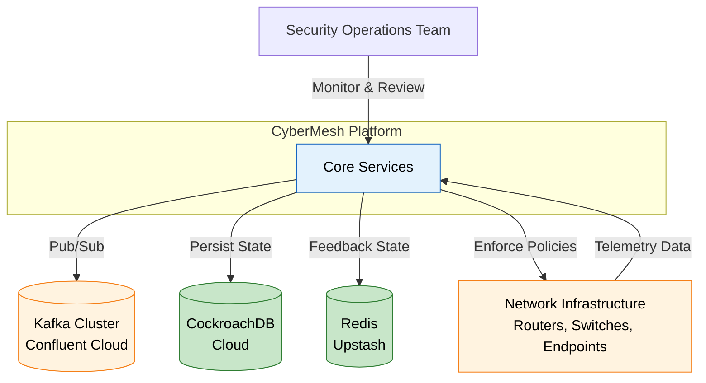
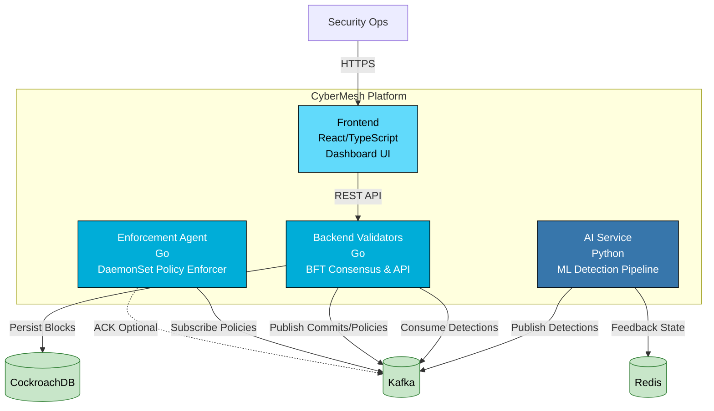
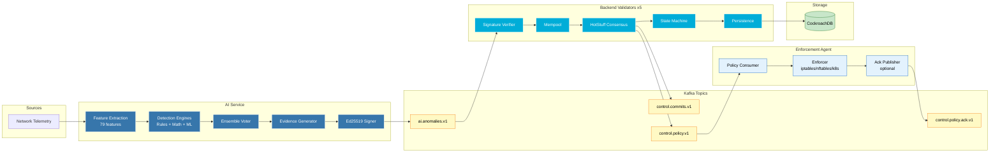
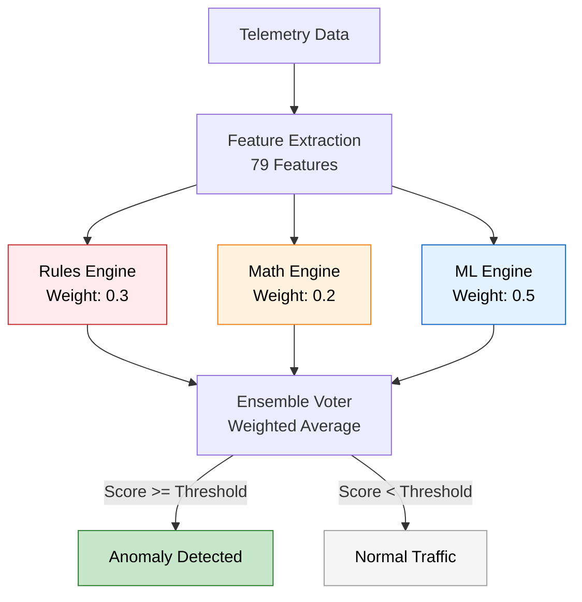
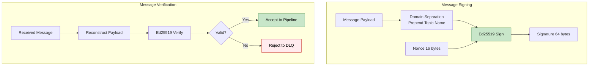
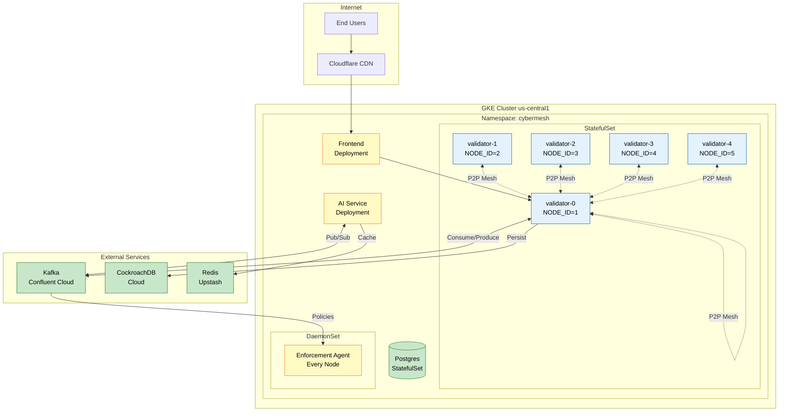
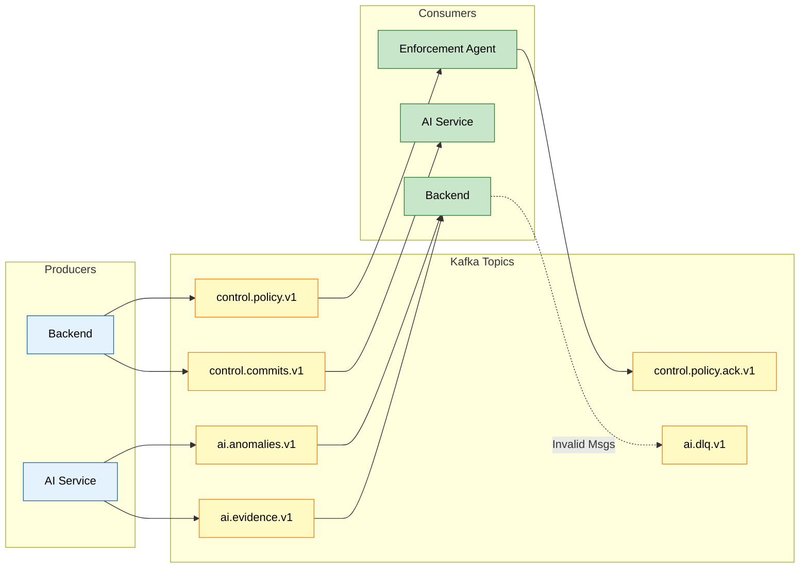

# CyberMesh High-Level Design (HLD)

**Version:** 2.0.0  
**Last Updated:** 2026-01-30  
**Authors:** Architecture Team

---

## 📑 Navigation

**Quick Links:**
- [🎯 Executive Summary](#1-executive-summary)
- [🏗️ Architecture](#2-system-context-c4-level-1)
- [⚡ Performance](#81-performance)
- [🔒 Security](#83-security)
- [📚 Related Docs](#9-related-documentation)

---

## 1. Executive Summary

CyberMesh is a **distributed cybersecurity threat detection and response platform** that combines real-time ML-based anomaly detection with Byzantine Fault Tolerant (BFT) consensus to validate and enforce security policies across a network.

### 🎯 Key Capabilities

| Capability | Description |
|------------|-------------|
| ⚡ **Real-time Detection** | 3-engine ML pipeline (Rules, Math, ML) with 5s interval |
| 🛡️ **BFT Consensus** | 5 validator nodes, tolerates 1 Byzantine failure |
| 🔐 **Cryptographic Integrity** | Ed25519 signatures on all messages |
| 🔄 **Adaptive Learning** | Validator feedback loop for threshold tuning |
| 🚀 **Automated Enforcement** | iptables/nftables/Kubernetes policy automation |

> [!IMPORTANT]
> CyberMesh uses **HotStuff 2-chain consensus** for lower latency compared to traditional PBFT. Block finality typically occurs within 1-2 seconds under healthy network conditions.

---

## 2. System Context (C4 Level 1)

---

## 3. Container Diagram (C4 Level 2)

The container diagram shows the major deployable components within CyberMesh.

---

## 4. Component Architecture

### 4.1 High-Level Data Flow

### 4.2 Component Summary

| Component | Technology | Purpose | Port |
|-----------|------------|---------|------|
| **Frontend** | React, TypeScript, Vite | Dashboard UI | 3000 (in-cluster) |
| **Backend Validators** | Go 1.25.1 | BFT consensus, API | 443 (HTTPS), 8001 (P2P), 9100 (metrics) |
| **AI Service** | Python 3.11, LightGBM | ML detection | 8080 (API), 10000 (metrics) |
| **Enforcement Agent** | Go 1.25.1 | Policy enforcement | 9094 (metrics/health/control) |
| **Kafka** | Confluent Cloud | Message broker | 9092 (TLS) |
| **CockroachDB** | CockroachDB 21+ | Distributed SQL | 26257 |
| **Redis** | Upstash Redis | Caching, state | 6379 |

> [!NOTE]
> Ports above reflect current `k8s_gke/` manifests. Local/dev ports may differ.

---

## 5. Key Architectural Decisions

### 5.1 BFT Consensus (HotStuff)

| Decision | Rationale |
|----------|-----------|
| **5 validators** | Tolerates f=1 Byzantine failure (2f+1 = 3 quorum) |
| **HotStuff 2-chain** | Lower latency than classic 3-phase PBFT |
| **Leader rotation** | Round-robin with reputation scoring |
| **Heartbeat protocol** | 500ms interval, 3s timeout for leader failure detection |

### 5.2 3-Engine ML Pipeline

| Engine | Technique | Weight | Use Case |
|--------|-----------|--------|----------|
| **Rules** | Threshold-based | 0.3 | DDoS pps, port scans |
| **Math** | Statistical (Z-score, entropy, CUSUM) | 0.2 | Statistical anomalies |
| **ML** | LightGBM models | 0.5 | Complex pattern detection |

### 5.3 Cryptographic Security

**Nonce Format (16 bytes):** `[8B timestamp_ms][4B instance_id][4B monotonic_counter]`

> [!WARNING]
> All Kafka messages MUST be signed with Ed25519. Messages without valid signatures are rejected to the DLQ topic.

---

## 6. Deployment Architecture

### 6.1 GKE Cluster Topology

### 6.2 Kubernetes Resources

| Resource | Type | Replicas | Notes |
|----------|------|----------|-------|
| validator | StatefulSet | 5 | P2P via headless service |
| ai-service | Deployment | 1 | HPA planned for scaling |
| frontend | Deployment | 2 | Behind Cloudflare CDN |
| enforcement-agent | DaemonSet | N | One per node (hostNetwork) |
| postgres | StatefulSet | 1 | Local AI cache |
| redis | Deployment | 1 | Optional local cache |

---

## 7. Integration Points

### 7.1 Kafka Topics

### 7.2 Wire Format

> [!NOTE]
> CyberMesh uses **Protobuf** message definitions as canonical wire contracts for Kafka payloads. Schemas live under `backend/proto/` and service-local `proto/` directories.

### 7.3 API Authentication

| Method | Description |
|--------|-------------|
| **mTLS Client Certs** | Production mode, role derived from CN |
| **Bearer Tokens** | Dev/staging, validated against allowlist |
| **RBAC** | Enabled when client CA configured |

---

## 8. Non-Functional Requirements

### 8.1 Performance

| Metric | Target | Current | Status |
|--------|--------|---------|--------|
| Detection latency | < 5s | 5s (loop interval) | ✅ Meeting |
| Consensus latency | < 2s | 1-2s (healthy) | ✅ Meeting |
| API response (P95) | < 500ms | ~200ms | ✅ Exceeding |
| Throughput | 100 detections/s | 100/s (rate limited) | ✅ Meeting |

### 8.2 Availability

| Component | Target | Strategy |
|-----------|--------|----------|
| Validators | 99.9% | 5-node BFT (tolerates 1 failure) |
| AI Service | 99.5% | Restart policy, HPA |
| Database | 99.99% | CockroachDB multi-region |

### 8.3 Security

- ✅ **TLS** for inter-service communication
- ✅ **mTLS** supported for production environments
- ✅ **Ed25519** signatures on all Kafka messages
- ✅ **Network Policies** restricting pod-to-pod traffic
- ✅ **Secrets** managed via Kubernetes Secrets

> [!CAUTION]
> In production, ALWAYS enable mTLS and signature verification. Dev mode relaxations should NEVER be deployed to production environments.

---

## 9. Related Documentation

### Architecture Documents
- [System Overview](../architecture/01_system_overview.md) - End-to-end data flow
- [AI Detection Pipeline](../architecture/02_ai_detection_pipeline.md) - ML pipeline details
- [HotStuff Consensus](../architecture/03_hotstuff_consensus.md) - BFT protocol
- [Kafka Message Bus](../architecture/04_kafka_message_bus.md) - Topic topology

### Design Documents
- [Backend LLD](./LLD-backend.md) - Go service internals
- [AI Service LLD](./LLD-ai-service.md) - Python ML architecture
- [Enforcement Agent LLD](./LLD-enforcement-agent.md) - Policy enforcement

### Source Code
- [Backend README](../../backend/README.md)
- [AI Service README](../../ai-service/README.md)
- [Enforcement Agent](../../enforcement-agent/BUILD_SUMMARY.md)

---

## 10. Technology Stack

| Layer | Technology |
|-------|------------|
| **Frontend** | React 18, TypeScript, Vite, TailwindCSS, Recharts |
| **Backend** | Go 1.25.1, libp2p, IBM Sarama (Kafka), pgx (DB) |
| **AI** | Python 3.11, LightGBM, scikit-learn, confluent-kafka |
| **Enforcement** | Go 1.25.1, iptables, nftables, client-go |
| **Database** | CockroachDB 21+, PostgreSQL 12+ |
| **Message Queue** | Apache Kafka (Confluent Cloud) |
| **Cache** | Redis 6+ (Upstash) |
| **Infrastructure** | GKE, Docker, Kubernetes 1.27+ |
| **CDN** | Cloudflare |
| **Monitoring** | Prometheus, Grafana (planned) |

---

**[⬆️ Back to Top](#-navigation)**
