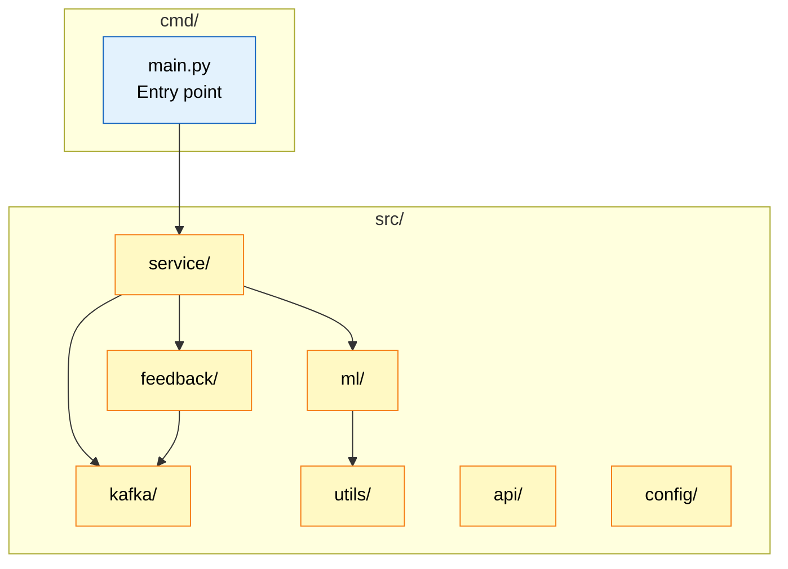
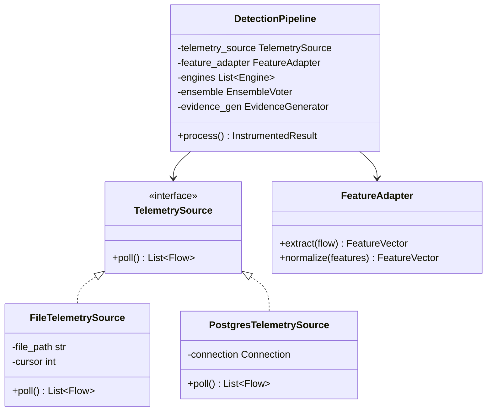
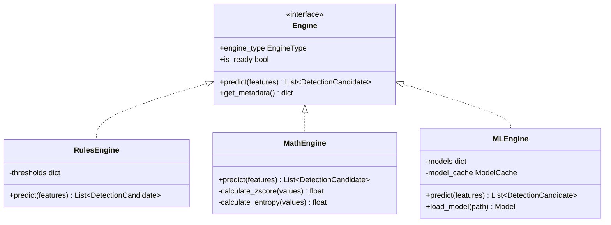
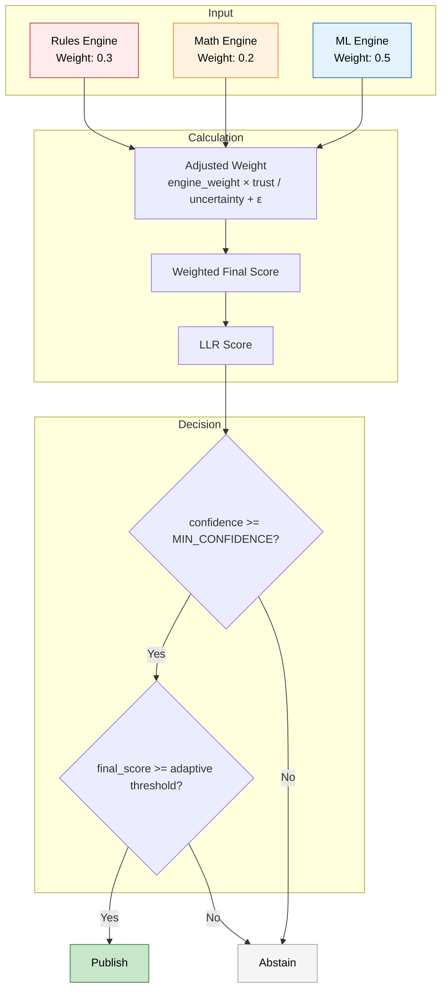
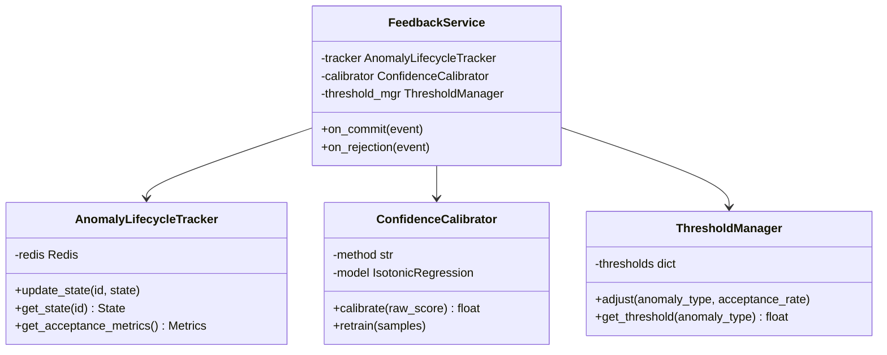
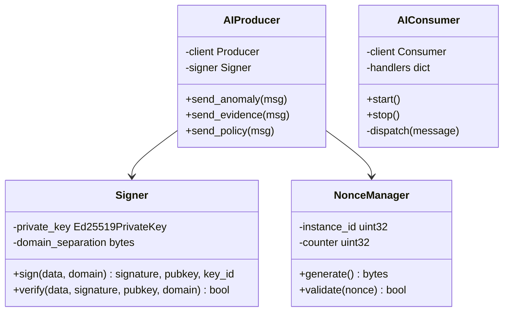
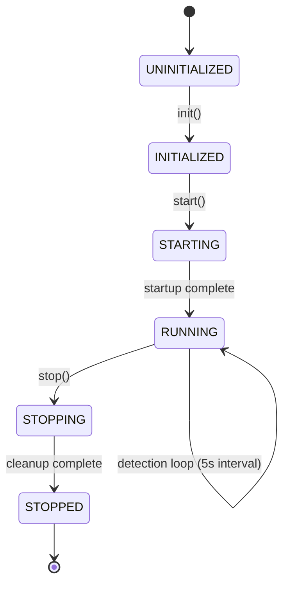
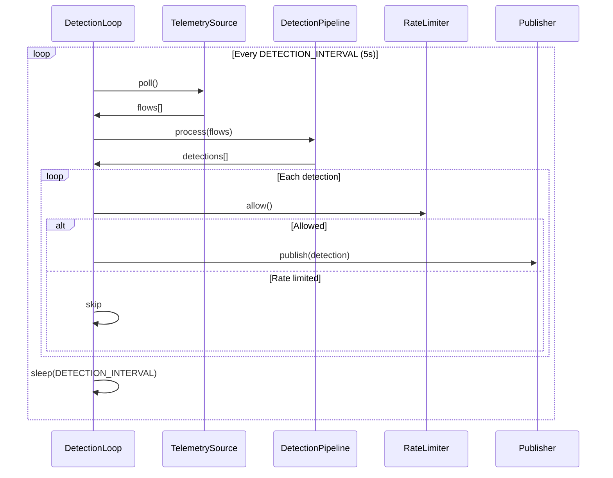
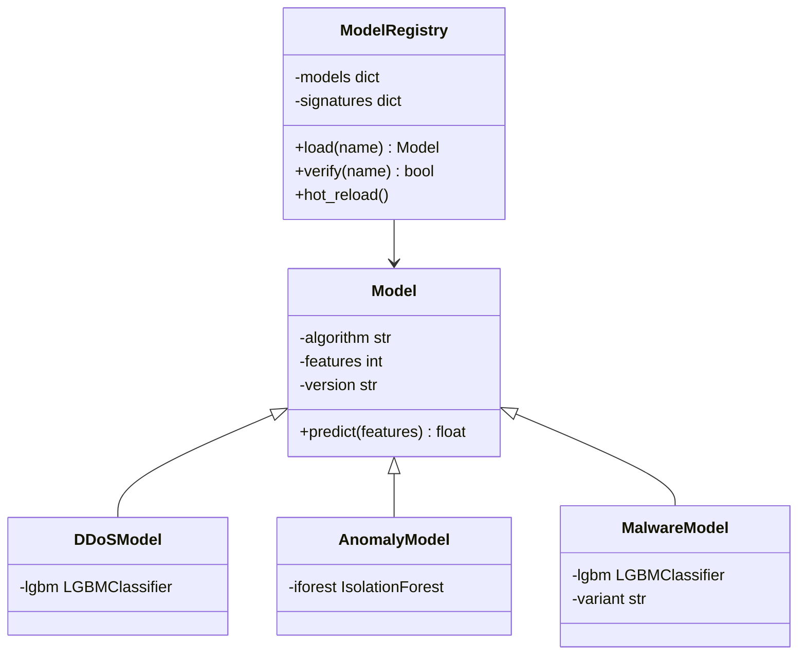

# CyberMesh AI Service - Low-Level Design (LLD)

**Version:** 2.0.0  
**Last Updated:** 2026-01-30

---

## 📑 Navigation

**Quick Links:**
- [🏗️ Module Architecture](#2-module-architecture)
- [🤖 Detection Pipeline](#3-detection-pipeline-srcml)
- [🗳️ Ensemble Voting](#4-ensemble-voting-srcmlensemblepy)
- [🔄 Feedback Service](#5-feedback-service-srcfeedback)
- [📊 ML Models](#8-ml-models)

---

## 1. Overview

The AI Service is a **Python-based ML detection pipeline** that analyzes network telemetry, detects threats using 3 detection engines, and publishes cryptographically signed alerts to Kafka.

> [!IMPORTANT]
> The AI Service uses **3 weighted engines** (Rules 30%, Math 20%, ML 50%) with adaptive threshold tuning based on validator feedback.

---

## 2. Module Architecture

### 2.1 Package Structure

---

## 3. Detection Pipeline (`src/ml/`)

### 3.1 Pipeline Class Diagram

### 3.2 Detection Engines

### 3.3 Rules Engine Thresholds

| Rule | Feature | Default Threshold | Config |
|------|---------|-------------------|--------|
| DDoS (rule) | pps | > 1,000,000 | `DDOS_PPS_THRESHOLD` |
| Port Scan (rule) | unique_dst_ports | > 500 | `PORT_SCAN_THRESHOLD` |
| SYN Flood (rule) | syn_ack_ratio | > 10.0 | `SYN_ACK_RATIO_THRESHOLD` |
| Malware (rule) | entropy | > 7.5 | `MALWARE_ENTROPY_THRESHOLD` |

---

## 4. Ensemble Voting (`src/ml/ensemble.py`)

### 4.1 Voting Algorithm

### 4.2 Thresholds by Type

| Anomaly Type | Base Threshold | Range |
|--------------|----------------|-------|
| DDoS | 0.85 | [0.50, 0.99] |
| Malware | 0.90 | [0.50, 0.99] |
| Anomaly | 0.75 | [0.50, 0.99] |
| Network Intrusion | 0.75 | [0.50, 0.99] |

> [!NOTE]
> Thresholds are **adaptive** and adjusted based on validator acceptance rates from the feedback loop.

---

## 5. Feedback Service (`src/feedback/`)

### 5.1 Component Diagram

### 5.2 Calibration Methods

| Method | Algorithm | Use Case |
|--------|-----------|----------|
| Isotonic | Non-parametric monotonic | Default, flexible |
| Platt | Logistic regression | Fast, simple |

---

## 6. Kafka Integration (`src/kafka/`)

### 6.1 Producer/Consumer

> [!WARNING]
> **Nonce Format (16 bytes):** `[8B timestamp_ms][4B instance_id][4B monotonic_counter]` - Must be unique per message.

---

## 7. Service Manager (`src/service/`)

### 7.1 Lifecycle State Machine

### 7.2 Detection Loop

---

## 8. ML Models

### 8.1 Model Registry

### 8.2 Model Specifications

| Model | Algorithm | Features | AUC | Signature |
|-------|-----------|----------|-----|-----------|
| ddos.pkl | LightGBM | 79 | 0.999 | ✅ Ed25519 |
| anomaly.pkl | IsolationForest | 30 | 1.000 | ✅ Ed25519 |
| malware_flow.pkl | LightGBM | 39 | 0.95 | ✅ Ed25519 |

---

## 9. API Endpoints (`src/api/`)

| Endpoint | Method | Description |
|----------|--------|-------------|
| `/health` | GET | Health check ✅ |
| `/ready` | GET | Readiness probe ✅ |
| `/metrics` | GET | Prometheus metrics 📊 |
| `/detections/stats` | GET | Detection statistics |

---

## 10. Key Files Reference

| File | Purpose | Lines |
|------|---------|-------|
| `cmd/main.py` | Entry point | ~200 |
| `src/ml/pipeline.py` | Detection pipeline | ~300 |
| `src/ml/detectors.py` | 3 engines | ~400 |
| `src/ml/ensemble.py` | Ensemble voting | ~250 |
| `src/feedback/tracker.py` | Lifecycle tracker | ~350 |
| `src/feedback/calibrator.py` | Confidence calibration | ~200 |
| `src/kafka/producer.py` | Kafka producer | ~150 |

---

## 11. Related Documents

### Design Documents
- [HLD](./HLD.md) - High-level design
- [Data Flow](./DATA_FLOW.md) - System data flow

### Architecture Documents
- [AI Detection Pipeline](../architecture/02_ai_detection_pipeline.md)
- [Feedback Loop](../architecture/06_feedback_loop.md)

### Source Code
- [AI Service README](../../ai-service/README.md)

---

**[⬆️ Back to Top](#-navigation)**
