# CyberMesh Backend - Low-Level Design (LLD)

**Version:** 2.0.0  
**Last Updated:** 2026-01-30

---

## 📑 Navigation

**Quick Links:**
- [🏗️ Module Architecture](#2-module-architecture)
- [⚙️ Consensus Engine](#3-consensus-module-pkgconsensus)
- [🔄 State Machine](#4-state-machine-pkgstate)
- [📨 Kafka Integration](#5-kafka-integration-pkgingestkafka)
- [🔌 API Layer](#9-api-layer-pkgapi)

---

## 1. Overview

The Backend is a **Byzantine Fault Tolerant (BFT) consensus engine** written in Go that validates AI-generated security alerts. This document covers the internal architecture, key modules, class diagrams, and algorithms.

> [!IMPORTANT]
> The backend uses **HotStuff 2-chain consensus** with 5 validators, tolerating 1 Byzantine failure (2f+1 = 3 quorum).

---

## 2. Module Architecture

### 2.1 Package Structure

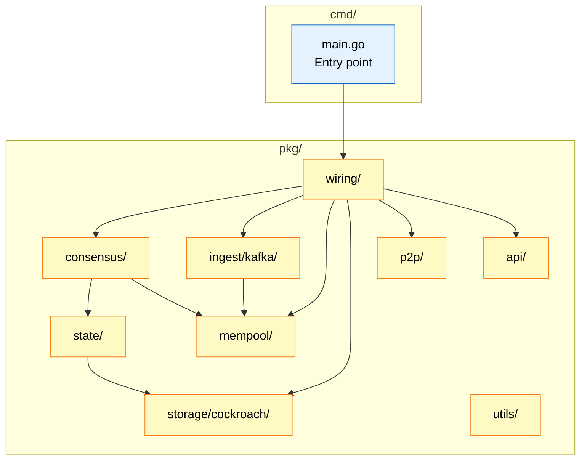

---

## 3. Consensus Module (`pkg/consensus/`)

### 3.1 Component Diagram

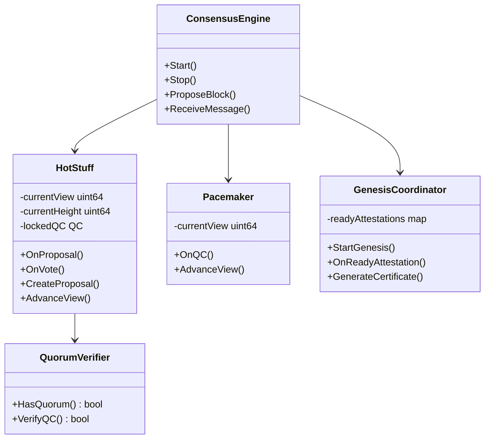

### 3.2 HotStuff (2-Chain) State Machine

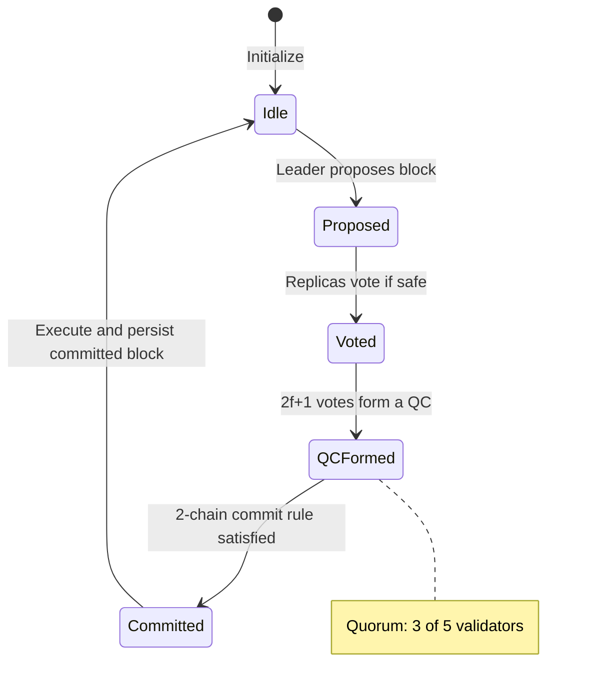

### 3.3 Key Algorithms

#### Leader Selection (Rotation / View-Based)

```go
function GetLeader(view, validators):
    active = validators.filter(v => v.reputation >= MIN_REPUTATION)
    sorted = active.sortBy(v => v.id)
    index = view % len(sorted)
    return sorted[index]
```

#### Quorum Calculation (BFT)

```
N = total validators
f = (N - 1) / 3                // Byzantine failures tolerated
Quorum = 2f + 1                // Need 2f+1 votes (e.g., for QC formation)

Example (N=5): f=1, Quorum=3
```

---

## 4. State Machine (`pkg/state/`)

### 4.1 Executor Flow

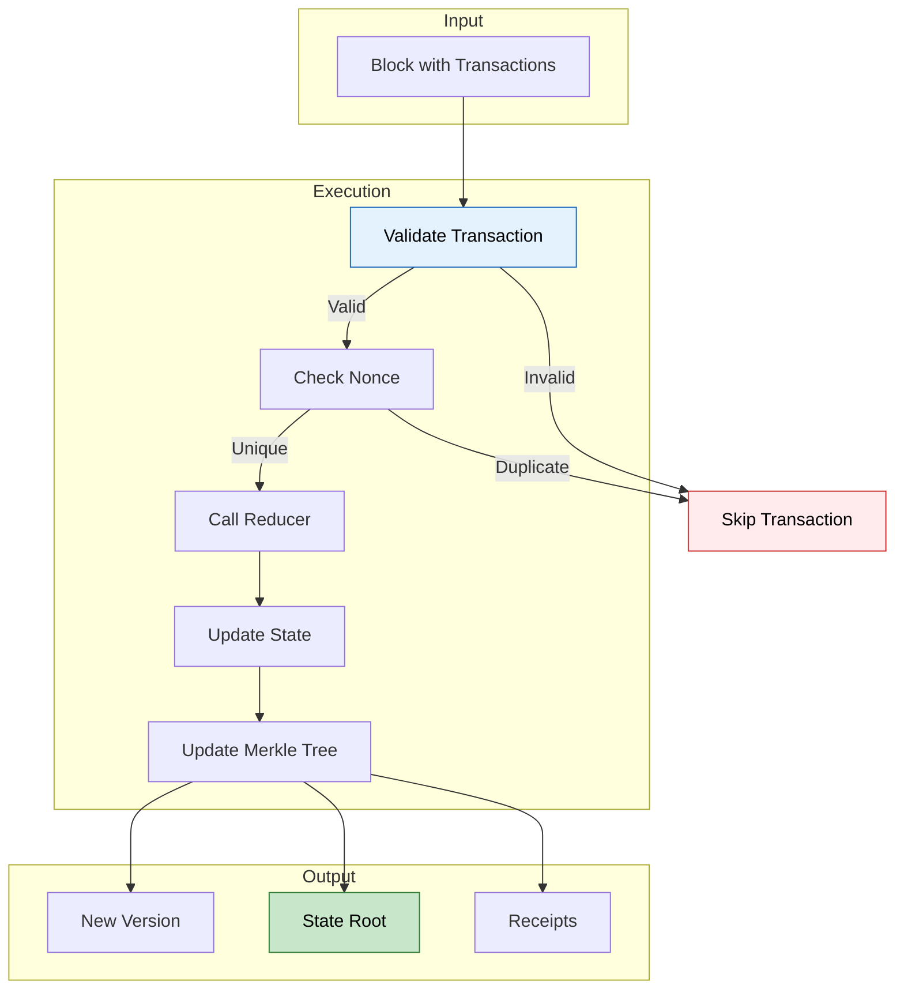

> [!WARNING]
> **Fail-Closed Design**: Any invalid transaction invalidates the entire block. This prevents state divergence across validators.

### 4.2 Reducer Functions

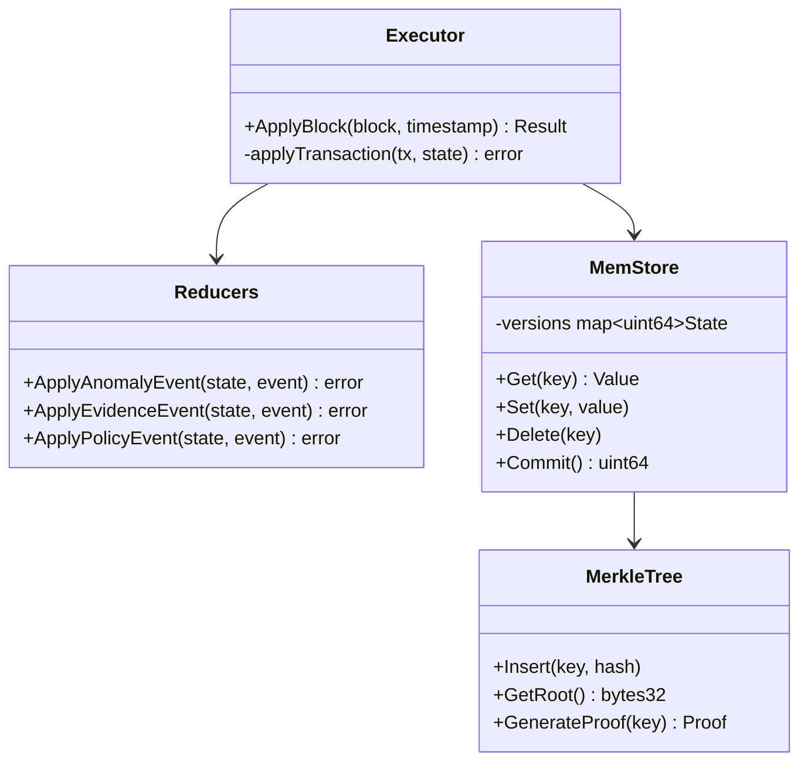

### 4.3 State Model

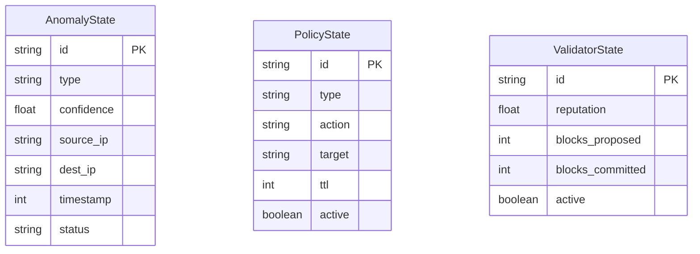

---

## 5. Kafka Integration (`pkg/ingest/kafka/`)

### 5.1 Consumer Architecture

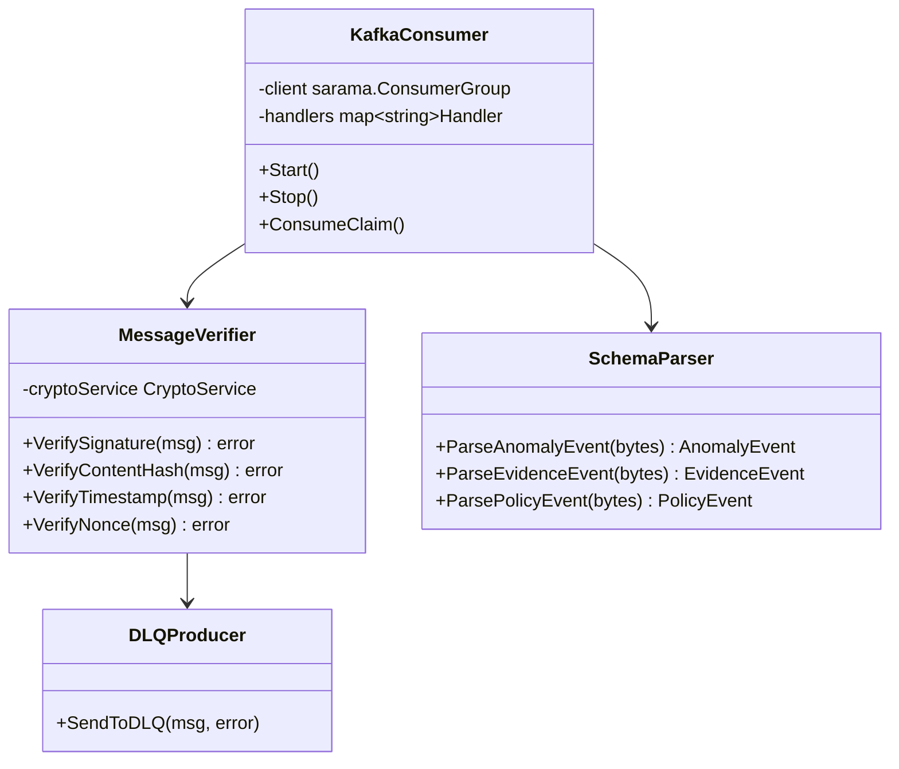

### 5.2 Message Verification Flow

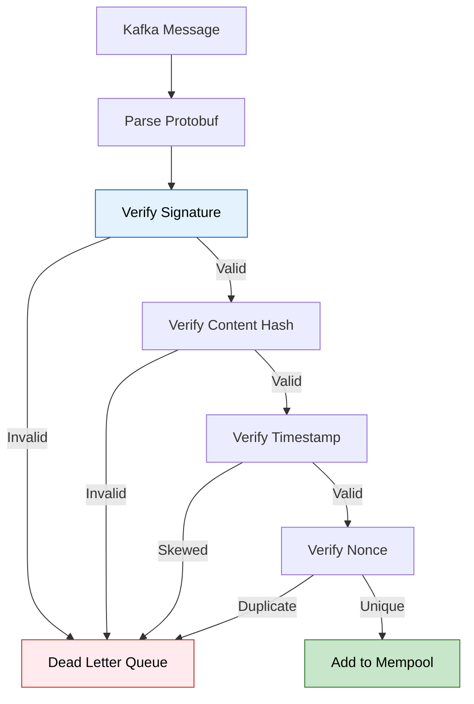

> [!NOTE]
> All Kafka messages use **Ed25519 signatures** with domain separation. Invalid messages are rejected to the DLQ topic.

---

## 6. Mempool (`pkg/mempool/`)

### 6.1 Class Diagram

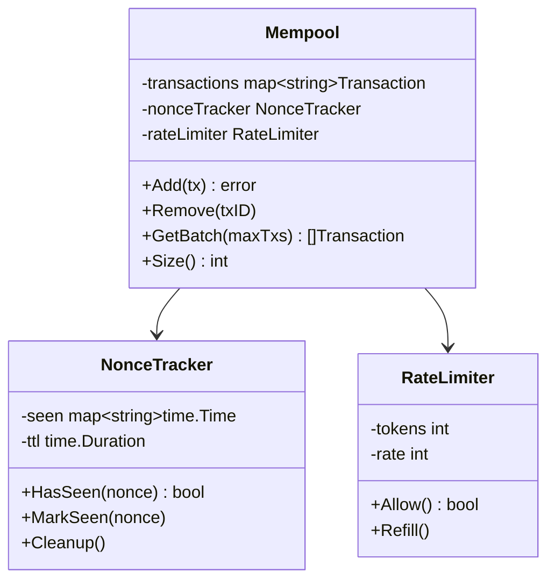

### 6.2 Configuration

| Parameter | Default | Description |
|-----------|---------|-------------|
| `MEMPOOL_MAX_TXS` | 1000 | Max transactions |
| `MEMPOOL_MAX_BYTES` | 10MB | Max total size |
| `MEMPOOL_NONCE_TTL` | 15m | Nonce expiration |
| `MEMPOOL_RATE_PER_SECOND` | 1000 | Rate limit |

---

## 7. Storage (`pkg/storage/cockroach/`)

### 7.1 Adapter Pattern

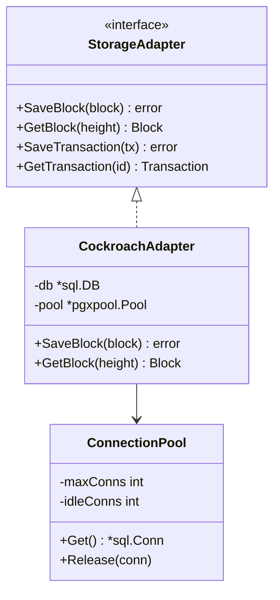

### 7.2 Write Path

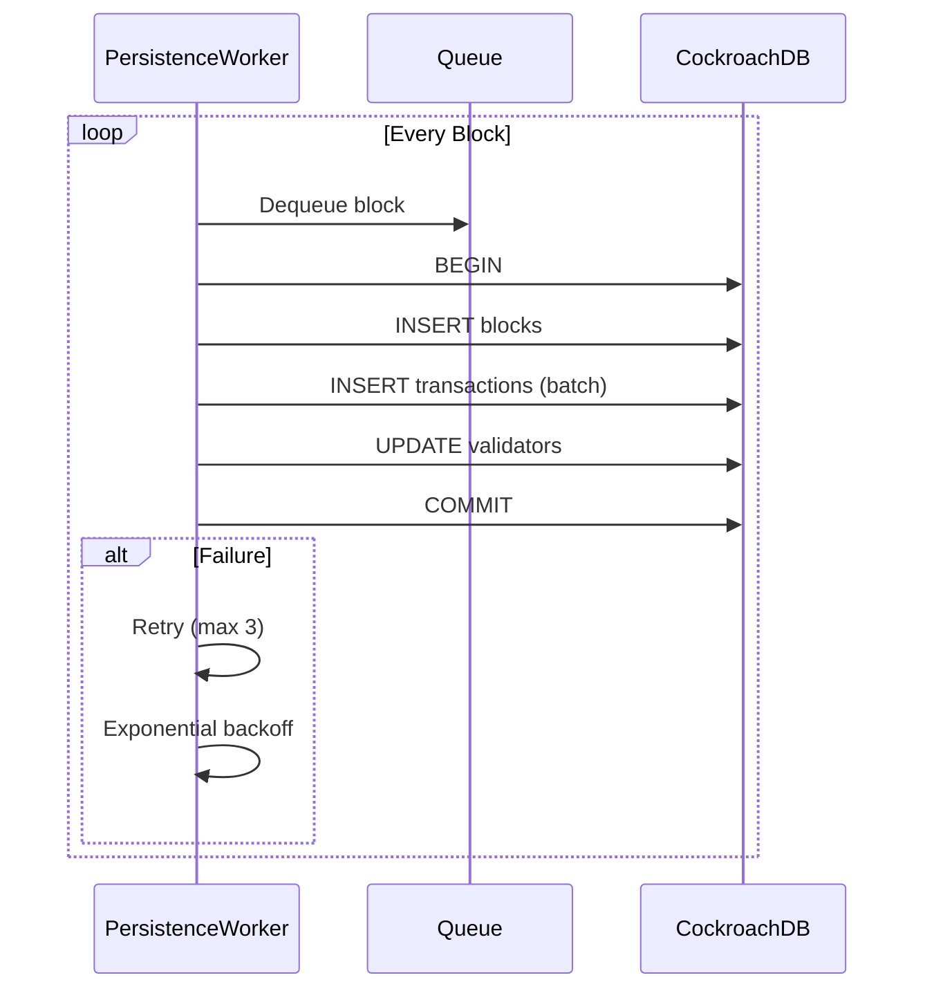

---

## 8. P2P Networking (`pkg/p2p/`)

### 8.1 LibP2P Integration

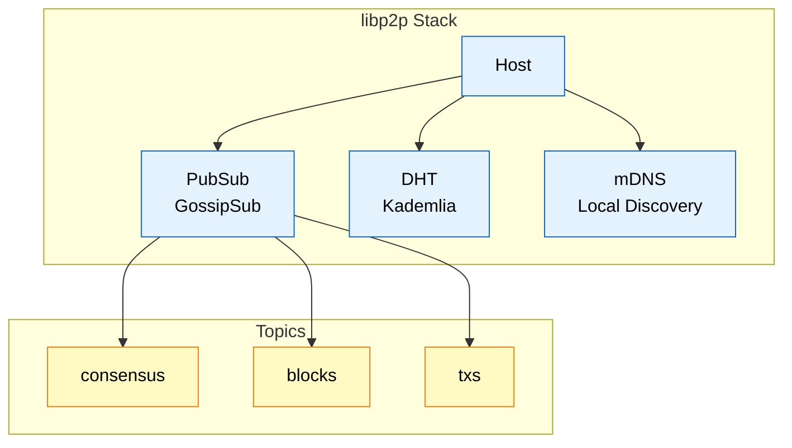

### 8.2 Message Types

| Topic | Message | Purpose |
|-------|---------|---------|
| `consensus/proposal` | Proposal | HotStuff proposal broadcast |
| `consensus/vote` | Vote | HotStuff vote broadcast |
| `consensus/viewchange` | ViewChange | View change signaling |
| `consensus/newview` | NewView | New view announcement |
| `consensus/heartbeat` | Heartbeat | Liveness/activation heartbeats |
| `blocks` | BlockAnnouncement | Block propagation |
| `txs` | Transaction | Transaction gossip |

---

## 9. API Layer (`pkg/api/`)

### 9.1 Endpoints

All endpoints are served under `/api/v1`:

| Endpoint | Method | Description |
|----------|--------|-------------|
| `/health` | GET | Health check (public) ✅ |
| `/ready` | GET | Readiness probe (public) ✅ |
| `/metrics` | GET | Prometheus metrics 📊 |
| `/blocks/latest` | GET | Latest block |
| `/blocks` | GET | List blocks |
| `/blocks/{height}` | GET | Get block by height |
| `/state/root` | GET | State root |
| `/state/{key}` | GET | State lookup |
| `/validators` | GET | List validators |
| `/validators/{id}` | GET | Validator details |
| `/dashboard/overview` | GET | Dashboard overview |
| `/anomalies` | GET | List anomalies |
| `/ai/metrics` | GET | AI metrics (proxy) |

### 9.2 Middleware & Auth

The router applies middleware in this order:

1. Panic recovery
2. Request logging
3. Request ID
4. Concurrency limiting (optional)
5. IP allowlist (optional)
6. Rate limiting (optional)
7. Global authentication (mTLS/Bearer tokens)
8. CORS headers (optional)
9. Security headers

### 9.3 Response Flow

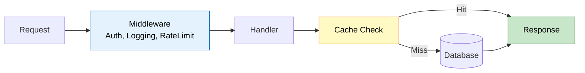

---

## 10. Key Files Reference

| File | Purpose | Lines |
|------|---------|-------|
| `cmd/cybermesh/main.go` | Entry point, signal handling | ~1100 |
| `pkg/consensus/api/engine.go` | Consensus orchestration | ~2000 |
| `pkg/consensus/pbft/pbft.go` | HotStuff (2-chain) engine | ~1000 |
| `pkg/consensus/genesis/coordinator.go` | Genesis ceremony | ~800 |
| `pkg/state/executor.go` | Transaction execution | ~400 |
| `pkg/ingest/kafka/consumer.go` | Kafka consumer | ~900 |
| `pkg/ingest/kafka/verifier.go` | Signature verification | ~300 |
| `pkg/mempool/mempool.go` | Transaction pool | ~300 |
| `pkg/storage/cockroach/adapter.go` | DB adapter | ~600 |

---

## 11. Related Documents

### Design Documents
- [HLD](./HLD.md) - High-level design
- [Data Flow](./DATA_FLOW.md) - System data flow

### Architecture Documents
- [HotStuff Consensus](../architecture/03_hotstuff_consensus.md)
- [Genesis Bootstrap](../architecture/07_genesis_bootstrap.md)
- [State Machine](../architecture/05_state_machine.md)

### Source Code
- [Backend README](../../backend/README.md)

---

**[⬆️ Back to Top](#-navigation)**
