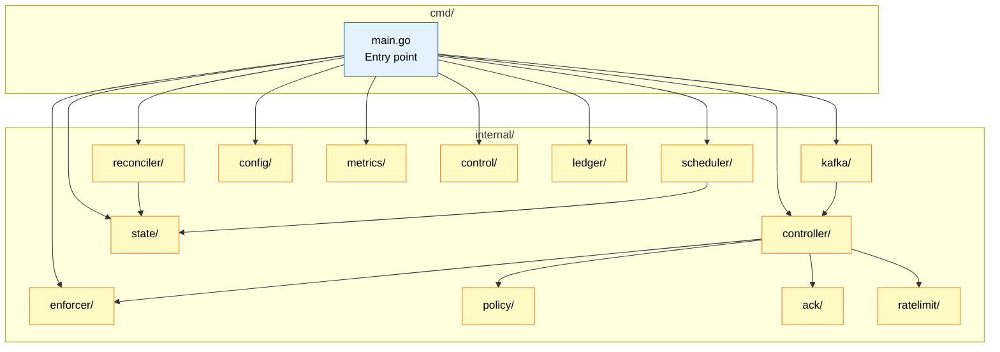
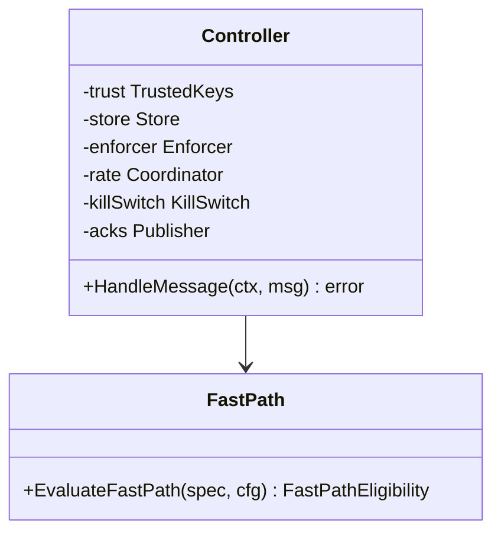
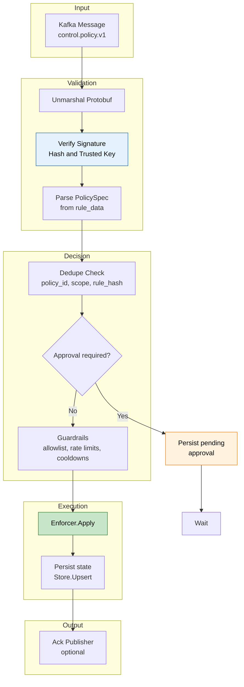
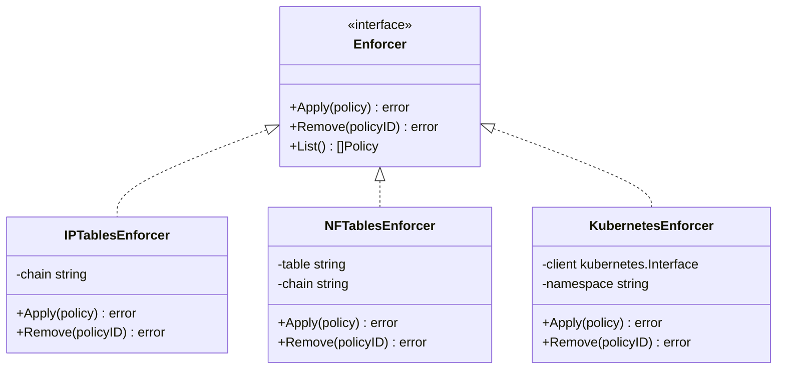
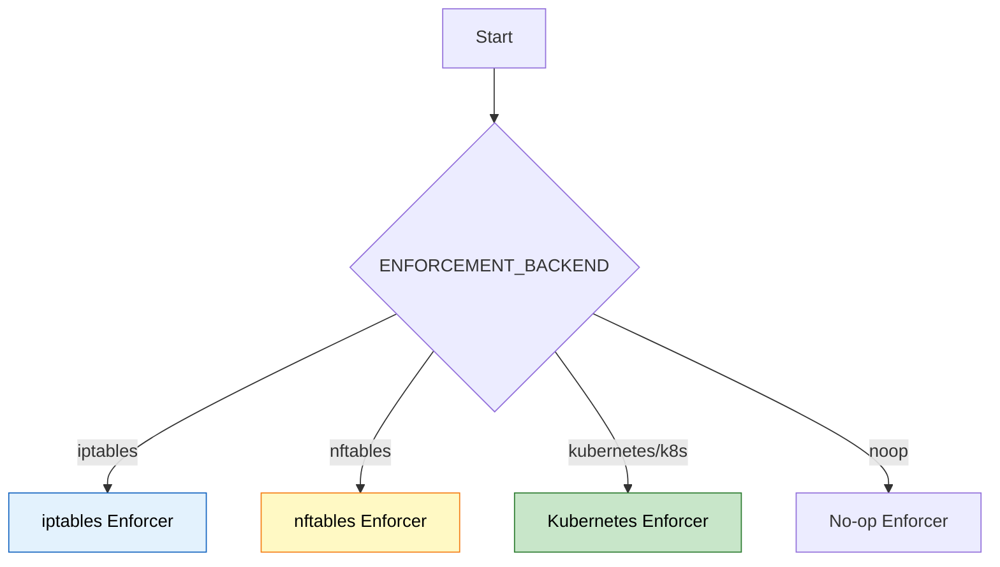
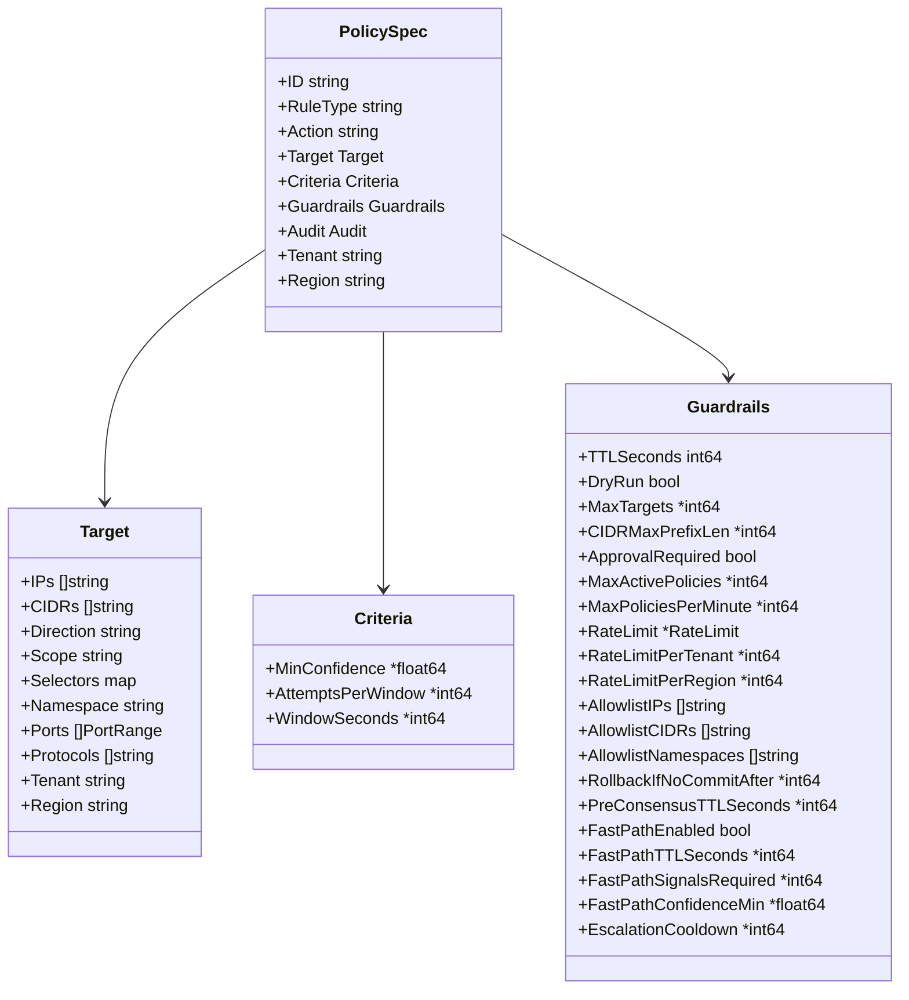
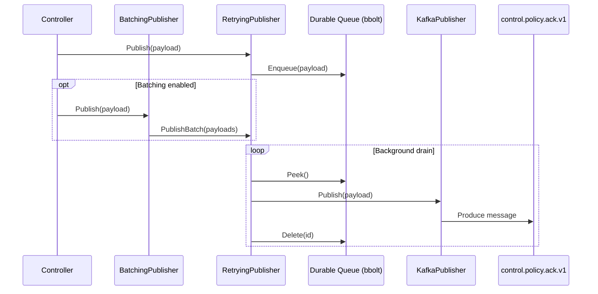
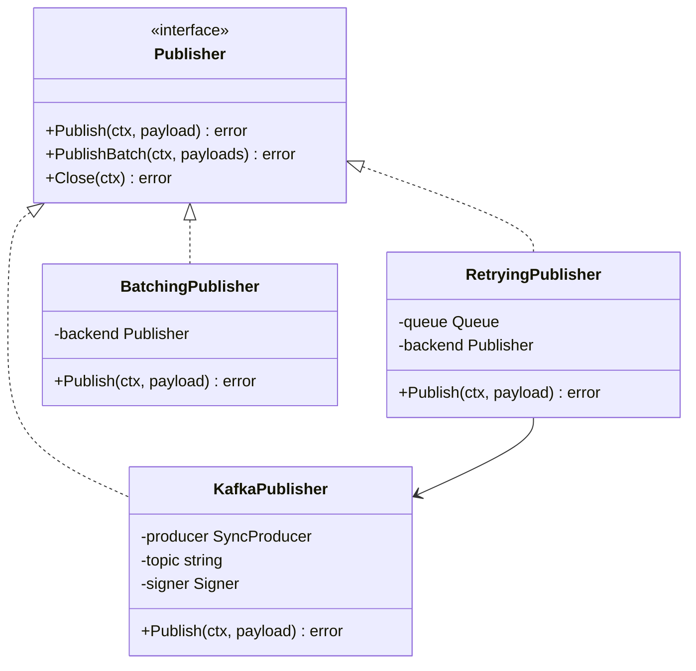
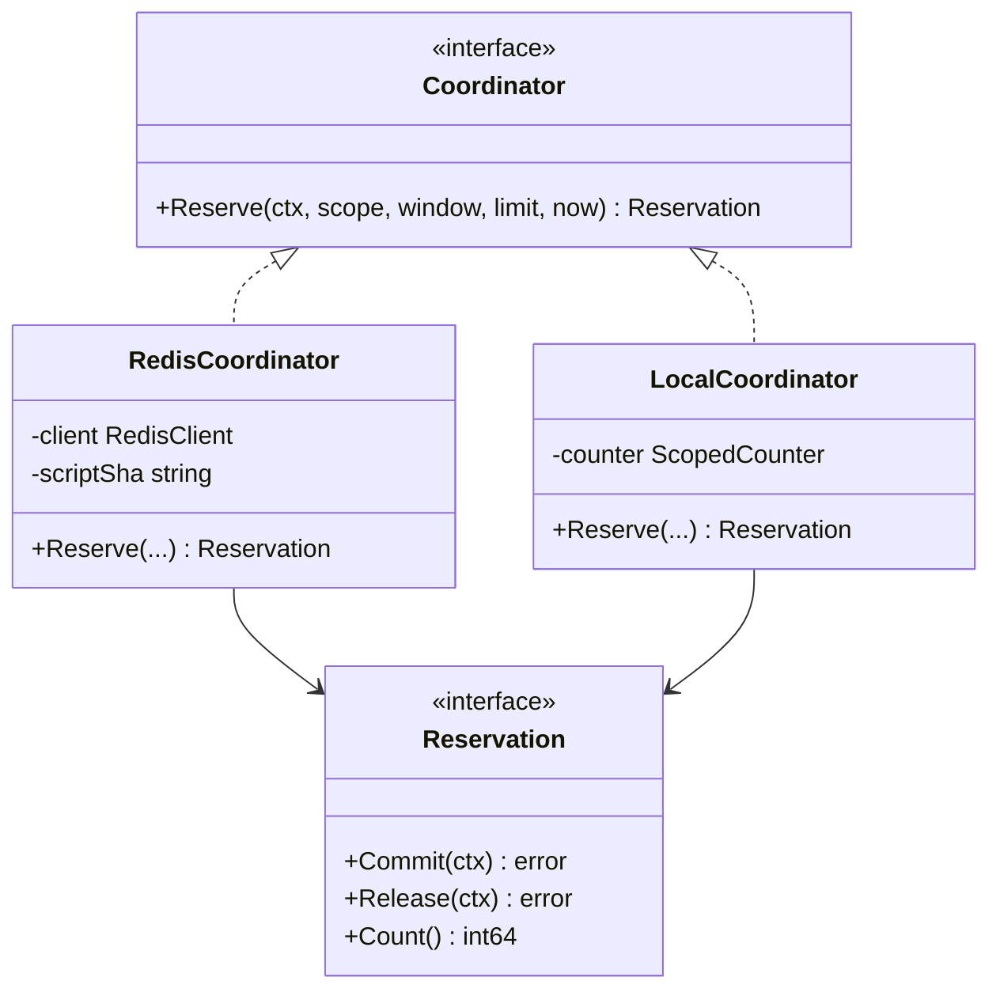
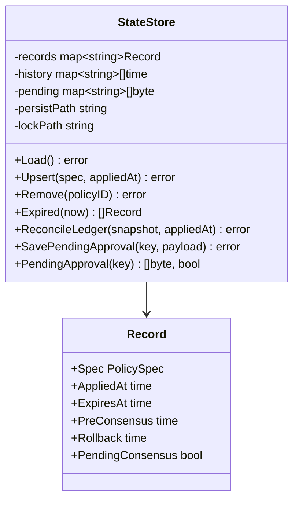

# CyberMesh Enforcement Agent - Low-Level Design (LLD)

**Version:** 2.0.0  
**Last Updated:** 2026-01-30

---

## 📑 Navigation

**Quick Links:**
- [🏗️ Module Architecture](#2-module-architecture)
- [🎛️ Controller](#3-controller-internalcontroller)
- [⚙️ Enforcer](#4-enforcer-internalenforcer)
- [📋 Policy Spec](#5-policy-specification-internalpolicy)
- [✅ ACK System](#6-ack-system-internalack)

---

## 1. Overview

The Enforcement Agent is a **Go-based DaemonSet** that consumes policy messages from Kafka and enforces them using iptables, nftables, or Kubernetes NetworkPolicies.

> [!IMPORTANT]
> The agent runs as a **DaemonSet** with `hostNetwork: true` and requires `NET_ADMIN` capability for iptables/nftables access.

---

## 2. Module Architecture

### 2.1 Package Structure



---

## 3. Controller (`internal/controller/`)

### 3.1 Class Diagram



### 3.2 Control Loop



---

## 4. Enforcer (`internal/enforcer/`)

### 4.1 Backend Interface



### 4.2 Backend Selection



---

## 5. Policy Specification (`internal/policy/`)

### 5.1 Policy Parser



### 5.2 Policy Types

| Type | Action | Example |
|------|--------|---------|
| `block` | `DROP`/`REJECT` | Block IP/CIDR or selector-scoped targets |

---

## 6. ACK System (`internal/ack/`)

### 6.1 Acknowledgment Flow



### 6.2 ACK Publisher



---

## 7. Rate Limiting (`internal/ratelimit/`)

### 7.1 Rate Limiter Types



---

## 8. State Store (`internal/state/`)

### 8.1 Local State



---

## 9. iptables/nftables Commands

### 9.1 iptables Example

```bash
# Block source IP
iptables -A INPUT -s 1.2.3.4 -j DROP

# Rate limit
iptables -A INPUT -p tcp --dport 80 -m limit --limit 100/sec -j ACCEPT
iptables -A INPUT -p tcp --dport 80 -j DROP

# Remove rule (by line number)
iptables -D INPUT 5
```

### 9.2 nftables Example

```bash
# Block source IP
nft add rule ip cybermesh input ip saddr 1.2.3.4 drop

# Rate limit
nft add rule ip cybermesh input tcp dport 80 limit rate 100/second accept

# Remove rule (by handle)
nft delete rule ip cybermesh input handle 15
```

---

## 10. Kubernetes NetworkPolicy

### 10.1 Generated Policy

```yaml
apiVersion: networking.k8s.io/v1
kind: NetworkPolicy
metadata:
  name: cybermesh-block-1-2-3-4
  namespace: default
spec:
  podSelector: {}
  policyTypes:
    - Ingress
  ingress:
    - from:
        - ipBlock:
            cidr: 0.0.0.0/0
            except:
              - 1.2.3.4/32
```

---

## 11. Key Files Reference

| File | Purpose | Lines |
|------|---------|-------|
| `cmd/agent/main.go` | Entrypoint wiring | ~440 |
| `internal/config/config.go` | Env config parsing | ~320 |
| `internal/kafka/consumer.go` | Kafka consumer-group wrapper | ~220 |
| `internal/controller/controller.go` | Policy handler | ~770 |
| `internal/enforcer/enforcer.go` | Backend factory + interfaces | ~120 |
| `internal/enforcer/iptables/iptables_linux.go` | iptables backend | ~240 |
| `internal/enforcer/nftables/nftables_linux.go` | nftables backend | ~520 |
| `internal/enforcer/kubernetes/kubernetes.go` | Kubernetes NetworkPolicy backend | ~520 |
| `internal/state/store.go` | Persistent state store | ~690 |
| `internal/reconciler/reconciler.go` | Re-apply + ledger reconciliation | ~250 |
| `internal/scheduler/scheduler.go` | TTL/rollback expiration loop | ~200 |
| `internal/ack/publisher.go` | Kafka ACK publisher | ~170 |
| `internal/metrics/metrics.go` | Prometheus metrics | ~390 |

---

## 12. Related Documents

### Design Documents
- [HLD](./HLD.md) - High-level design
- [Data Flow](./DATA_FLOW.md) - System data flow

### Source Code
- [Build Summary](../../enforcement-agent/BUILD_SUMMARY.md)

---

**[⬆️ Back to Top](#-navigation)**
