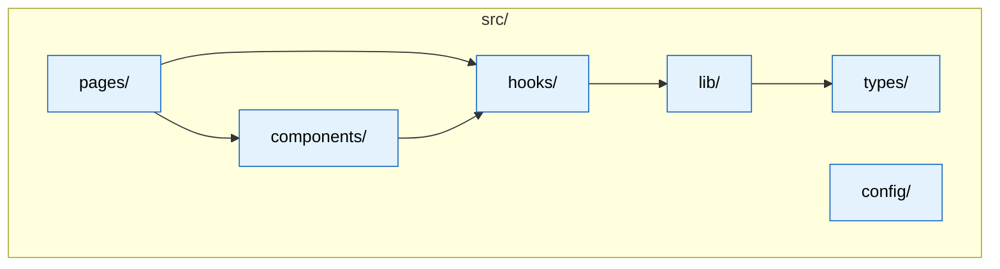
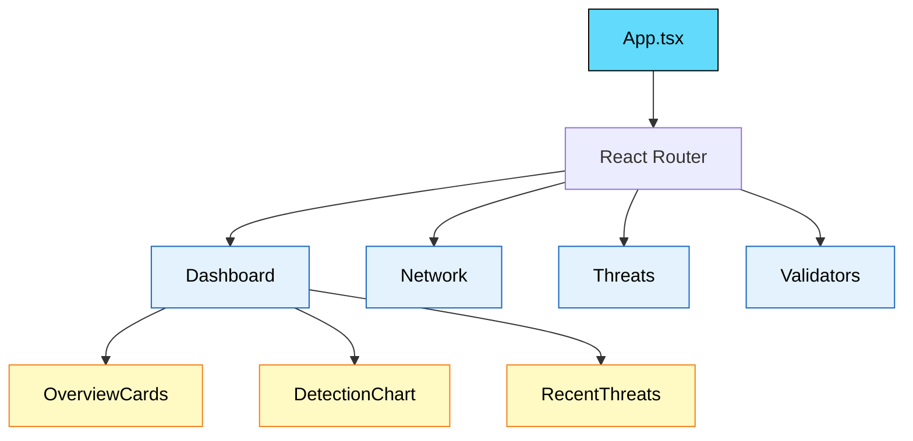
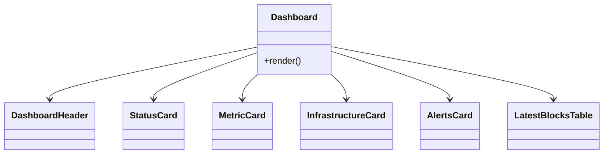
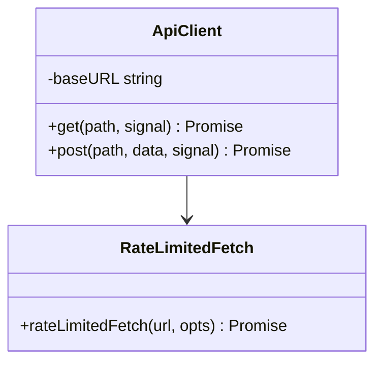
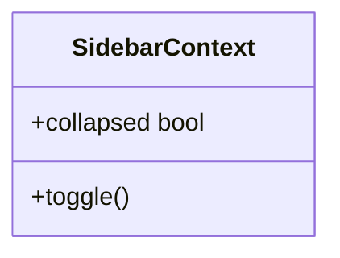
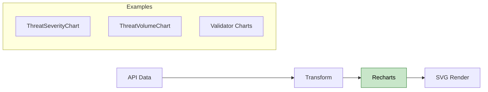

# CyberMesh Frontend - Low-Level Design (LLD)

**Version:** 2.0.0  
**Last Updated:** 2026-01-30

---

## 📑 Navigation

**Quick Links:**
- [🏗️ Project Structure](#3-project-structure)
- [📄 Page Architecture](#4-page-architecture)
- [🧩 Components](#5-component-hierarchy)
- [📊 Data Fetching](#6-data-fetching-srclib)
- [📈 Charts](#8-chart-components)

---

## 1. Overview

The Frontend is a **React/TypeScript dashboard** for monitoring CyberMesh threat detection and network status.

> [!NOTE]
> The frontend uses **React Query** for server state management with automatic refetching and caching.

---

## 2. Technology Stack

| Layer | Technology |
|-------|------------|
| Framework | React 18 ✅ |
| Language | TypeScript |
| Build | Vite ⚡ |
| Styling | TailwindCSS 🎨 |
| State | React Query |
| Charts | Recharts 📊 |
| HTTP | fetch (typed client) |

---

## 3. Project Structure



---

## 4. Page Architecture

### 4.1 Routes

| Path | Page | Description |
|------|------|-------------|
| `/` | Index | Landing / entry |
| `/dashboard` | Dashboard | Overview metrics 📊 |
| `/ai-engine` | AI Engine | AI engine status 🤖 |
| `/threats` | Threats | Threat list 🚨 |
| `/blockchain` | Blockchain | Ledger / block views ⛓️ |
| `/network` | Network | Network topology 🌐 |
| `/system-health` | System Health | Health + readiness ✅ |
| `/settings` | Settings | Configuration ⚙️ |
| `/404` | NotFound | Not found ❌ |

### 4.2 Page Flow



---

## 5. Component Hierarchy

### 5.1 Dashboard Components



---

## 6. Data Fetching (`src/lib/`)

### 6.1 API Client



### 6.2 React Query Hooks

```typescript
// Example: useDashboardData hook
export const useDashboardData = ({ pollingInterval = 15000 } = {}) =>
  useQuery({
    queryKey: ["dashboard-overview"],
    queryFn: ({ signal }) => apiClient.dashboard.getOverview(signal),
    refetchInterval: pollingInterval,
    staleTime: 10_000,
  });
```

---

## 7. State Management

### 7.1 Server State (React Query)

| Hook | Key | Refetch Interval |
|------|-----|------------------|
| `useDashboardData` | `['dashboard-overview']` | 30s (Dashboard) |
| `useThreatsData` | `['threats-summary']` | 15s |
| `useNetworkData` | `['network-status']` | 15s |
| `useBlockchainData` | `['blockchain-data', limit]` | 30s |
| `useAIEngineData` | `['ai-engine-status']` | 15s |
| `useSystemHealthData` | `['system-health']` | 15s |

### 7.2 UI State (React Context)



---

## 8. Chart Components

### 8.1 Recharts-Based Charts



---

## 9. API Endpoints Used

| Endpoint | Method | Component |
|----------|--------|-----------|
| `/api/v1/dashboard/overview` | GET | Dashboard + derived pages |
| `/api/v1/ready` | GET | BackendStatusPanel / SystemHealth |
| `/api/v1/health` | GET | SystemHealth |
| `/api/v1/blocks?limit=N` | GET | Blockchain page (optional) |

---

## 10. Key Files

| File | Purpose |
|------|---------|
| `src/App.tsx` | Root component |
| `src/pages/Dashboard.tsx` | Dashboard page |
| `src/pages/Network.tsx` | Network page |
| `src/pages/Threats.tsx` | Threats page |
| `src/pages/Blockchain.tsx` | Blockchain page |
| `src/pages/AIEngine.tsx` | AI engine page |
| `src/pages/SystemHealth.tsx` | System health page |
| `src/lib/api/client.ts` | Typed API client |
| `src/lib/api/rate-limiter.ts` | Retry/backoff wrapper |
| `src/lib/query-client.ts` | React Query client config |
| `src/config/runtime.ts` | Runtime config loader |

---

## 11. Related Documents

### Design Documents
- [HLD](./HLD.md) - High-level design

### Source Code
- [Frontend README](../../cybermesh-frontend/README.md)

---

**[⬆️ Back to Top](#-navigation)**
