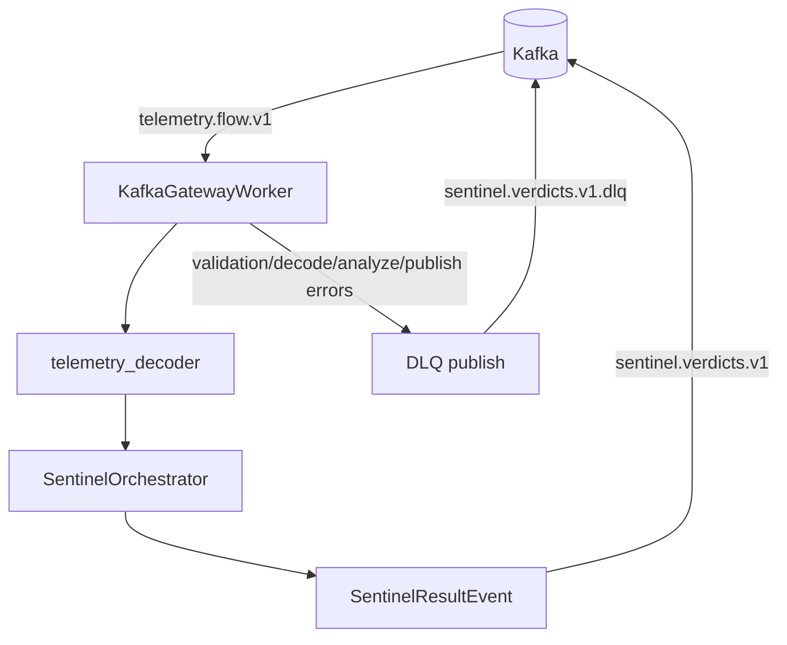
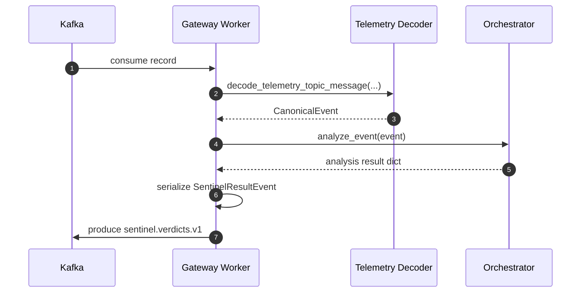

# CyberMesh Sentinel - Low-Level Design (LLD)

**Version:** 1
**Last Updated:** 2026-02-20

---

## 1. Overview

Sentinel is the multi-agent analysis layer that consumes canonical telemetry events and publishes signed/structured verdicts for AI ingestion.

Current integrated runtime uses the Kafka gateway worker path:
- Input: `telemetry.flow.v1` (and optionally `telemetry.deepflow.v1` via topic/schema map)
- Output: `sentinel.verdicts.v1` (deployment override)

Code defaults (when not overridden by env):
- Input fallback: `telemetry.features.v1`
- Output fallback: `ai.anomalies.v1`

Primary code:
- `sentinel/sentinel/kafka/gateway.py`
- `sentinel/sentinel/kafka/telemetry_decoder.py`
- `sentinel/sentinel/agents/orchestrator.py`
- `sentinel/sentinel/contracts/generated/sentinel_result_pb2.py`

---

## 2. Runtime Architecture

---

## 3. Processing Pipeline

---

## 4. Agent Catalog (Code-Accurate)

### 4.1 Runtime Routing by Modality

| Modality | Engine | Parallel/Sequential | Main entrypoint |
|---|---|---|---|
| `FILE` | `AnalysisEngine` | Hybrid (env toggle) | `sentinel/sentinel/agents/graph.py` |
| `NETWORK_FLOW` | `TelemetryAnalysisEngine` | Hybrid (env toggle) | `sentinel/sentinel/agents/telemetry_graph.py` |
| `PROCESS_EVENT`, `SCAN_FINDINGS`, `ACTION_EVENT`, `MCP_RUNTIME`, `EXFIL_EVENT`, `RESILIENCE_EVENT` | `EventAnalysisEngine` | Parallel | `sentinel/sentinel/agents/event_graph.py` |

### 4.2 Agent Mapping (Business Name -> Code)

| Business name | Current implementation | Wired in runtime |
|---|---|---|
| SignatureAgent | Fast-path signatures + `StaticAnalysisAgent` | Yes (`FILE`) |
| StaticFileAgent | `StaticAnalysisAgent` | Yes (`FILE`) |
| BehaviorAgent | `FlowAgent`, `ProcessAgent`, `SequenceRiskAgent` | Yes (`NETWORK_FLOW` + event modalities) |
| NetworkAgent | `FlowAgent` + telemetry decoder/normalizer | Yes (`NETWORK_FLOW`) |
| IdentityAgent | No dedicated identity-only class yet | Not dedicated |
| CloudIAMAgent | No dedicated cloud IAM-only class yet | Not dedicated |
| ThreatIntelAgent | `ThreatIntelAgent`, `TelemetryThreatIntelAgent` | Yes (`FILE`, `NETWORK_FLOW`) |
| LLMReasonerAgent | `LLMReasoningAgent` | Yes (`FILE`, optional) |

### 4.3 Runtime Control Agents

| Agent | Class | Modality |
|---|---|---|
| Sequence Risk Agent | `SequenceRiskAgent` | `ACTION_EVENT` |
| MCP Runtime Controls Agent | `MCPRuntimeControlsAgent` | `MCP_RUNTIME` |
| Exfil / DLP Agent | `ExfilDLPAgent` | `EXFIL_EVENT` |
| Resilience Agent | `ResilienceAgent` | `RESILIENCE_EVENT` |

### 4.4 File Graph Agent Set

- `StaticAnalysisAgent`
- `ScriptAgent`
- `MalwareAgent` (fallback `MLAnalysisAgent` when malware providers are unavailable)
- `ThreatIntelAgent` (optional)
- `LLMReasoningAgent` (optional, conditional)
- `CoordinatorAgent` (final merge/scoring)

### 4.5 OSS Tool Outputs (as ingest sources, not native Sentinel agents)

| Tool output source | Ingest path |
|---|---|
| Zeek / Suricata / IPFIX | `telemetry.flow.v1` / `telemetry.deepflow.v1` -> decoder -> Sentinel |
| Falco / Sigma / BZAR / mcp-scan / skill-scanner / trufflehog / rebuff (normalized findings) | `SCAN_FINDINGS` modality via event builder + `ScannerFindingsAgent` |

---

## 5. Contracts

### 5.1 Input (from telemetry)
- Topic: `telemetry.flow.v1`
- Optional topic: `telemetry.deepflow.v1`
- Encoding: protobuf/json (topic-mapped)
- Schemas: `FlowV1` / `DeepFlowV1` (`telemetry-layer/proto/*.proto`)

### 5.2 Output (to AI path)
- Topic: `sentinel.verdicts.v1`
- Encoding: protobuf (default; JSON fallback supported)
- Schema: `SentinelResultEvent` (`ai-service/proto/sentinel_result.proto`)

Key output fields used downstream:
- `schema_version`, `event_id`, `tenant_id`
- `input` metadata
- `threat_level`, `final_score`, `confidence`
- `findings[]`, `errors[]`, `degraded`

---

## 6. Validation and Error Handling

- Hard limits:
  - max message size via `KafkaWorkerConfig.max_message_size`
  - timestamp skew checks in gateway parser path
- Failure behavior:
  - decode/validate/analyze/publish failures are routed to DLQ
  - consumer offsets are committed after DLQ handoff to prevent tight poison-message loops
- Determinism:
  - output schema fixed as `sentinel.result.v1`
  - analysis metadata normalized before serialization

---

## 7. Configuration (Operational)

Current integrated job config source:
- `k8s_azure/sentinel/sentinel-kafka-ai-integration-job.yaml`

Key env:
- `KAFKA_INPUT_TOPIC=telemetry.flow.v1`
- `KAFKA_TOPIC_SCHEMA_MAP=telemetry.flow.v1:flow_v1`
- `KAFKA_TOPIC_ENCODING_MAP=telemetry.flow.v1:protobuf`
- `KAFKA_OUTPUT_TOPIC=sentinel.verdicts.v1`
- `KAFKA_OUTPUT_ENCODING=protobuf`
- `KAFKA_DLQ_TOPIC=sentinel.verdicts.v1.dlq`

---

## 8. Integration Touchpoints

### 8.1 AI Service
- Consumer: `ai-service/src/service/sentinel_adapter.py`
- Reads `sentinel.verdicts.v1`, publishes:
  - `ai.anomalies.v1`
  - `ai.policy.v1` (when policy candidate exists)

### 8.2 Backend + Enforcement
- Backend consumes `ai.policy.v1` and publishes `control.policy.v2`
- Enforcement consumes `control.policy.v2` and emits `control.enforcement_ack.v1`

---

## 9. Related Docs

- `docs/architecture/13_sentinel_integration.md`
- `docs/architecture/04_kafka_message_bus.md`
- `docs/design/LLD-ai-service.md`
