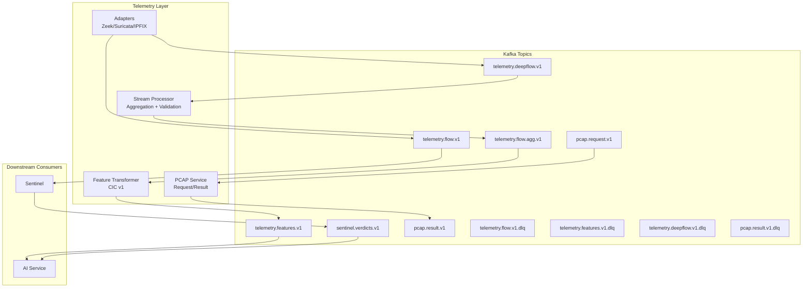
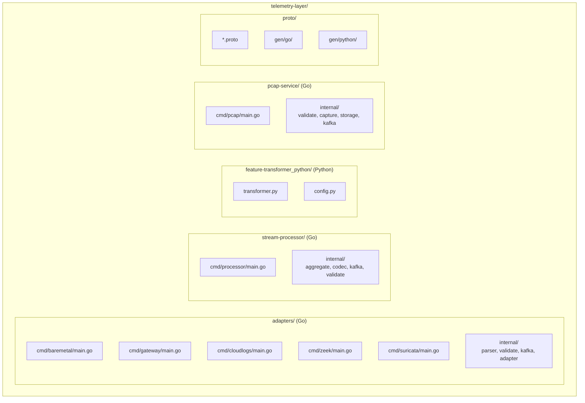
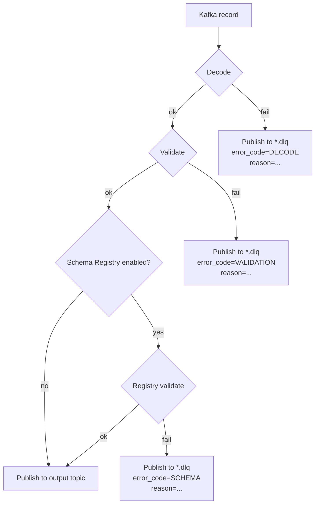
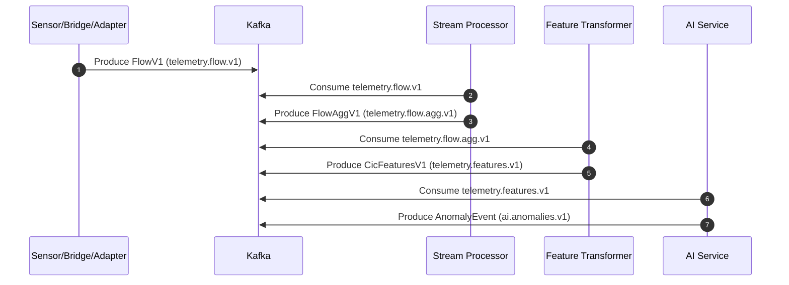
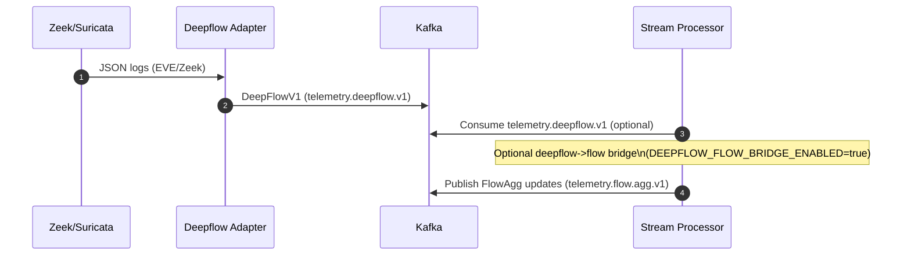
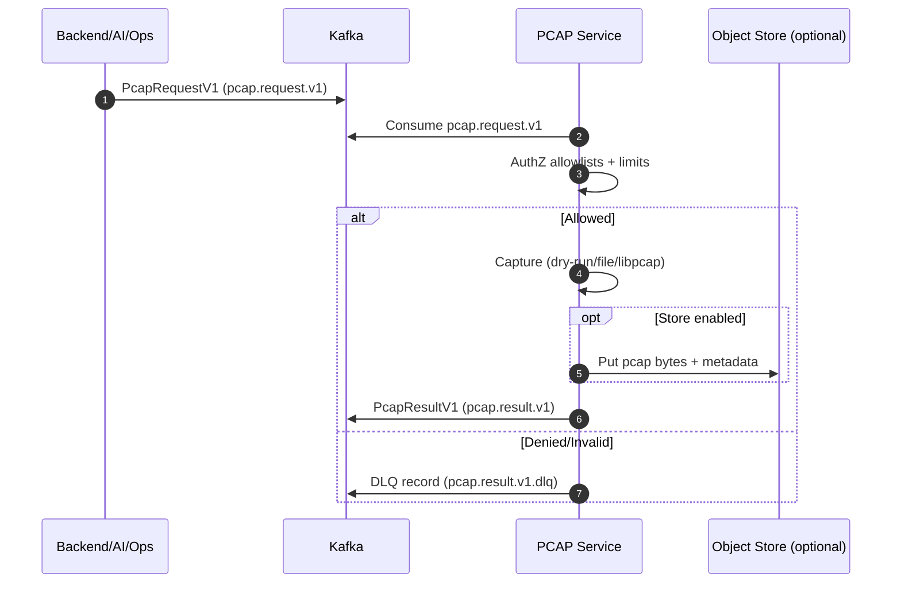
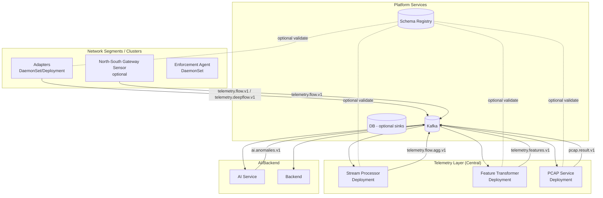

# CyberMesh Telemetry Layer - Low-Level Design

**Version:** 1
**Last Updated:** 2026-02-20  
**Authors:** Architecture Team

---

## Navigation

- [Architecture](#2-architecture)
- [Components](#3-components)
- [Kafka Topics](#4-kafka-topics)
- [Schemas](#5-schemas)
- [Security and Validation](#6-security--validation)
- [Validation Gates](#7-validation-gate-driven)
- [Deployment Notes](#8-deployment-notes)

---

## 1. Overview

This layer is the ingestion and normalization path between raw network signals and Sentinel/AI consumers.
It ingests flows/alerts/PCAP requests, validates and normalizes them, aggregates by flow window, derives CIC features, and publishes feature vectors for AI consumers.

**Design goals:**
- One canonical path for K8s/Hubble, Zeek/Suricata, IPFIX, and PCAP workflows.
- Schema-first contracts with explicit DLQ behavior for invalid payloads.
- Support both central and edge feature extraction without changing downstream topics.

---

## 2. Architecture

### 2.1 Module Architecture (Data Path)

---

## 3. Components

### 3.1 Adapters (Go)
**Purpose:** Convert external sources into canonical telemetry events.  
**Inputs:** Zeek JSON, Suricata EVE, IPFIX, cloud flow logs, gateway/baremetal sensor records.  
**Outputs:** `telemetry.flow.v1` and/or `telemetry.deepflow.v1` + DLQ on parse/validation errors.

**Key files:**
- `telemetry-layer/adapters/internal/deepflow/runner.go`
- `telemetry-layer/adapters/internal/parser/deepflow.go`
- `telemetry-layer/adapters/cmd/zeek/main.go`
- `telemetry-layer/adapters/cmd/suricata/main.go`

**Validation:** `telemetry-layer/adapters/internal/validate/deepflow.go`

---

### 3.2 Stream Processor (Go)
**Purpose:** Aggregate flows per 5‑tuple window and normalize metadata.  
**Inputs:** `telemetry.flow.v1` + optional `telemetry.deepflow.v1`  
**Outputs:** `telemetry.flow.agg.v1` + DLQ on schema/validation errors.

**Key files:**
- `telemetry-layer/stream-processor/cmd/processor/main.go`
- `telemetry-layer/stream-processor/internal/aggregate/`
- `telemetry-layer/stream-processor/internal/codec/`

**Deepflow bridge:** controlled by `DEEPFLOW_FLOW_BRIDGE_ENABLED=true`.

---

### 3.3 Feature Transformer (Python)
**Purpose:** Convert `flow.agg.v1` into CIC feature vectors.  
**Inputs:** `telemetry.flow.agg.v1`  
**Outputs:** `telemetry.features.v1` (JSON or Protobuf)

**Key files:**
- `telemetry-layer/feature-transformer_python/transformer.py`
- `telemetry-layer/feature-transformer_python/config.py`

**Edge/Central routing:**
- `FEATURE_ROLE` (`central` or `edge`)
- `EDGE_FEATURE_SOURCE_IDS`, `EDGE_FEATURE_SOURCE_TYPES`

---

### 3.4 PCAP Service (Go)
**Purpose:** Process `pcap.request.v1` and publish `pcap.result.v1`.  
**Inputs:** `pcap.request.v1`  
**Outputs:** `pcap.result.v1` + DLQ on error.

**Key files:**
- `telemetry-layer/pcap-service/cmd/pcap/main.go`
- `telemetry-layer/pcap-service/internal/validate/request.go`
- `telemetry-layer/pcap-service/internal/storage/`
- `telemetry-layer/pcap-service/internal/capture/`

**Modes:** `mock`, `file`, `libpcap` (compile with `-tags=pcap`).

---

### 3.5 Package Structure (Developer Map)

This diagram is intentionally "where is the code" rather than "what is the data flow".

---

## 4. Kafka Topics

| Topic | Producer | Consumer | Purpose |
|------|----------|----------|---------|
| `telemetry.flow.v1` | Ingest/bridge | Stream processor, Sentinel | Raw flows |
| `sentinel.verdicts.v1` | Sentinel | AI service | Multi-agent verdict stream |
| `telemetry.flow.agg.v1` | Stream processor | Feature transformer | Aggregated flows |
| `telemetry.features.v1` | Feature transformer | AI service/Ops | CIC features |
| `telemetry.deepflow.v1` | Adapters | Stream processor | IDS/deepflow events |
| `pcap.request.v1` | Backend/AI/Ops | PCAP service | Capture request |
| `pcap.result.v1` | PCAP service | Backend/AI/Ops | Capture result |
| `*.dlq` | Telemetry components | Ops | Invalid/error messages |

---

## 5. Schemas

**Location:** `telemetry-layer/proto/`  
**Primary v1 schemas:**
- `telemetry_flow_v1.proto`
- `telemetry_deepflow_v1.proto`
- `telemetry_feature_v1.proto`
- `telemetry_pcap_request_v1.proto`
- `telemetry_pcap_result_v1.proto`
- `telemetry_dlq_v1.proto`

**Wire formats:** JSON (dev/test) and Protobuf (canonical).

---

## 6. Security & Validation

### 6.1 DLQ Semantics (No Silent Failure)

DLQs are owned by the producer component (not Kafka). A DLQ record should carry:
- `error_code` (stable, searchable)
- `reason` (human readable)
- original `topic`/`partition`/`offset` if available
- original payload bytes (or truncated/redacted form if size/PII constraints apply)

### 6.2 Feature Coverage (Missing Features Are Security-Significant)

If upstream capture cannot provide timing/flags/IAT/active-idle features, the transformer must:
- mark them as missing in `feature_mask`
- compute `feature_coverage` accurately
- avoid silently coercing missing values to numeric zeros in a way that looks "present"

### 6.3 Schema Registry (Optional)

When enabled, producers validate payloads against the registry subject policy before publishing to canonical topics.

**PCAP controls:**
- Tenant/requester allowlists.
- Duration and max‑bytes limits.
- Optional retention and legal‑hold tags.

---

## 7. Validation (Gate-Driven)

Gate-driven validation provides deterministic "known good" checks without relying on old Kafka offsets or shared topics.

Recommended gate-driven validation (local/staging):
- Telemetry -> AI ingest: `python telemetry-layer/scripts/smoke_telemetry_to_ai_publish.py --env env/integration_test.env`
- Flow pipeline: `python telemetry-layer/scripts/gates/gates_flow_pipeline.py --env env/integration_test.env --gate b|c|d`
- Deepflow + PCAP: `python telemetry-layer/scripts/gates/gate_phase3_deepflow_pcap.py --env env/integration_test.env --timeout-sec 90`

Notes:
- Gates use isolated Kafka topics per run so they are not affected by deployed components or old offsets.
- Use `env/integration_test.env` so Telemetry/AI/Backend read consistent Kafka creds and topic overrides.

---

## 8. Deployment Notes

**Recommended workloads**
- `telemetry-stream-processor` (Deployment)
- `telemetry-feature-transformer` (Deployment)
- `telemetry-adapters` (Deployment/DaemonSet per segment)
- `telemetry-pcap-service` (Deployment)

**Config/Secrets**
- `telemetry-config` (runtime config)
- `telemetry-secrets` (Kafka + Schema Registry credentials)

---

## Appendix A: End-to-End Sequences

### A.1 Happy Path (Flows -> Features -> AI)

### A.2 Deepflow (Zeek/Suricata -> DeepFlowV1 -> Optional Bridge)

### A.3 PCAP Request -> Result (Access Controlled)

---

## Appendix B: Deployment Topology (Typical)

**[⬆️ Back to Top](#-navigation)**
